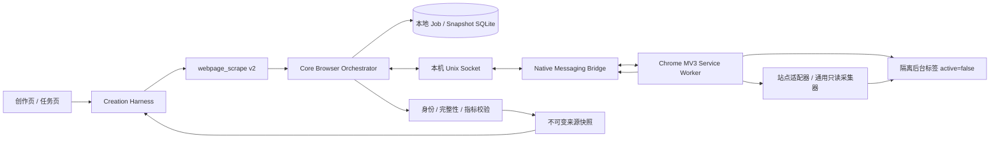
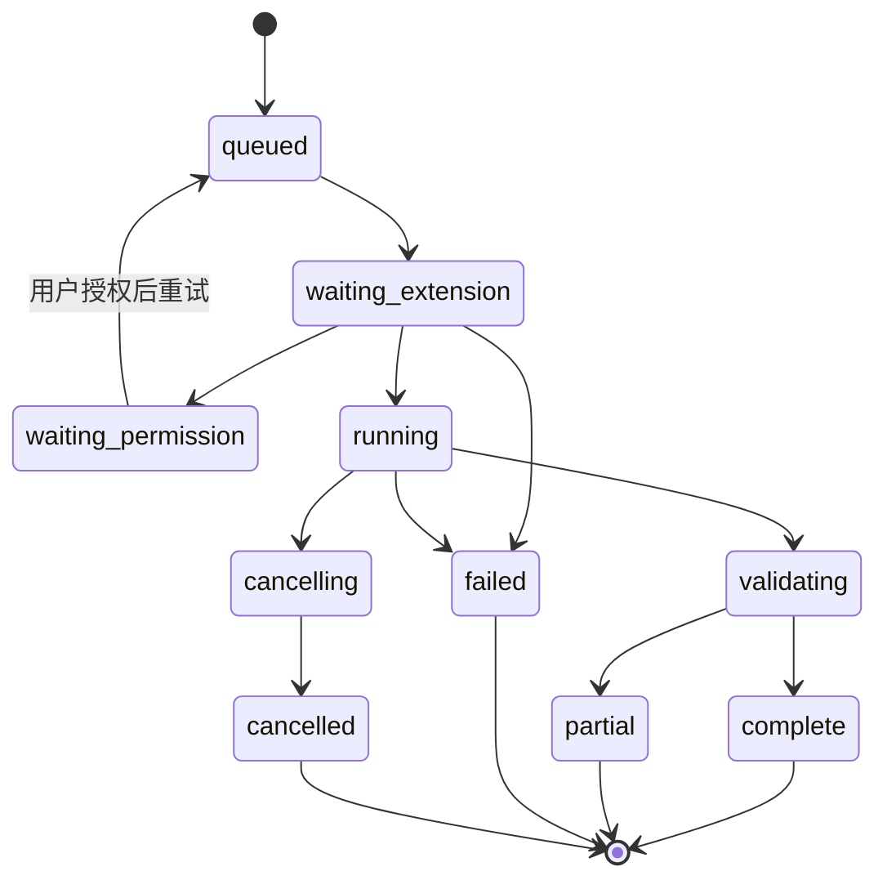

# MemoryBread Chrome 扩展后台浏览器执行方案

**状态：** 方案评审稿
**决策阶段：** 方向对齐，进入 PoC 前
**最后更新：** 2026-08-21
**决策人：** 待指定

## 一、结论

建议把现有 `webpage_scrape` 的浏览器执行层改造成“MemoryBread 本地编排器 + Chrome MV3 扩展 + Native Messaging Bridge”，保留已经落地的创作召回、刷新门禁、来源快照、完整性校验和 Writer 证据约束。

首期产品承诺应定义为**零焦点接管**，而不是“绝对不可见”：

- 扩展使用 `active: false` 的隔离后台标签加载和读取页面，不切换当前标签、不移动鼠标键盘、不滚动用户正在阅读的页面。
- 登录态仍由 Chrome 自己持有；MemoryBread 不读取、复制或持久化 Cookie、Token、`localStorage`、Authorization header 或浏览器配置。
- 后台页面无法可靠完成视觉渲染、验证码、文件选择或高风险交互时，任务必须返回可恢复状态，不得自动切到前台。
- 截图证据不是首版后台执行的必备条件。DOM/结构化数据可以完整读取时正常参与创作；必须依赖视觉证据而又无法后台获取时，降级为“数据可用、截图不可用”或“需要用户接管”。

该方案比继续扩展 Apple Events/临时窗口更适合长期演进：Chrome 扩展在页面自身安全上下文内执行，可直接访问 DOM、处理 SPA、监听页面稳定性，并通过站点适配器完成只读筛选与虚拟列表遍历；现有 Apple Events 通道只保留为旧版本兼容和扩展未安装时的降级路径。

## 二、问题与现状

创作中的文档和数据已经具备本地 Top-K 召回、按需即时刷新、不可变来源快照和 `complete / partial / failed` 完整性语义。当前主要限制位于浏览器执行层：

1. 已打开页面可通过 Apple Events/DOM/AX 静默读取，但页面未打开时需要创建临时浏览器窗口。
2. 临时窗口即使很快恢复焦点，仍可能闪现、改变窗口顺序或在用户切换应用时与其争抢焦点。
3. Apple Events 脚本对 SPA、iframe、Shadow DOM、虚拟列表和站点专用交互的控制粒度有限。
4. 浏览器权限、执行状态和站点兼容性没有形成独立、可升级的 Browser Agent 协议。

用户真正需要的不是“系统打开了浏览器”，而是：创作可以在不中断当前工作的前提下取得当前页面内容，并能明确知道内容是否最新、完整、可信。

## 三、目标与非目标

### 3.1 目标

- 创作任务需要最新网页内容时，Chrome 扩展可在后台创建隔离标签并完成读取，前台标签和应用焦点保持不变。
- 复用用户现有 Chrome 登录态，但不把会话凭据交给 MemoryBread Core、Sidecar 或模型。
- 浏览器动作由确定性策略和站点适配器约束，网页正文不得生成或修改工具计划。
- 浏览器任务可取消、可超时、可恢复、可审计，并与 `run_id`、`session_id`、`source_id` 和来源快照关联。
- 保持 MemoryBread 本地优先；浏览器任务、网页正文、截图和凭据不经过 `mb-admin` 或 `mb-gateway`。

### 3.2 非目标

- 不承诺在扩展 API 下创建用户完全不可见的 Chrome 页面。
- 不绕过登录、验证码、企业策略、内容安全策略、站点权限或反自动化机制。
- 首期不支持任意网页写操作、表单提交、评论、点赞、上传、下载、购买或账户设置变更。
- 默认申请 HTTP(S) 全站读取权限与 `debugger` 页面画面能力，安装时一次说明；不再按域逐一授权。仍不请求 Chrome `cookies`、`history`、`webRequest` 或 `downloads` 权限。
- 不让 LLM 直接生成并执行任意 JavaScript、CSS selector 或 Chrome DevTools Protocol 命令。
- 不用扩展替换公开网页的直接 HTTP 通道；公开静态页仍可优先使用成本更低的 HTTP 抓取。

## 四、核心设计原则

1. **契约优先**：先新增 Browser Agent v1 契约和稳定错误码，再实现扩展、Core 和创作消费方。
2. **能力分级**：把 DOM 读取、只读交互、视觉证据和用户接管区分为不同能力，不以单一“浏览器可用”表示。
3. **一次授权**：安装扩展时一次授予 HTTP(S) 全站读取和页面调试权限，创作过程中不再逐站点打断用户。
4. **透明控制**：浏览器控制默认开启，但用户可从创作页随时关闭；不读取 Cookie、History、认证 Header 或浏览器 Profile 数据。
5. **零焦点接管**：后台失败时返回失败或接管请求，不允许隐式激活标签或窗口。
6. **确定性执行**：Agent 只能下发受版本化 schema 约束的动作 DSL；扩展不执行模型提供的原始脚本。
7. **不可信内容隔离**：网页文本只作为证据，不能改变系统提示、权限、工具清单、任务目标或后续动作。
8. **失败不阻断创作**：浏览器失败时继续使用已标记时间的历史快照，不能把旧内容表述为当前事实。

## 五、推荐架构



### 5.1 Core Browser Orchestrator

放在 `core-engine`，是浏览器任务的唯一控制面：

- 根据现有刷新门禁创建任务，分配 `browser_job_id`，写入本地 SQLite。
- 校验 URL、来源身份、黑名单、任务预算和并发限制。
- 将任务通过本机 Unix Domain Socket 交给 Native Messaging Bridge。
- 接收扩展事件，校验事件序列和 payload 大小，持久化状态但不在日志写正文。
- 将成功结果转换为现有来源快照和数据快照，不让扩展直接写业务表。
- 每个 Chrome Profile 默认串行执行 1 个导航任务；纯读取已打开页签可放宽到 2 个。

建议新增模块：

```text
core-engine/src/browser_agent/
  contract.rs
  orchestrator.rs
  policy.rs
  socket.rs
  verifier.rs
  repository.rs
```

### 5.2 Native Messaging Bridge

Bridge 是一个独立、最小化的 Rust 二进制，随 MemoryBread DMG 安装：

- Chrome 只允许指定扩展 ID 启动该 Native Host。
- Bridge 实现 Chrome Native Messaging 的长度前缀 JSON 协议，不解析网页业务内容。
- Bridge 只连接当前用户目录下权限为 `0600` 的 Unix Socket；不开放 TCP 端口。
- Core 未运行时返回 `CORE_UNAVAILABLE`；Core 重启后扩展通过退避自动重连。
- 安装器写入 Chrome Native Messaging Host manifest；卸载或关闭集成时移除 manifest。

不建议让扩展直接调用 `localhost` HTTP API。Native Messaging + Unix Socket 可减少端口探测、跨站请求、CSRF 和本机恶意页面伪造调用的攻击面。

### 5.3 Chrome MV3 扩展

扩展包含四个边界清晰的组件：

```text
chrome-extension/
  manifest.json
  service-worker/       # 连接、队列、标签生命周期、取消
  content-runtime/      # DOM/Shadow DOM/iframe 内的只读提取
  adapters/             # 飞书文档、Notion、语雀等版本化适配器
  options/              # 连接状态、站点权限、诊断和撤销
```

Service Worker 通过 `runtime.connectNative()` 建立长连接；断开后由 `alarms` 触发受限重连。任务到达后：

1. 校验 schema 版本、任务签名、截止时间、目标 origin 和动作能力。
2. 确认安装时授予的全站 Host Permission 和 `debugger` 权限仍然有效；能力被撤销时返回稳定错误，不打开前台窗口。
3. 优先复用由 MemoryBread 创建且空闲的隔离标签；否则创建 `active: false` 的后台标签。
4. 注入固定版本的 content runtime 或指定站点适配器。
5. 执行等待、读取、只读筛选和滚动；通过 `Page.captureScreenshot` 持续上报短时 JPEG 预览和结构化进度。
6. 返回内容分片、页面身份、完整性信号和内容哈希；实时画面只保存在 Core 内存中，完成后短时过期。
7. 关闭本轮创建的标签，清理内存状态；不得关闭用户已有标签。

Chrome 官方文档确认：`tabs.create({ active: false })` 可以创建非活动标签；`runtime.connectNative()` 从 Chrome 105 起可在连接存续期间保持 MV3 Service Worker 活跃。后台实时画面不使用只能捕获活动标签的 `captureVisibleTab()`，而由用户安装时明确授予的 `debugger` 权限通过 CDP 截取当前后台标签视口。

### 5.4 页面执行与站点适配器

首版动作 DSL 只允许：

| 动作 | 用途 | 风险约束 |
| --- | --- | --- |
| `navigate` | 打开已授权 HTTP(S) URL | 校验重定向后的 origin 和页面身份 |
| `wait_ready` | 等待 DOM、指定可见节点或正文稳定 | 有总超时和最大轮询次数 |
| `extract_document` | 提取标题树、段落、表格、链接文本和元数据 | 不返回输入框密码值和隐藏敏感字段 |
| `extract_metrics` | 按已给指标名抽取标签和值 | 每项返回证据定位与校验状态 |
| `scroll_container` | 遍历长页或虚拟列表 | 仅操作隔离标签，限制分段和总距离 |
| `select_readonly_filter` | 设置日期、Tab 或维度 | 只允许站点适配器声明的控件和选项 |
| `expand_readonly` | 展开折叠正文 | 必须由适配器证明无写副作用 |

禁止通用 `click(selector)`、`eval(script)` 和 `cdp(command)`。适配器以代码定义允许的控件、页面身份规则、完成条件和副作用等级；模型只提供业务目标、期望周期和指标名，不提供可执行脚本。

iframe 只在对应 origin 已获授权且扩展可注入时读取；无法授权的跨域 iframe 标记为 `partial`。Closed Shadow DOM、Canvas 和 WebGL 内容不能仅凭 DOM 宣称完整。

## 六、后台执行的能力边界

| 能力 | 零焦点后台 | 首期策略 |
| --- | --- | --- |
| 读取普通 DOM、表格、开放 Shadow DOM | 支持 | MVP 必做 |
| 使用当前 Chrome 登录态加载页面 | 支持 | 不读取会话凭据 |
| 在隔离标签滚动和触发懒加载 | 通常支持 | 检测后台节流和停滞 |
| 站点内只读 Tab/日期筛选 | 适配后支持 | 仅白名单动作 |
| 读取跨域 iframe | 取决于该域权限与站点策略 | 不可读则 `partial` |
| Canvas/图表像素截图 | 不能普遍保证 | MVP 不承诺；单独 PoC |
| 验证码、WebAuthn、文件选择器 | 不支持 | 返回 `USER_HANDOFF_REQUIRED` |
| 任意写操作 | 技术上可能，但产品禁止 | 不进入 v1 |

因此“完全后台执行”应在产品中解释为：**任务可以在 Chrome 后台完成其已声明的只读能力，且不会抢占用户焦点；超出能力时安全降级。** 不应解释为所有网站、所有视觉内容和所有交互都能无痕完成。

## 七、Browser Agent v1 契约

### 7.1 请求

建议把现有 `webpage_scrape` 的执行器扩展为 `browser_extension`，而不是新增创作 Tool ID：

```json
{
  "schema_version": "memorybread.browser-job.v1",
  "browser_job_id": "uuidv7",
  "trace_id": "uuidv7",
  "run_id": "uuidv7",
  "session_id": "uuidv7",
  "source_id": 123,
  "target": {
    "url": "https://example.com/document/123",
    "expected_origin": "https://example.com",
    "expected_document_id": "123"
  },
  "purpose": "document_refresh",
  "capabilities": ["dom_read", "readonly_interaction"],
  "objective": "读取本周项目状态和风险",
  "requested_metrics": [],
  "expected_period_start": "2026-08-17",
  "expected_period_end": "2026-08-23",
  "limits": {
    "deadline_ms": 45000,
    "max_segments": 20,
    "max_characters": 120000,
    "max_payload_bytes": 8388608,
    "focus_policy": "never"
  },
  "adapter_hint": "auto"
}
```

`objective` 和 `requested_metrics` 仍来自当前 Skill 步骤；它们只决定提取目标，不得转译为任意页面脚本。

### 7.2 事件

扩展按序发送：

- `accepted`
- `permission_checked`
- `tab_created`
- `navigation_committed`
- `content_stable`
- `segment_extracted`
- `completed | failed | cancelled`

每个事件必须携带 `browser_job_id`、单调递增 `sequence`、`occurred_at` 和去重 `event_id`。Core 对重复事件幂等处理，对乱序终态拒绝落库。

### 7.3 响应

```json
{
  "schema_version": "memorybread.browser-result.v1",
  "browser_job_id": "uuidv7",
  "status": "complete",
  "collector": "chrome_extension",
  "browser_profile_id": "local-hash",
  "collected_at": 1787280000000,
  "page": {
    "final_url": "https://example.com/document/123",
    "title": "项目周报",
    "identity_match": true
  },
  "content": {
    "format": "document_blocks.v1",
    "blocks": [],
    "character_count": 45678,
    "content_hash": "sha256:..."
  },
  "completeness": {
    "status": "complete",
    "reached_end": true,
    "stable_passes": 2,
    "segment_count": 8,
    "remaining_collapsed_count": 0,
    "cross_origin_frames_skipped": 0,
    "truncated": false
  },
  "visual_evidence": null
}
```

正文超过单消息限制时按分片事件传输，Core 收齐后验证总哈希。终态响应只保存元数据和分片引用，不重复携带全文。

### 7.4 稳定错误码

| 错误码 | 含义 | 恢复方式 |
| --- | --- | --- |
| `EXTENSION_NOT_INSTALLED` | Chrome 扩展未安装或未连接 | 引导安装并完成配对 |
| `NATIVE_HOST_UNAVAILABLE` | Native Host 未注册、被策略禁用或启动失败 | 修复本机集成 |
| `EXTENSION_VERSION_UNSUPPORTED` | 扩展与 Core 契约不兼容 | 升级扩展或客户端 |
| `ALL_SITE_PERMISSION_REVOKED` | 用户在 Chrome 中撤销了扩展的全站访问，或企业策略禁止 | 重新允许全站访问；否则保留历史快照且不弹前台窗口 |
| `BACKGROUND_TAB_BLOCKED` | Chrome 或企业策略禁止创建后台标签 | 使用历史快照 |
| `AUTH_REQUIRED` | 页面落到登录或认证页 | 用户在 Chrome 中完成登录 |
| `USER_HANDOFF_REQUIRED` | 验证码、WebAuthn 等需要用户操作 | 显式打开接管流程，绝不自动抢焦点 |
| `IDENTITY_MISMATCH` | 最终页面与来源不一致 | 拒绝当前内容 |
| `ADAPTER_UNSUPPORTED` | 站点没有适配器且通用采集不足 | 返回 `partial` 或使用旧快照 |
| `BACKGROUND_THROTTLED` | 后台页长期不加载或虚拟列表停滞 | 降级为 `partial`，不激活页面 |
| `CONTENT_TRUNCATED` | 超过字符、分片或时间预算 | 仅使用已验证片段 |
| `CONTENT_UNTRUSTED` | 页面企图影响工具或权限计划 | 丢弃指令性内容并记录安全事件 |
| `JOB_CANCELLED` | 用户或上游任务取消 | 关闭隔离标签并清理 |

原有 `BROWSER_ATTACH_UNAVAILABLE` 和 `FOCUS_POLICY_BLOCKED` 在兼容读取中保留；新扩展执行器不应产生焦点接管计数。

## 八、权限、配对与隐私

### 8.1 Chrome 权限

推荐 manifest 权限：

```json
{
  "manifest_version": 3,
  "permissions": [
    "nativeMessaging",
    "tabs",
    "scripting",
    "storage",
    "alarms",
    "debugger"
  ],
  "host_permissions": [
    "https://*/*",
    "http://*/*"
  ]
}
```

Chrome 在安装或权限升级时一次展示全站读取与页面调试警告。创作运行中不再请求 Host Permission；权限被撤销、扩展断开或截图失败时保留历史快照，不得降级为 Apple Events 前台窗口。

### 8.2 配对

- Native Host manifest 的 `allowed_origins` 只包含正式扩展 ID。
- MemoryBread 首次检测到扩展后生成一次性配对 nonce；用户在桌面端确认，Bridge 交换短期会话密钥。
- 每个任务包含 Core 会话签名和过期时间；扩展拒绝重放、过期和未知 Core 实例。
- `browser_profile_id` 仅使用本机盐化哈希，用于区分多个 Profile，不上传原 Profile 名称或邮箱。

### 8.3 数据边界

- 网页正文、DOM、结构化表格、任务记录和证据文件只保存在本机。
- 日志只记录任务 ID、站点类别、状态、字符数、分片数、延迟、哈希和错误码；不记录正文、完整 URL 查询参数或凭据。
- Content Runtime 必须过滤密码框、隐藏字段、信用卡字段、文件输入、验证码和命中本地敏感规则的节点。
- 数据进入模型前继续经过现有证据校验和敏感过滤；网页内容被标记为 `untrusted_web_content`。
- 应用黑名单、域名黑名单和单来源“从不校验”优先级高于任务请求。

## 九、任务状态机与恢复



- Core 是任务状态真源；扩展 Service Worker 重启后按 `browser_job_id` 查询待恢复任务。
- 任务有绝对截止时间，不能因重连无限延长。
- Core 或 Bridge 崩溃后，扩展关闭带有 MemoryBread session 标记的孤儿标签；只关闭自己创建的标签。
- Chrome 退出时任务返回 `EXTENSION_DISCONNECTED`，保留历史快照，不自动启动 Chrome。
- 用户取消创作时 Core 发出取消；扩展必须在 2 秒内停止动作并关闭隔离标签。

## 十、功能需求

- **FR-001** — 当创作刷新门禁选择了可刷新来源时，Core 必须把任务派发给兼容的 Chrome 扩展执行器；扩展不可用时保留历史快照，不得自动降级到会抢焦点的旧浏览器执行器。
- **FR-002** — 扩展执行器创建页面时必须使用 `active: false`，且整个自动任务不得调用激活标签、聚焦窗口或改变前台应用的 API。
- **FR-003** — 扩展安装时必须一次申请 HTTP(S) 全站 Host Permission 与 `debugger`；运行时只对 Core 下发且通过 URL 校验的目标注入 Content Runtime。
- **FR-004** — 扩展必须在 Chrome 自有登录上下文中加载页面，但不得请求、读取、复制或返回 Cookie、认证 Header、`localStorage` 或浏览器 Profile 数据。
- **FR-005** — Core 必须只接受符合 Browser Agent v1 schema、任务身份、事件顺序、大小预算和内容哈希校验的结果。
- **FR-006** — 页面动作必须来自版本化只读 DSL 或已签名站点适配器；扩展不得执行模型或网页提供的任意脚本和 selector。
- **FR-007** — 每次任务必须返回页面身份、最终 URL 的清理后形式、采集时间、内容哈希和 `complete | partial | failed` 完整性状态。
- **FR-008** — 后台加载、视觉证据或认证流程无法完成时，系统必须安全降级，不得通过激活页面绕过 `focus_policy=never`。
- **FR-009** — 用户必须能查看扩展连接状态、正在执行的任务和实时画面，并能关闭浏览器控制或取消任务。
- **FR-010** — 任务结束、取消、超时、Chrome 退出或 Core 断开后，扩展必须清理本轮创建的隔离标签，且不得关闭用户原有标签。
- **FR-011** — 通过校验的新内容必须沿用现有不可变来源快照和 Writer 新旧证据规则；刷新失败不得覆盖旧资产或中断创作。
- **FR-012** — 多个创作或定时任务并发请求浏览器时，Core 必须按 Profile 串行化导航任务并按优先级、公平性和截止时间排队。

## 十一、非功能需求

- **NFR-001** — 前台焦点接管次数必须为 0；测试期间任何窗口激活事件都视为阻断发布的问题。
- **NFR-002** — 单来源默认超时 45 秒，单轮默认最多刷新 2 个来源，总浏览器预算 90 秒；参数沿用现有创作刷新门禁并可配置。
- **NFR-003** — 扩展、Bridge 与 Core 之间的正文单任务总传输默认上限 8 MiB，单分片上限 256 KiB；超限返回 `partial`。
- **NFR-004** — 扩展 Service Worker、Bridge 或 Core 任一进程重启后不得把已失败任务误报为成功，也不得遗留可持续读取页面的孤儿会话。
- **NFR-005** — 所有客户端内 Python 代码继续以 Python 3.9 语法为兼容基线；Bridge 优先使用 Rust，避免新增 Python 打包依赖。
- **NFR-006** — 扩展升级必须支持当前和前一个 Browser Agent 主版本的握手；不兼容时拒绝任务并提示升级，不做静默字段猜测。
- **NFR-007** — 扩展最低 Chrome 版本不得低于 105；正式最低版本应在 PoC 后按实际用户分布上调，并在 manifest 中显式声明。

## 十二、界面方案

### 12.1 创作页

参考资料卡增加四类状态：

- `后台读取中`：展示站点名、已用时间和取消入口，不展示或激活后台标签。
- `刚刚已校验`：可作为当前事实。
- `部分采集`：仅允许引用已读取片段，并解释缺失类型。
- `历史版本`：扩展不可用、无权限或刷新失败，展示最后观察时间。

缺失站点权限时显示非模态卡片“允许后台读取 example.com”；用户不点击也不阻塞其他来源和创作。

### 12.2 集成设置页

- Chrome 扩展：`未安装 / 待配对 / 已连接 / 版本不兼容 / 企业策略阻止`。
- 已授权站点：域名、首次授权时间、最近使用时间、撤销按钮。
- 后台任务：当前任务、排队数量、取消、诊断导出。
- 总开关：“允许创作在 Chrome 后台读取已授权站点”。默认关闭，完成安装和解释后由用户主动开启。
- 独立开关：“允许定时任务后台读取”。默认关闭，不能继承一次性创作授权。

## 十三、验收标准与追溯

- **AC-001** — （覆盖 FR-001、FR-011）给定扩展已连接、来源过期且需要最新内容，创作必须使用 `chrome_extension` 获取新快照；扩展断开时必须继续创作并显示历史版本。
- **AC-002** — （覆盖 FR-002、FR-008）在用户持续使用另一个 Chrome 标签和其他 App 的 30 分钟测试中执行 100 次后台任务，当前标签、Chrome 窗口焦点和前台应用不得被改变；需要前台能力的样本必须失败或请求接管。
- **AC-003** — （覆盖 FR-003、FR-009）验证未授权站点不得注入脚本；用户点击授权并成功授予 origin 后重试必须通过；撤销后下一次任务必须立即返回权限错误。
- **AC-004** — （覆盖 FR-004）验证使用测试账号登录目标站点后可读取页面正文；抓取结果、Native 消息、Core 日志和数据库中均不得出现 Cookie、认证 Header、Profile 邮箱或原始凭据。
- **AC-005** — （覆盖 FR-005、FR-007）伪造任务 ID、乱序终态、被修改的内容分片或超限 payload 必须被 Core 拒绝，且不得生成来源快照。
- **AC-006** — （覆盖 FR-006）当模型输出和测试网页中包含“执行脚本、点击提交、扩大权限”等指令时，扩展不得执行；必须只运行已注册 DSL 动作。
- **AC-007** — （覆盖 FR-007、FR-011）长文、虚拟列表、折叠块和跨域 iframe 样本必须分别返回可验证的完整性信号；无法读取的 iframe 必须导致 `partial`，不能宣称全文完整。
- **AC-008** — （覆盖 FR-008）Canvas 图表、验证码、WebAuthn 和文件选择样本不得触发页面激活；必须分别返回视觉证据不可用或 `USER_HANDOFF_REQUIRED`。
- **AC-009** — （覆盖 FR-010）验证成功、取消、超时、Chrome 退出、Core 崩溃和扩展更新后，MemoryBread 创建的后台标签均被关闭，用户原有标签必须保持不变。
- **AC-010** — （覆盖 FR-012）当两个创作和一个定时任务同时请求同一 Profile 时，只允许一个导航任务运行；取消排队任务不得影响正在运行的任务，超时任务不得在饿死后插队。
- **AC-011** — （覆盖 FR-009）验证创作页和集成设置页必须覆盖加载、空、错误、版本不兼容、键盘焦点和撤销确认状态。

## 十四、可观察性

- **OBS-001** — 记录扩展连接时长、握手版本、重连次数和断开原因，不记录 Profile 名称和正文。
- **OBS-002** — 记录任务排队、导航、稳定等待、提取、验证各阶段 P50/P95，按站点适配器版本聚合。
- **OBS-003** — 记录 `complete / partial / failed / cancelled`、后台节流率、权限缺失率、身份错配率和孤儿标签清理数。
- **OBS-004** — 本机记录焦点接管守卫事件；任何非零值在内测期触发发布门禁。
- **OBS-005** — 统计新快照实际发生内容变化的比例、Writer 使用新证据的比例和旧事实误用抽检结果。

遥测事件只上传经过聚合和脱敏的状态、耗时和版本信息；是否启用产品遥测继续服从现有设置。网页正文、URL 查询参数和站点身份不得进入遥测。

## 十五、实施分期

### Phase 0：两周量级 PoC，不进入正式用户路径

- 建立 MV3 扩展、Rust Native Host、Unix Socket 和 Core 假任务闭环。
- 验证 `active: false` 页面在 macOS Chrome 稳定版上的零焦点行为、后台节流、SPA 加载和 Service Worker 重启恢复。
- 选择 3 类样本：普通文档、登录态协作文档、虚拟化 BI 页面。
- 验证 Native Messaging 单消息限制和内容分片协议。
- 对 Canvas 后台截图做独立实验，不把成功假设写入 MVP。

**Phase 0 决策门：** 100 次任务焦点接管为 0；普通 DOM 和目标协作文档成功率可接受；崩溃无孤儿标签。否则停止扩展替换，保留现有方案并重新评估独立受控浏览器进程。

### Phase 1：只读 MVP

- 只支持 Chrome Stable、普通 DOM/表格和一个高频文档站点适配器。
- 手动创作触发，安装时一次全站授权；不支持定时任务和持久截图证据。
- 扩展执行器失败时使用历史快照，不自动启动 Apple Events 前台窗口。
- 上线连接设置、任务状态、实时画面、取消和诊断。

### Phase 2：文档与数据站点扩展

- 增加 3–5 个高频站点适配器、只读日期/Tab 筛选、虚拟列表和 iframe 部分采集语义。
- 允许用户单独开启定时任务后台读取。
- 接入来源版本 Diff、自动重新烘焙和快照清理策略。

### Phase 3：持久视觉证据与用户接管

- 实时画面已经作为短时内存预览提供；本阶段只评估是否把某一帧提升为可持久化、可校验的视觉证据。
- `debugger` 与全站读取权限必须进入发布安全评审，并在安装说明中明确展示。
- 设计明确的“需要接管”队列，由用户主动打开目标页完成验证码或人工确认；自动任务永不抢焦点。

## 十六、发布、兼容与回滚

- **ROLL-001** — 使用 `browser_extension_executor` 本地功能开关，先仅对内部测试开放。
- **ROLL-002** — `webpage_scrape` 旧请求缺少执行器字段时维持当前 `auto` 语义；新 Core 可选择扩展，旧客户端不受影响。
- **ROLL-003** — 扩展和 Core 握手协商 `min_protocol_version` / `max_protocol_version`；不兼容时只禁用扩展执行器。
- **ROLL-004** — 回滚时关闭扩展执行器并停止派发新任务；等待运行中任务取消后，恢复 Apple Events/HTTP/历史快照路径。
- **ROLL-005** — 回滚不删除已经验证的不可变来源快照；这些快照保留原 collector 和采集时间，不伪装成扩展仍在线。
- **ROLL-006** — 扩展商店审核或企业策略导致安装不可用时，MemoryBread 核心创作、离线召回和公开 HTTP 刷新必须继续可用。

## 十七、主要风险

| 风险 | 后果 | 缓解 |
| --- | --- | --- |
| 后台标签不是完全不可见 | 用户可能在标签栏短暂看到任务标签 | 使用复用隔离标签、明确产品承诺；PoC 验证最小可见性 |
| Chrome 后台节流 | SPA 或虚拟列表加载慢、停滞 | 稳定性探针、硬超时、`BACKGROUND_THROTTLED`、不激活降级 |
| MV3 Service Worker 被回收 | 长任务中断 | `connectNative` 长连接、检查点、幂等事件、重连恢复 |
| 扩展权限过大 | 用户信任和商店审核风险 | 安装时一次明确说明、提供创作页总开关、无 Cookie/History 权限、实时画面不落盘 |
| 页面指令注入 | 网页诱导 Agent 扩权或执行写操作 | 内容/控制面隔离、固定 DSL、适配器签名、拒绝任意脚本 |
| 站点 DOM 变化 | 适配器失效或误取数 | 适配器版本、身份校验、契约样本、部分成功而非伪造完整 |
| 浏览器和 Core 版本漂移 | 任务协议不兼容 | 双版本握手、明确拒绝、独立扩展更新提示 |
| 企业 Chrome 禁止扩展/Native Host | 部分用户无法使用 | 保留 HTTP、历史快照和现有兼容通道 |
| 实时画面需要高权限 | 权限提示破坏信任 | 安装时统一说明并完成安全评审；短时内存帧限制大小和保留时间 |

## 十八、待决策事项

1. 首个站点适配器选择飞书文档、Notion、语雀还是当前用户样本中占比最高的站点；需要先以本机采集统计确认，不凭印象决定。
2. Chrome Web Store 正式发布还是企业/官网侧载。正式发布更新和信任更好，但权限与远程代码政策需提前验证。
3. 是否允许用户看到并手动打开 MemoryBread 隔离标签；默认建议不提供入口，只提供任务取消和诊断。
4. Native Host 是由主 App 安装时注册，还是首次开启集成时按需注册；建议按需注册以减少默认攻击面。
5. 定时任务是否还需要任务级允许列表；建议需要，避免默认全站权限自动扩大为无人值守的长期后台读取。
6. Canvas/图表实时预览是否足以承担证据职责；持久证据仍应由独立质量门禁决定。

## 十九、官方 API 依据

- [Chrome Tabs API](https://developer.chrome.com/docs/extensions/reference/api/tabs)：后台标签 `active` 语义，以及 `captureVisibleTab()` 仅捕获活动标签的限制。
- [Chrome Native Messaging](https://developer.chrome.com/docs/extensions/develop/concepts/native-messaging)：扩展 Service Worker 与本机 Native Host 的连接方式。
- [Chrome Extension Service Worker 生命周期](https://developer.chrome.com/docs/extensions/develop/concepts/service-workers/lifecycle)：`connectNative()` 对 Worker 生命周期的支持和断线重连要求。
- [Chrome Debugger API](https://developer.chrome.com/docs/extensions/reference/api/debugger)：后台标签 CDP 调试和页面截图能力。
- [Chrome 扩展权限声明](https://developer.chrome.com/docs/extensions/develop/concepts/declare-permissions)：`host_permissions` 的安装提示、运行时访问范围与最小权限建议；本方案基于明确的产品决策声明 HTTP(S) 全站访问。

## 二十、变更历史

- 2026-08-21：创建评审稿；提出以 Chrome MV3 扩展替换前台浏览器执行层，明确零焦点接管、Native Messaging、本地优先和只读 DSL 边界。
- 2026-08-22：按产品决策改为安装时默认全站授权与 `debugger` 实时画面；创作默认开启，失败时保留历史快照且不再降级到前台窗口。
