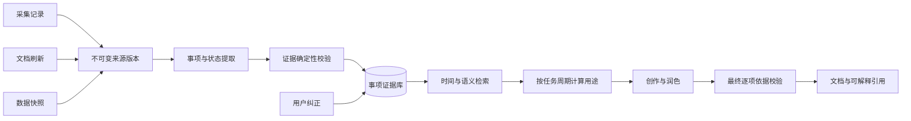

# 创作中的历史事实误用：时间与事实状态校验方案

状态：**方案已放弃**。阶段 A 已完成验收但未通过阶段 B 准入质量门；根据 2026-08-29 决策，停止阶段 A.1 和阶段 B-E，不接入产品运行链路。本文仅作为历史决策与验收记录保留。

## 0. 决策摘要

> 最终决策（2026-08-29）：放弃本方案，不继续整改模型抽取原型，不启动阶段 B-E。阶段 A 产物仅用于保留评测证据，不构成后续实施授权。

这是一个跨越采集/刷新、提炼、存储、检索、创作和创作详情的中大型改造，不适合以一次性大版本上线。它的价值是建立通用的“来源版本—事项—时间依据—创作用途”证据链，系统性解决最近看到旧资料、文档新但事项旧、会议回顾旧成果、目标被写成完成等问题。

建议决策为：**批准长期方向，按独立关卡分期实施；每一阶段达标后再批准下一阶段，不一次性承诺全量切换。** 第一关只建立契约、标注集和影子评估，不影响用户输出；如果提取质量达不到门槛，可以在没有迁移风险的情况下停止。

### 结论性判断

| 决策问题 | 判断 |
| --- | --- |
| 是否比短期创作拦截准确 | 是。时间和状态在记忆形成时就绑定到事项，后续各召回路径共享同一证据，不依赖每次创作重新理解整篇文档 |
| 能否完全判断所有事项时间 | 不能。来源没有表达时间时必须保留未知；方案提高的是有证据判断的正确性和可解释性，不制造缺失事实 |
| 能否防止这次两类错误 | 设计上可以：重新观察不能改写事件时间；建设中/目标不能升级为完成；最终输出还会进行第二次依据校验 |
| 最大产品代价 | 严格模式下，无日期、弱证据的进展会减少；需要通过补证、来源上下文和用户纠正恢复覆盖，不能靠放宽真实性门槛恢复 |
| 最大工程风险 | 现有多个时间字段含义部分重叠，且数值事实的周桶由观察时间生成；若直接重解释旧字段会污染历史数据 |
| 推荐实施方式 | 新字段可选、旧数据保持未知、双写/影子读、按来源惰性回填、周期进展先灰度、任何阶段可关闭读取与强制准入 |

### 预计改造范围

工作量分级仅用于决策，不是排期承诺。

| 工作包 | 复杂度 | 主要原因 |
| --- | --- | --- |
| 契约、时间解析、状态词典、标注集 | 中 | 需要统一术语和建立可靠的测试真值 |
| 来源版本与事项证据持久化 | 大 | 涉及 SQLite 迁移、提炼双写、来源版本和证据定位 |
| 检索与创作准入 | 大 | 所有记忆域需要统一适配，并要防止生成和润色绕过 |
| 惰性回填、纠错和创作详情 | 中到大 | 需要版本失效、撤销、兼容读取和 UI 解释 |
| 发布验证与长期评测 | 中 | 需要同时控制误纳、误删、性能和隐私 |

只有“降低旧事项误纳”是唯一目标时，短期方案成本更低；若目标是让周报、月报、进展总结长期具备可追溯的时间真实性，应选择本方案。

## 1. 问题与证据

近期阅读或重新抓取历史文档后，创作把其中的旧事项当成报告周期内的进展；同时可能把“方案建设中”增强为“已完成”，把长期目标放进近期进展。后果是周报看似有来源，却没有对应周期和状态的证据。

本次只读核查本机最新完成的创作记录 104，其请求为上周 GPU 成本优化周报，对应报告周期应为 2026-08-17 至 2026-08-23（Asia/Shanghai）。未修改历史记录或数据库，未保存原始私有材料到仓库。

| 已确认事实 | 判断边界 |
| --- | --- |
| 最新创作包含用户指出的两条内容，且 AIGC 步骤召回了对应历史方案与目标类数据 | 可确认材料进入该步骤；历史记录没有逐条结论到证据的完整绑定，不能声称还原了模型逐句推理 |
| 历史方案的本次刷新快照仍有 2026-02-06 的版本修订日期，相关章节标注建设中、装修中 | 刷新成功没有把旧内容变成新进展；目录标题不足以支持“完成设计” |
| 金额对应的召回文本明确属于专项目标，快照正文未检出完整日期 | 用户确认内容久远；仅凭该快照不能推定目标具体制定日期或当前是否仍然有效 |
| 目标类工作记忆快照被分入报告周期内的周桶 | 该桶不能单独证明目标在报告周期内提出、调整或达成 |
| 最新记录持久化的相关参考摘要缺少 `period_evidence`、`observed_at` 字段 | 需要核对运行服务版本和落库路径，不能假定当前工作区源码已在该次执行中生效 |

当前源码中的相关缺口：

- `ai-sidecar/creation/service.py`：参考评分使用 `updated_at` 计算 freshness；`ReferenceDocument` 尚未完整承接上游事件时间及其证据依据。
- 同文件 `reference_period_evidence`：扫描标题、摘要和正文中的完整日期，只要一个日期落在周期内，整篇标记 `matched`；日期角色和它约束的具体事项没有绑定。
- 同文件 `_query_data_memory_rows`：周期筛选允许回退到 `observed_at/collected_at`，且优先选择来源最新采集快照，可能误纳历史内容，也可能漏掉真正属于目标周期的旧快照。
- `ai-sidecar/background_processor.py`：`timeline_data_facts` 的周桶根据观察时间生成。这可用于管理采集阶段，但不能直接当作事实发生周期。
- `ai-sidecar/creation/agent_loop.py`：目前把周期判断作为参考元数据和提示词提供给模型，没有在该召回消费路径形成逐条事实的强制准入。

只读验证当前日期函数：实际历史方案返回 `outside`；合成的“本周会议＋历史回顾”返回整篇 `matched`；无日期的目标返回 `unknown`。这证明现有函数能识别一部分旧日期，但不足以决定某条结论是否可用于本期。此次没有运行产品回归，也没有宣称修复已完成。

## 2. 用户场景、目标与非目标

### 用户场景

适用于周报、月报、项目进展、阶段总结，以及同一文档中分别要求“背景、进展、目标、当前状态”的章节。方案应覆盖文档、知识、操作、数据、原始采集和修订上下文，不针对某个业务名、金额或固定文档 ID 写规则。

### 目标

1. 本期进展必须有本期事件证据；最近浏览和最近刷新只能证明最近接触了资料。
2. 输出保持证据中的事实状态，不能把计划、目标、建设中、累计结果写成本期完成。
3. 旧资料继续可用于历史背景、术语和结构；时间不明确时不编造日期。
4. 每条进展可追溯到具体来源片段、时间依据和使用决策。

### 非目标

- 不删除历史记忆、不禁止召回旧文档、不全量重新烘焙数据库。
- 不根据用户指出的两句话建立业务黑名单。
- 不在本轮重写历史周报，不改动既有 Skill 的章节白名单。
- 不扩展服务端能力，不上传本地事实，不触发 DMG 打包。

## 3. 方案取舍

| 选项 | 作用与不足 | 建议 |
| --- | --- | --- |
| 提示模型忽略旧资料 | 有辅助作用，但无日期、混合日期、后续润色都可能绕过 | 作为提示，不能作为唯一保障 |
| 只召回最近几天采集的资料、提高 freshness 权重 | 最近看到的旧材料仍会入选；反而遗漏晚采集的真实本期事件 | 不采用为事实准入规则 |
| 整篇按文档日期过滤 | 可排除明确旧材料，但会误删旧文档新增进展，误放新文档历史回顾 | 仅作候选提示 |
| 按事项绑定时间、状态和原始证据，再决定用途 | 能保留背景价值并约束进展输出，需补充结构化证据和校验 | 推荐 |

核心流程：解析任务周期与章节用途 → 多路召回 → 必要时刷新 → 提取带来源的事实 → 校验时间和状态 → 分离本期进展与背景 → 生成 → 润色后再次校验。

### 3.1 总体架构

需要明确两个边界：

1. 来源版本保存“系统看到了什么”；事项证据保存“来源具体支持什么”。两者不可合并为一个 `updated_at`。
2. 事项证据是长期记忆属性；`eligible/background_only` 是针对某次任务周期和章节用途计算的临时决策，不能永久写回事项。

### 3.2 利用现有能力，而不是推倒重建

现有 `timelines` 已有观察时间、事件时间、内容来源、活动类型、证据强度和工作状态；`bake_document_source_snapshots` 已有不可变内容哈希和抓取时间；`timeline_data_facts` 已有逐字证据；创作历史已有引用、执行轨迹和证据字段。因此长期方案应以兼容扩展为主：

- 保留 `timelines.observed_at` 的观察语义，不再用它填补未知事件时间。
- 保留 `bake_document_source_snapshots.collected_at` 的抓取语义，增加可选的来源元数据，不把抓取时间改名冒充修改时间。
- 将现有时间线级 `event_time_start/end` 作为粗粒度候选；真正用于创作的时间必须落到事项级，并带证据定位。
- `timeline_data_facts` 继续服务数值事实，但补充 `period_basis`；现有按观察时间生成的周桶标为兼容分桶，不当作来源明确的统计周期。
- 创作 `references_json` 保留来源摘要，新增逐项使用记录；不能再仅凭“某文档被召回”解释某句话为何成立。

### 3.3 可靠性分层

系统不输出一个容易被误用的综合置信分，而是分别记录来源完整性、时间依据、状态依据和冲突状态。

| 层级 | 典型依据 | 可支持的行为 |
| --- | --- | --- |
| 已确认 | 用户对具体事项和来源版本的确认；来源内明确日期、状态和逐字片段均通过校验 | 可在匹配用途下直接采用；仍受任务周期约束 |
| 已回证 | 模型提出事项，程序确认引用存在、日期表达和状态词存在，作用域无冲突 | 可用于普通进展；数字和强状态必须保留原始口径 |
| 上下文继承 | 事项本句无日期，但能在同一会议、章节或列表范围内继承明确日期 | 作用域解析通过后可采用，并记录继承路径 |
| 不确定 | 仅观察时间、仅文档更新时间、相对时间无锚点、正文被截断 | 只用于发现和背景，不能作为本期进展 |
| 冲突 | 多个来源对日期或状态表述不一致，且无可靠覆盖关系 | 不输出确定结论，等待补证或用户确认 |

“已回证”不是“事实绝对真实”，它表示系统能证明输出忠实反映了某个可定位来源。多个来源相互印证可以提高使用优先级，但不能把来源共识误称为客观真相。

## 4. 契约与需求

### 4.1 时间语义

复用现有字段时先明确含义，不直接把旧 `period_*` 改解释为事件时间。新增字段应为可选字段，缺失视为未知。

| 信息 | 含义与约束 |
| --- | --- |
| `observed_at / collected_at` | 用户观察、采集器获取内容的时间，不证明内容发生时间 |
| `source_published_at / source_modified_at` | 来源发布和修改时间；只提供辅助上下文，不让整篇事实自动变新 |
| `event_time_start / event_time_end` | 具体事项发生区间，可为空；只有与该事项相关的证据才可赋值 |
| `time_basis / time_precision` | 时间来自正文、章节标题、会议日期、经核验的统计区间或用户确认；精度为日、周、月等；区分观察时间与事件时间 |
| `time_evidence` | 原文定位、日期角色、适用范围、相对时间的锚点及解析置信信息；模型置信分数本身不能替代证据 |
| `claim_kind / claim_status` | 区分事件、状态、目标、预测、指标与背景；状态保留计划、进行中、完成、取消、未知等语义 |
| `source_ref` | 来源类型、ID、内容版本哈希、章节/片段定位；派生记忆能回溯原始来源 |
| `usage_decision` | 针对当前周期和章节计算 `eligible / background_only / unresolved / conflict`，不可作为永久属性跨任务复用 |

`period_*` 继续表示原有采集/统计分桶时，必须带 `period_basis` 区分依据；来源确实提供统计区间的指标可以使用该区间，旧观察时间周桶不能获得同等资格。时间存储遵循 UTC，解释和周界按任务时区。

### 4.2 三类时间的形成规则

#### 观察时间

观察时间由采集系统确定，不调用模型推断：屏幕采集取 capture 时间，浏览器刷新取 `collected_at`，导入取导入时间。同一来源可有多个观察时间；来源版本以内容哈希去重，另记首次和最近观察。观察时间只回答“系统何时获得这份内容”。

#### 文档时间

文档时间只能来自来源原生元数据、经过身份校验的页面元信息，或明确属于文档本身的修订记录。分别记录创建、发布和修改时间以及依据，不合并成单一更新时间。获取不到时为空。

文档修订表中的 2026-02-06 可以成为该版本的修改时间候选；如果同一表明确写“本次增加 AIGC 章节”，还可以约束这次内容变更，但仍不能证明章节内每个方案已经完成。网页抓取发生在 8 月不影响上述判断。

#### 事项发生时间

事项时间按以下顺序生成，每一步都必须留下可定位依据：

1. 提取事项本句中的明确发生日期或统计区间。
2. 若本句没有日期，按结构作用域继承同一表格行、列表项、最近且未越过标题边界的章节日期、会议日期。
3. 解析“本周、此前、明年”等相对时间时，使用来源自身的可靠锚点；没有锚点则保持未知。
4. 标记日期角色：发生、完成、计划、截止、目标期限、统计周期、发布、修订或历史回顾。只有发生/完成/统计周期等与当前断言匹配的角色才可形成事件区间。
5. 多个依据冲突时不自动取最新日期；根据来源版本覆盖关系消解，仍冲突则标记 `conflict`。

事项时间不得由下列信息单独生成：观察时间、抓取时间、文档修改时间、向量相关性、某个日期碰巧出现在整篇文档、模型置信分或同主题另一事项的日期。

### 4.3 事项状态和数值口径

每个事项由“断言类型＋语态＋状态＋时间＋对象”共同描述：

- 断言类型：进展事件、当前状态、目标、预测、指标、决策、背景。
- 语态：实际、计划、目标、预测、条件成立时。
- 工作状态：待启动、进行中、完成、阻塞、取消、未知。
- 数值口径：本期、累计、年化、目标值、预测值、实际值、统计区间、单位。

输出允许等价压缩，不允许增强语义。`建设中 → 进行中` 可以；`建设中 → 完成设计` 不可以。`预计年化节省 → 年化节省目标/预测` 可以；`预计年化节省 → 本期实现节省` 不可以。状态变化本身也必须有发生时间；仅知道“当前为完成”不能推导“本周完成”。

### 4.4 推荐持久化模型

为避免继续扩大 `timelines` 和数值专用表的职责，增加通用事项证据表；字段名在实现前需同步到共享迁移和 core-engine 兼容迁移。

| 实体 | 关键字段 | 不变量 |
| --- | --- | --- |
| `memory_source_versions` | `source_kind/source_id/version_hash`、观察时间、来源创建/发布/修改时间、完整性、父版本 | 内容版本不可变；同源同哈希幂等；来源时间可空且带依据 |
| `memory_claims` | 稳定 ID、事项文本、对象、断言类型、语态、状态、事件区间、精度、提取规则版本、决策状态 | 事件时间未知时必须为 null；不能回退观察时间；模型输出先进入 shadow |
| `memory_claim_evidence` | 事项 ID、来源版本、片段定位、引用哈希、证据类型、日期角色、作用域、验证状态 | 引用必须能在对应不可变版本内回证；一个事项可有多条支持或冲突证据 |
| `memory_claim_overrides` | 事项/来源版本范围、用户纠正值、原因、创建时间、撤销时间 | 本地、可撤销、有范围；新来源版本默认重新评估，不永久污染主题 |
| `creation_claim_usages` | 创作历史、步骤、事项 ID、任务周期、用途、决策原因、最终文本定位 | 每个确定性进展都能追溯；不复制原始全文；随创作历史删除策略处理 |

存储事项时使用稳定语义键辅助去重，但不直接覆盖旧事项。来源版本变化后生成新的提取结果，通过 supersedes/contradicts 关系表达覆盖或冲突。不同状态和不同时间的同主题事项不得因向量相似而合并。

### 4.5 端到端处理流程

1. **来源版本化：** 采集、刷新或导入先保存不可变内容版本，记录观察时间、完整性及能够验证的来源时间。
2. **结构切分：** 保留标题、表格行、列表和会议元数据边界，为时间继承提供确定作用域。
3. **模型提议：** 本地提炼模型输出事项、状态、日期角色、作用域和引用；输出被视为候选，不直接发布。
4. **确定性回证：** 校验引用存在、数字/单位存在、时间表达可定位、继承不越界、区间合法、状态没有超出原文强度。
5. **关系消解：** 同一事项的多版本通过来源顺序和明确修订语句建立延续、覆盖或冲突，不按最近观察时间裁决。
6. **索引发布：** 校验通过的事项进入可消费索引；不确定事项保留在 shadow，便于惰性补提炼和用户确认。
7. **任务准入：** 根据任务周期、章节用途和状态变化计算用途。本期进展只取本期发生或本期明确变化的事项。
8. **生成约束：** 模型收到结构化事项和引用，而非依赖整篇资料自由概括；每个进展句关联事项 ID。
9. **最终复验：** 解析最终文档中的确定性进展、状态和数字，验证存在足以支持其强度和周期的事项；失败时定向修复或删除该句。
10. **反馈闭环：** 用户纠正保存为限定范围的覆盖记录，同时进入本地评测样本；不把私人原文写入仓库或遥测。

### 4.6 功能需求

- **FR-001 —** 创作必须在任务开始时确定报告周期、时区及各章节用途，并在步骤和修订中继承；用户明确指定的“上周”优先于模板固定文字“本周”。无法确定“最近”的具体范围时必须按已配置且可见的默认范围执行，或向用户澄清。
- **FR-002 —** 所有候选必须区分观察时间、来源时间与事实时间；读取旧数据时不得把采集时间或缺少依据的周桶升级为事件时间。
- **FR-003 —** 事实提取必须绑定原始片段和局部时间依据。支持在有明确作用域时继承会议日期、章节日期、统计周期；历史回顾、计划日期和文档修订日期必须单独解释。无年份或相对日期只有存在可靠来源锚点时才能解析，不得默认使用当前年或当前周。
- **FR-004 —** 本期进展章节只能消费 `eligible` 事实：事项的进展/变化确实属于本期，且原文支持所用动词和状态。跨期目标、持续状态或累计指标仅与本期相交，不足以证明本期新增进展。
- **FR-005 —** 历史和不确定事实必须与本期进展分离：明确历史内容可进入已要求的背景章节；时间未知时允许一次有界补证，仍无依据则省略该进展。不得为凑满条数回填历史事实，不擅自新增模板外的“待核验”章节。
- **FR-006 —** 每个输出事项必须关联已准入的事实 ID；原文只列技术目录、建设中或目标时，不得生成“已完成”“已实现”等更强结论。金额必须保留目标/预测/实际、年化/累计/本期及单位等口径。
- **FR-007 —** 资料刷新、派生、去重、跨步骤合并、生成、润色和修订必须保留或重验事实依据；新证据可改变判断，单纯刷新时间或更高相关性分数不得改变使用资格。
- **FR-008 —** 所有召回路径必须共用消费准入；时间明确的候选应在本期候选预算中优先。读取目标周期的数据时必须选择匹配的历史快照，不能只选最新采集快照。背景候选独立预算，避免挤满本期结果。
- **FR-009 —** 创作详情必须可解释某事项的事件时间、观察时间、状态及未采用原因；用户明确的时间/状态纠错可保存为有来源范围和版本约束的本地覆盖记录，并可撤销，不得使整篇资料永久失效。
- **FR-010 —** 每次采集、刷新或导入必须先形成带内容哈希和完整性状态的来源版本；同一内容的再次观察只能更新观察记录，不能生成新的事件或改变来源修改时间。
- **FR-011 —** 提炼必须将模型输出作为候选，并在引用、数字、时间、状态及作用域回证后才发布事项；验证失败的候选必须保留可诊断状态，不能进入可消费索引。
- **FR-012 —** 最终输出中的每个确定性进展、状态变化和数字必须映射到与任务周期及用途匹配的事项；无法映射或语义强度超出证据时，系统必须定向修复、弱化或删除该陈述。

### 4.7 准入规则与异常路径

| 证据情形 | 进展总结中的行为 |
| --- | --- |
| 今年 2 月的方案，本周重新查看或刷新 | 作为历史方案，不生成本周完成；只有独立本周进展证据才能支持新结论 |
| 本周会议明确说“此前已完成” | 历史完成，不计本期新增 |
| 本周会议明确说“本周完成验收”，原始方案创建很早 | 允许采用本周验收；不因文档创建时间久远而排除 |
| 当前年度目标覆盖报告周，但没有本周调整证据 | 不作为本期进展；若任务要求目标背景，可注明其原始口径，当前有效性仍需依据 |
| 目标本周被正式调整 | 可写“本周调整目标”，不能写“本周实现目标” |
| 本周重读旧文档的活动 | 可写“本周阅读/回顾资料”，不能把被阅读事项当作本周完成 |
| 新文件含旧回顾与新事项 | 逐条判断，不让某个新日期为整篇背书 |
| 某月累计收益，查询其中一周 | 不推导周增量；只有同口径可比数据充分时才计算差额 |
| 无日期、截断丢失日期、来源日期冲突 | 补读相关章节或查独立证据；仍无法确认则省略该条，保留内部原因 |
| 补证工具不可用、模型输出不合法 | 使用已有可验证事实；无合格事实时保持正文无虚假进展，完成回执说明本章节无可用本期证据 |

补证次数、候选预算、用途策略、提取版本均可配置。第一期建议最多补证一轮。来源片段中的任何指令都只作资料，不执行。

语义提取负责识别“此前/本周/计划”等关系；程序负责验证引用片段存在、时间范围、字段合法性和状态准入。语义无法确认时进入 `unresolved`，不能把模型自报的高置信度直接变成通过。

## 5. 落地范围与非功能要求

长期方案不重建采集数据库，而是在现有记忆之上建立通用事项证据层。实现必须遵循契约优先：共享 schema 和枚举 → core-engine 兼容迁移与 API → sidecar 提炼/检索/创作 → 桌面详情与纠错。

| 落点 | 改造 |
| --- | --- |
| `shared/db-schema` 与内部证据契约 | 定义表、枚举、字段语义、时间单位、版本和兼容规则 |
| core-engine 存储与 API | 幂等迁移、事项和证据 repository、创作使用记录、纠错生命周期 |
| 文档刷新与提炼/索引路径 | 来源版本化、结构定位、事项提取、确定性回证、发布/shadow 索引 |
| `creation/service.py` | 跨记忆域适配、时间与用途检索、按目标周期选择正确快照和事项 |
| `creation/agent_loop.py` | 步骤前准入、生成绑定事项 ID、润色后复验、诊断落库 |
| 桌面创作详情 | 展示三类时间、来源片段、采用/排除原因；支持有范围的纠正和撤销 |

### 5.1 分阶段交付与停止条件

每阶段都是单独的决策门，未达标不进入下一阶段。

| 阶段 | 交付物 | 用户行为 | 进入下一阶段的条件 | 可停止/回滚点 |
| --- | --- | --- | --- | --- |
| A 契约与评测基线 | 字段语义、标注指南、合成与脱敏金标集、现状误纳/保留基线 | 无变化 | 标注一致性达标；关键反例覆盖完整；迁移设计评审通过 | 仅文档和测试资产，无运行风险 |
| B 来源版本和事项影子写入 | 新表、提炼双写、证据回证、版本失效、诊断工具 | 输出不变 | 新写入幂等；证据可回查；影子提取达到质量门槛；性能可接受 | 关闭双写，旧链路继续运行；新表可保留 |
| C 检索影子读与离线重放 | 新旧召回对比、任务周期用途判断、创作历史重放报告 | 输出不变 | 误纳和真实进展保留率均达标；来源类型无系统性退化 | 关闭影子读，无用户影响 |
| D 周期进展受控启用 | 周报/月报/进展章节使用事项准入，最终复验 | 部分任务生效 | 受控样本通过人工复核；无高严重度回归；回滚演练通过 | 按功能开关回旧读链路；保留双写 |
| E 纠错、惰性回填与广泛启用 | 创作详情、纠错撤销、按需回填、更多创作类型 | 可见解释和纠错 | 纠错闭环、兼容读取、备份恢复和长期指标稳定 | 分别关闭 UI、回填和强制准入 |

不得在阶段 B 对全库同步强制回填。先覆盖新产生/新刷新的来源，阶段 C 只对实际召回且缺少事项证据的来源做有预算的惰性回填。这样可以控制首次升级耗时，也避免把不成熟的提取器一次性写满历史库。

### 5.2 数据迁移与一致性

1. 新表和新字段均为向后兼容；旧记录没有来源时间、事件时间或事项证据时保持未知。
2. 迁移不得执行 `event_time = observed_at` 或把旧 `period_*` 标记成来源明确周期。已有观察周桶增加兼容 basis，或在读取时显式解释为 `observation_bucket`。
3. 双写期间旧路径仍是用户输出依据，新写入失败只记录脱敏错误和重试状态，不阻断采集；进入强制阶段后，事项索引失败的来源走保守旧资料背景路径，不能绕开准入生成本期成果。
4. 每个提取结果绑定内容哈希、提取器版本、提示契约版本和规则版本。任何一个影响语义的版本改变，只使对应结果过期，不原地改写证据。
5. 来源版本、事项、证据和纠正写入使用事务与唯一约束保证幂等；索引发布在事务提交后执行，可由状态表重建。
6. 本地备份/恢复必须包含新增表；老客户端看到新库时忽略新表，新客户端读取老库时自动创建空表，不影响旧创作历史。

### 5.3 性能与成本控制

- 常规事项提取在提炼或文档刷新后完成，创作时只做检索和用途计算，避免每次重复阅读全文。
- 内容哈希未变化时复用提取；规则变化按需重验，模型变化不自动全库重跑。
- 对未知事项的补证和惰性回填设置来源数、字符数、执行时间和重试预算；超限保持未知，不降级猜测。
- 最终校验优先使用事项 ID 和确定性字段；只有模型新增了无法映射的陈述时才做语义复核。
- 在不同硬件档位记录相对基线的提炼吞吐、内存和创作 p50/p95 增量；正式阈值由阶段 A/B 实测后审批，不预先假定所有设备相同。

### 5.4 失败模式与恢复行为

| 故障 | 可靠行为 | 恢复 |
| --- | --- | --- |
| 来源只抓取到部分正文 | 版本标记不完整，事项不获得高可靠状态；允许补抓，不覆盖完整旧版本 | 新完整版本到达后重新提取并建立覆盖关系 |
| 提取模型不可用或 JSON 非法 | 保留来源版本，事项写入失败状态；不伪造空成功 | 有预算重试或后续惰性提取 |
| 引用、日期或状态无法回证 | 候选进入 shadow 并记录枚举原因 | 新证据、规则升级或用户确认后重验 |
| 同一事项来源冲突 | 保留多条证据和冲突关系，不按观察时间覆盖 | 来源明确修订、独立证据或用户裁决 |
| 事项索引损坏 | 不删除证据表；暂停强制读取或从已提交事项重建索引 | 完整性检查后恢复灰度 |
| 最终文档校验失败 | 定向删除/弱化不支持的句子；不得把校验异常当通过 | 有界重写一次，仍失败则交付可验证部分并在完成状态提示 |
| 用户纠正错误 | 允许撤销；保留审计状态，不删除底层来源 | 重新计算受影响事项和后续用途缓存 |

- **NFR-001 —** 证据处理保持本地优先和既有模型调用授权边界；普通日志只记录计数、枚举原因和脱敏标识，不记录全文、私人 URL、密钥或原始 prompt。
- **NFR-002 —** 使用来源内容哈希与提取规则版本缓存事实提取；决策缓存还必须包含任务周期、时区、用途和用户覆盖版本。仅重新采集不重新赋予事件时间。
- **NFR-003 —** 新增 Python 必须通过 Python 3.9 兼容性检查；相关单元、集成和前端回归均通过后才能交付实现。不默认打包 DMG。
- **NFR-004 —** 新旧字段兼容读取；旧证据缺失默认为未知，不静默迁移成确定时间。最终文档保留正常表达，证据诊断放创作详情，不污染章节正文。
- **NFR-005 —** 所有时间字段使用毫秒 UTC 和显式精度；相对周期的边界计算必须携带任务时区，夏令时地区按本地自然日/周转换，不能用固定毫秒数代替所有日历周期。
- **NFR-006 —** 对相同来源版本、提取契约和规则版本重复执行必须得到等价的持久化结果；模型表达变化不能产生重复事项或改变已经确定性验证的字段。
- **NFR-007 —** 事项证据、纠正和创作使用记录进入现有本地备份与删除生命周期；产品遥测不得上传原文、引用、私人 URL、事项正文或用户纠正内容。

## 6. 验收与验证矩阵

测试使用虚构业务、日期和金额，不把本次私人正文复制进测试文件。固定时钟和时区，分别覆盖纯函数、召回消费、生成修订与持久化。

### 6.1 金标集与标注质量

阶段 A 先建立两套测试资产：

1. 可提交仓库的合成/公开结构测试集，覆盖每种日期角色、文档结构、状态和冲突组合。
2. 仅保留在本机 QA 环境的脱敏真实样本，覆盖实际文档噪声、截断、表格、会议回顾和工作记忆派生；原文不进入仓库或遥测。

建议首个决策门至少标注 300 个原子事项，并满足：文档、会议/聊天、时间线、工作记忆、数值数据和原始采集六类来源均有覆盖；明确日期、上下文继承、无日期、相对日期、冲突日期和文档/事件日期混淆均有覆盖；目标、预测、进行中、完成、累计指标及状态变化均有覆盖。

标注项包含三类时间、日期角色、作用域、事项状态、原始口径、是否可用于给定周期，以及最小支持片段。至少两名标注者独立标注关键集；事项用途和状态的一致性建议达到 Cohen's kappa ≥ 0.80，未达标先修订定义。所有分歧经过裁决后才成为发布金标。样本规模和阈值属于待批准的质量门，不是当前已取得的结果。

### 6.2 评测指标与建议发布门槛

| 指标 | 计算 | 建议门槛 | 防止的问题 |
| --- | --- | --- | --- |
| 本期误纳率 | 被准入事项中，实际不属于本期或状态被增强的比例 | 金标集 ≤ 1%；关键反例 0 个误纳 | 旧事项继续混入、目标写成完成 |
| 本期保留率 | 金标中应当准入的真实本期事项被保留的比例 | ≥ 90%，且每类来源均不得低于批准的分层底线 | 通过全部删空获得虚假高质量 |
| 时间依据正确率 | 事件区间和日期角色均正确的比例 | ≥ 98% | 把修订、截止、观察时间当事件时间 |
| 状态/语态忠实率 | 输出状态和目标/预测/实际口径不强于证据的比例 | ≥ 99%；强状态关键集 100% | 建设中变完成、预计变实现 |
| 证据可回查率 | 发布事项的引用可在绑定版本和定位内验证 | 100% | 模型编造引用或版本漂移 |
| 最终覆盖率 | 文档内确定性进展和数字成功映射到合格事项的比例 | 100%；未映射陈述不得交付为确定事实 | 润色或修订绕过准入 |
| 迁移一致性 | 重复升级、备份恢复、索引重建后语义结果等价 | 关键路径 100% 通过 | 本地库损坏或重复事项 |
| 性能退化 | 相对同设备旧链路的提炼吞吐、内存和创作 p95 增量 | 阶段 B 实测后批准；未批准不得强制启用 | 在旧设备上不可用 |

以上准确率只在通过标注一致性和分层覆盖审查的冻结集上计算。调整 prompt、模型、规则、状态词典或作用域算法后必须生成新版本并重跑全集，不能挑选通过样本。

### 6.3 测试金字塔

- **契约测试：** JSON/schema、枚举、时间单位、空值、版本兼容、Python/Rust 往返序列化。
- **纯函数测试：** 时区周界、日期角色、区间相交、状态强度偏序、数值口径、作用域继承和冲突消解。
- **回证属性测试：** 随机插入无关日期、调整章节边界、重复同义事项，验证不会跨作用域借用日期或错误合并。
- **存储测试：** 迁移幂等、事务回滚、内容哈希去重、来源版本覆盖、纠正撤销、备份恢复和索引重建。
- **提炼契约测试：** 固定模型响应，验证非法 JSON、幻觉引用、错日期、状态增强一律 fail closed；模型端到端评测另在冻结集执行。
- **检索集成测试：** 关键词、向量、知识、操作、数据和原始采集返回相同/冲突事项时，共享同一用途计算。
- **创作端到端测试：** 从请求周期到生成、润色、修订和落库，验证最终每条确定性结论都有事项映射。
- **升级与回滚测试：** 从多个真实历史 schema 快照升级，验证旧功能、关闭开关、降级读取、再次升级均不丢数据。
- **桌面测试：** 创作详情三类时间展示、空/冲突状态、键盘操作、纠正和撤销；沿用现有设计系统。

### 6.4 评审与变更控制

- 时间语义、状态偏序和数据库契约至少经过产品/领域、提炼、存储和创作链路评审；评审结论写入变更记录。
- 每次影响判断的变更携带 `extractor_version`、`contract_version`、`rule_version` 和评测报告；没有版本变更不得静默改变旧事项。
- PR 必须同时提交对应反例测试和新旧结果对比。修复单个样本时，要证明采用了通用规则，并在同类反向样本上验证没有过拟合。
- 阶段 D 前执行一次故障演练：关闭模型、截断来源、破坏索引、制造冲突和触发最终校验失败，逐项验证保守行为与恢复路径。
- 生产影子评估默认只在本机计算；未经用户明确授权不上传事项、引用或纠正。用户反馈的问题转为测试时必须使用虚构内容或不可逆脱敏结构。

### 6.5 验收用例

- **AC-001 —** 给定用户请求上周且 Skill 固定写本周，验证所有进展步骤使用用户周期，周界按任务时区计算；显式日期范围也生效。对应 FR-001。
- **AC-002 —** 给定本周重读 2 月历史方案、其观察周桶在本周，验证不能产生本周进展；最新抓取成功也不改变资格。对应 FR-002、FR-004、FR-007。
- **AC-003 —** 给定本周会议包含“此前完成”和“本周完成”两条，验证仅后者进入本期进展；日期在前后章节、引用块或修订表时不跨作用域误继承。对应 FR-003、FR-004。
- **AC-004 —** 给定只有目录和建设中状态的方案，验证不能输出完成设计；年度节省目标不能写成当期实现或未经确认的当前预测。对应 FR-006。
- **AC-005 —** 给定无日期目标、截断内容或时间冲突，验证在补证上限后省略该项并记录原因；其余有证据内容仍正常生成。对应 FR-003、FR-005。
- **AC-006 —** 给定旧文档含本周新增且有明确时间的验收记录，验证该事实不会因为文档创建时间早被删掉；晚采集的本期事件同样可用。对应 FR-002、FR-003、FR-004。
- **AC-007 —** 给定历史回顾任务和阅读活动总结，验证旧方案仍可作为历史内容、近期阅读仍可作为阅读活动，但不变成项目新进展。对应 FR-001、FR-005。
- **AC-008 —** 给定多个快照、观察周桶及明确统计周混合，验证按真实目标周期选择可用快照，未知时间不能靠最近采集补齐；关键词预算优先覆盖本期候选。对应 FR-002、FR-008。
- **AC-009 —** 给定关键词、向量、知识、操作、数据、原始采集和修订上下文各自返回同一旧事实，验证任何路径均不能绕过准入，来源去重不合并不同事项的时间。对应 FR-007、FR-008。
- **AC-010 —** 给定润色模型把“目标”改成“完成”或加入无证据事项，验证最终检查拒绝该变更并定向修复；修复失败不得把不支持的事项交付为确定结论。对应 FR-006、FR-007。
- **AC-011 —** 给定用户纠正某事实属于历史，验证本次和后续同源使用遵守纠正，其他事实不受影响；撤销与源版本改变可重新评估。对应 FR-009。
- **AC-012 —** 给定全部候选不可用及工具失败，验证不生成虚假进展，不强加模板外栏目；详情显示原因和补证结果，并可读取旧创作记录。对应 FR-005、FR-009。
- **AC-013 —** 给定同一历史内容在本周再次采集，验证只增加观察记录，来源版本幂等，事件时间和事项状态不改变；给定正文真实变化则生成新版本。对应 FR-010。
- **AC-014 —** 给定模型输出存在幻觉引用、越界日期继承或“建设中→完成”的增强，验证候选停留在 shadow，带确定性拒绝原因且不进入索引。对应 FR-003、FR-006、FR-011。
- **AC-015 —** 给定来源包含文档修改日、会议日、目标截止日和历史事项日，验证每个日期角色和作用域正确，单个本期日期不放行整篇历史事项。对应 FR-002、FR-003、FR-011。
- **AC-016 —** 给定最终润色新增无依据数字、删除目标限定词或把状态变化移动到本周，验证最终复验定向修复；修复失败时不交付该确定性陈述。对应 FR-007、FR-012。
- **AC-017 —** 给定旧库重复升级、双写中途失败、备份恢复、索引删除重建和功能开关回退，验证原始记忆与旧创作可读，新表无重复或半提交记录。对应 FR-007、FR-010、FR-011。

验收前必须回归 `test_creation_references.py`、`test_creation_agent_loop.py`、`test_creation_query_engine.py`、涉及定时创作和新旧数据读取的相关用例；第二期还需回归提炼、索引和存储迁移。新增 UI 时补充创作详情及修订交互测试。

## 7. 指标、发布、迁移与回滚

- **OBS-001 —** 统计本期候选、准入、历史降级、时间未知、状态冲突、补证成功与最终校验拦截数量；支持按来源类型、规则版本聚合。日志不含原文。
- **OBS-002 —** 使用人工标注的混合时间测试集衡量“旧事项误作本期进展”的比例，同时衡量真实本期事实保留率，避免通过全部删空获得好指标。上述必测反例不得误放行；真实业务保留率和耗时阈值在试运行后评审确定。
- **OBS-003 —** 记录新增提取与校验调用数、缓存命中率及端到端 p50/p95 耗时；对比启用前的同任务基线，再决定默认预算。
- **OBS-004 —** 单独统计因未知而弃权的比例、补证恢复率、用户纠正率和纠正类型；高弃权意味着覆盖不足，低误纳不能掩盖该问题。
- **OBS-005 —** 对事项提取版本、规则版本、来源完整性和各来源类型做分层，避免总体指标掩盖某一记忆域退化。仅输出本机可查看的聚合计数。
- **ROLL-001 —** 阶段 A 只提交契约、测试和评测工具，不读取或修改用户记忆；评测门槛审批后才创建持久化迁移。
- **ROLL-002 —** 阶段 B 对新内容影子双写事项证据，用户输出仍走旧路径；双写开关、迁移幂等和索引重建经过演练后才扩大覆盖。
- **ROLL-003 —** 阶段 C 对历史创作及受控任务做新旧决策重放，不改变已保存文档；只有证据齐全的来源才参与自动发布，其他保持 shadow。
- **ROLL-004 —** 阶段 D 先对周期进展章节受控启用，采用准入和最终复验两个独立开关；任何质量门下降、高严重度误纳或数据一致性异常立即关闭读取，保留影子双写供排查。
- **ROLL-005 —** 阶段 E 才开放纠错、惰性回填及更多创作类型。回滚不得删除新表或把未知时间写成观察时间；过度过滤通过补证和显式背景用途恢复，不能静默放宽真实性规则。

### 7.1 上线证明材料

每个决策门必须产出一份可复查报告，而不是以“测试通过”概括：

- 代码版本、模型/提取契约/规则版本和数据库迁移版本；
- 冻结评测集版本、各层样本数、标注一致性和分歧处理；
- 总体及按来源/日期角色/状态分层的误纳率、保留率和弃权率；
- 所有失败样本清单及判定，不只展示平均分；
- 新旧链路差异、性能和资源占用；
- 迁移、备份恢复、索引重建、故障和回滚演练结果；
- 已知限制、未解决风险以及是否满足进入下一阶段的建议。

这份报告可以证明系统在定义明确的样本和版本上达到门槛，不能证明未来任意文档绝不出错。因此强制准入、最终复验、可解释来源和回滚开关需要长期保留。

## 8. 风险与待决策事项

1. 事实时间不明确会使进展条数减少。建议优先保证不错误陈述，并通过章节上下文、补证和可撤销确认逐步恢复覆盖。
2. 多日期、多版本文档的事项归属存在语义歧义。必须保留来源定位，冲突不靠最近抓取自动裁决；目录或修订日期不等于事项完成日期。
3. 最新历史记录与当前未提交源码中的字段不一致。实施前必须确认实际运行服务版本、周期解析结果和参考落库链路；本方案不声称已经确认该次运行缺失字段的唯一原因。
4. 默认“最近”的时间窗口、补证预算、是否在创作详情首期开放持久纠错，由用户评审。建议明确周期任务立即执行严格准入，泛化咨询和背景任务不强制同一策略。
5. 运行中采集可能把生成的周报再次提炼为记忆。第二期应保留生成来源并沿链回溯原始证据，避免输出反过来给自己作证。
6. 来源平台未必暴露可靠创建/修改时间。缺失时必须为空，不能以浏览器抓取时间填充；这会降低覆盖，但不会破坏正确性。
7. 本地模型和硬件存在差异。确定性回证负责兜底真实性；模型质量不足的设备会产生更多 shadow/未知，而不是自动放宽发布规则。
8. 事项级证据会增加本地存储。引用优先保存定位和哈希，避免重复整篇正文；保留与删除生命周期必须随备份策略一并评审。
9. 用户确认也可能错误或过时。确认必须绑定事项和来源版本、可撤销、可被新版本重新评估，不能成为无限期全局规则。

### 8.1 需要本次决策批准的内容

建议本次只批准以下方向，不直接批准全量上线：

1. 接受三类时间严格分离，以及“未知优于猜测”的产品原则。
2. 接受新增通用事项证据层，不把全部语义继续塞进 `timelines` 或数值事实表。
3. 批准阶段 A：契约、标注指南、至少 300 个原子事项的评测集、现状基线和数据库详细设计。
4. 原则认可阶段 B-E，但每阶段必须重新提交质量报告和实施变更供审批。
5. 确认周期进展类创作优先追求低误纳，同时以本期保留率和弃权率作为同等发布门槛。

### 8.2 阶段 A 完成后再决策的内容

- 是否采用本文建议的数值门槛，或根据现状基线调整；调整必须同时说明风险容忍度。
- 是否首批支持所有六类来源，还是先支持文档、会议/时间线和数据快照三类；不支持的来源不得绕过准入。
- 事项证据表的最终 schema、索引规模及备份影响。
- 模型补证预算、可接受性能增量和最低支持硬件。
- 纠错 UI 是阶段 D 同步上线还是阶段 E 上线；在 UI 上线前如何查看影子诊断。
- 严格准入的首批 Skill/任务范围及受控样本选择。

### 8.3 不建议批准的执行方式

- 一次性全库回填后直接切换创作读取；
- 用抓取时间填空事件时间，追求更高覆盖；
- 只以 prompt 调整或模型评分作为发布门禁；
- 只考核误纳率，不考核真实进展保留率和弃权率；
- 在没有最终复验的情况下假定润色不会改变事实强度；
- 因新链路故障永久删除旧记忆或覆盖原始证据。

## 9. 变更记录

- 2026-08-29：用户决定放弃本方案；停止阶段 A.1 和阶段 B-E，不进行数据库迁移、运行时接入或产品发布，保留阶段 A 材料作为历史验收证据。
- 2026-08-29：阶段 A 完成交付和冻结集验收。端到端保留率、日期角色准确率、状态不增强率及独立人工双标未达到准入要求，因此不批准进入阶段 B；详细结果见 `temporal-evidence-stage-a/acceptance-report.md`。
- 2026-08-29：用户批准执行阶段 A 及其验收；阶段 B-E 仍须基于阶段 A 报告另行决策。
- 2026-08-29：细化长期建设决策摘要、三类时间形成规则、通用事项证据模型、分阶段交付、迁移与故障恢复、金标评测、发布门槛和审批事项；未修改运行代码或用户数据。
- 2026-08-27：基于最新创作、对应本地来源快照和当前代码形成评审方案；只新增本文档，未修改产品逻辑、用户数据库或创作产物。
