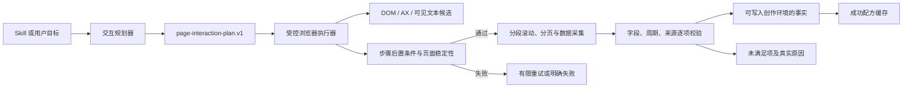

# 交互式数据页面通用采集协议 RFC

**状态：** Draft / 待评审  
**Owner：** Unassigned  
**决策人：** Unknown  
**最后更新：** 2026-08-26

## 摘要

MemoryBread 当前可读取已经打开的网页，也能根据创作目标尝试切换 Tab 和日期，但交互意图主要从自然语言临时解析，执行端依赖少量通用 DOM 选择器，且“目标视图是否到达”“目标指标是否取得”“页面是否真的不存在指标”没有形成严格区分。

本 RFC 提议新增 `memorybread.page-interaction-plan.v1`：由规划层把 Skill 或用户目标转换为结构化、只读的交互计划；浏览器执行层通过语义定位、状态机、显式后置条件和有限重试执行计划；采集与校验层只消费已验证视图中的指标。成功过的语义路径可以作为特定数据源的可失效配方复用，但配方不保存坐标、Cookie、令牌或页面正文。

本方案面向通用数据页面，覆盖 Tab、日期、筛选器、下拉框、查询按钮、展开区、内部滚动容器、分页和虚拟列表，不为 KwaiBI 或单个业务看板写死字段与分支。

## 问题与证据

### 当前问题

数据类页面常常需要先完成页面内操作，才能获得目标数据。例如：

- 切换到指定 Tab、子页或侧边导航项；
- 设置统计日期、组织、项目、模型等筛选条件；
- 点击“查询”或“应用”并等待异步请求完成；
- 展开折叠区域，或滚动看板内部容器触发懒加载；
- 遍历分页、虚拟列表或多个图表区域。

当前实现把 `objective` 原文传给采集器，并从“第二个 tab”等文字中提取序号。浏览器脚本只在有限的 `role` 和 class 模式中查找 Tab。目标控件不满足这些模式时，会出现“页面可见、数据存在，但自动采集没有进入目标视图”的情况。

### 本次故障证据

2026-08-26 的创作记录 ID 100 要求读取 LangBridge 看板第二个 Tab 的六项输入/输出 Token。实时快照记录：

- `interaction.actions = [{kind: "tab_missing", index: 2}, {kind: "period_control_missing", ...}]`；
- `period_verified = false`；
- `page_state.data_complete = false`；
- 六项历史数据存在，但属于上一统计周期，因 `requested_period_mismatch` 被排除；
- 当前视图的四项汇总指标被保留，Writer 随后错误写成“看板未展示拆分数据”。

这说明故障不在指标是否存在，而在“交互未完成”和“结果归因不准确”。

## 目标与结果

- 任意受支持浏览器中的常见报表操作都能由统一协议描述和执行。
- 显式目标视图必须通过后置条件验证后才允许采集目标指标。
- 对每个请求指标独立返回“已验证、未采集到、周期不符、交互未完成”等机器可判定状态。
- 采集失败时保留可恢复路径和审计证据，且不误写成“页面不存在数据”。
- 成功路径可复用，页面改版时自动失效并回退到重新发现。

## 非目标

- 不执行新增、编辑、删除、审批、发送、上传、下载、购买或发布等写操作。
- 不绕过登录、权限、验证码、MFA、反自动化或站点安全策略。
- 不保证对 Canvas 中没有任何 DOM/AX 语义标签的图表做无条件可靠提取。
- 不在客户端写死某个供应商、网站、业务字段或看板 ID。
- 不使用固定屏幕坐标作为持久交互契约。

## 用户与场景

### 创作与任务用户

- 用户要求生成日报、周报或分析文档，目标数据位于网页的特定视图；系统应在不中断正常工作的前提下完成只读交互和取数。
- 用户定义 Skill 时可以用自然语言描述目标，也可以通过界面录制一次安全的只读路径；后续任务复用同一交互意图。

### 采集与维护人员

- 维护人员需要从事件中看到失败发生在哪个步骤、候选控件有哪些、验证条件为何没有满足，而不是只看到 `SCRAPE_FAILED`。
- 页面结构变化后，维护人员可以停用旧配方或补充声明式适配规则，无需修改通用执行器代码。

## 范围

**范围内**

- 交互目标规划、语义控件发现、只读动作执行、页面稳定等待、视图验证、长页/分页采集、字段校验、配方复用和事件观测。
- Chrome 扩展、浏览器附加和专用浏览器窗口使用相同的计划与结果协议。
- 旧 `objective`、`requested_metrics`、`expected_period_start/end` 请求兼容。

**范围外**

- 远程托管浏览器、云端保存网页内容、跨设备同步登录态。
- 自动破解未知控件或在低置信度下试探性点击。
- 用大模型输出直接替代确定性的页面状态验证。

## 核心设计

### 三层架构



1. **交互规划层**：把自然语言目标规范化为动作和验证条件，不直接操作页面。
2. **受控执行层**：发现控件、执行白名单动作、等待页面稳定，并验证每一步后置条件。
3. **采集校验层**：只从已验证视图取数；指标、周期和来源仍按现有证据规则逐项校验。

### 交互计划契约

新增可选请求字段 `interaction_plan`。未提供时，由 Sidecar 根据当前 Skill 步骤生成；旧客户端只传 `objective` 时继续兼容生成计划。

```json
{
  "schema_version": "memorybread.page-interaction-plan.v1",
  "intent": "collect_metrics",
  "safety_mode": "read_only",
  "steps": [
    {
      "id": "open-usage-view",
      "action": "activate",
      "target": {
        "role_hints": ["tab", "navigation_item"],
        "labels": ["用量统计（每周周报）"],
        "ordinal": 2,
        "within": {"labels": ["用量统计"]}
      },
      "postconditions": [
        {"kind": "selected", "target_ref": "self"},
        {"kind": "text_present", "any": ["独立部署输入Tokens", "公共部署输入Tokens"]}
      ]
    },
    {
      "id": "set-period",
      "action": "set_date_range",
      "value": {"start": "2026-08-17", "end": "2026-08-23"},
      "postconditions": [{"kind": "date_range_displayed", "source": "page"}]
    },
    {
      "id": "apply",
      "action": "activate",
      "target": {"role_hints": ["button"], "labels": ["查询", "应用"]},
      "postconditions": [{"kind": "data_stable", "minimum_stable_passes": 2}]
    },
    {
      "id": "collect",
      "action": "collect",
      "scope": "all_scroll_containers",
      "pagination": "until_end"
    }
  ],
  "requested_metrics": [
    "独立部署输入Token",
    "独立部署输出Token",
    "公共部署输入Token",
    "公共部署输出Token",
    "商业模型输入Token",
    "商业模型输出Token"
  ]
}
```

契约中的标签是语义提示，不是唯一 CSS 选择器。`labels` 优先于 `ordinal`；序号只在同一已确认控件组中作为回退，禁止对全页面“第二个疑似 Tab”直接点击。

### 支持的动作

首期动作白名单：

| 动作 | 行为 | 必需验证 |
| --- | --- | --- |
| `wait_for` | 等待控件、文本或加载完成 | 条件命中或超时 |
| `activate` | 激活 Tab、导航项、查询/应用按钮、只读展开项 | 选中态、目标文本或数据刷新至少一项 |
| `set_value` | 设置普通筛选输入 | 页面显示值与目标一致 |
| `select_option` | 选择单选、多选或下拉项 | 已选值可从页面读取 |
| `set_date_range` | 设置开始与结束日期 | 页面显示周期或返回数据周期匹配 |
| `expand` | 展开折叠区域 | 展开态或目标内容出现 |
| `scroll_collect` | 遍历主页面与内部滚动容器 | 到达末端且各分段稳定 |
| `paginate` | 遍历分页或加载更多 | 行身份连续、终止条件明确 |
| `collect` | 汇总当前已验证视图 | 生成采集清单与覆盖率 |

任何不在白名单中的动作必须拒绝执行。控件附近出现“删除、保存、提交、发送、审批、创建、购买、上传、下载、发布”等写操作语义时，即使标签同时命中也必须拒绝。

### 语义定位与候选评分

执行器按以下证据寻找目标控件：

1. AX/ARIA role、accessible name、选中/展开/禁用状态；
2. 可见标签的标准化精确匹配和同义词匹配；
3. 控件所属分组、附近标题、父子关系和目标区域锚点；
4. 站点稳定属性，例如 `data-testid`，但不依赖动态 class 哈希；
5. 同组序号回退；
6. 可选站点声明式适配器提供的额外候选，不允许直接绕过安全和验证规则。

候选必须达到置信度阈值且第一、第二候选分差足够大。候选歧义时返回 `INTERACTION_TARGET_AMBIGUOUS`，不得试点多个控件。

### 执行状态机

每个步骤依次进入：

`planned → discovering → ready → executing → waiting → verifying → completed`

可能的终止状态：

- `target_not_found`：没有达到阈值的候选；
- `target_ambiguous`：存在多个近似候选；
- `action_blocked`：动作不在只读白名单或触发风险词；
- `postcondition_failed`：点击或设置后未进入目标状态；
- `page_unstable`：加载、刷新或虚拟列表始终不稳定；
- `permission_blocked`：浏览器、站点或焦点权限不允许；
- `completed_partial`：交互完成，但部分请求指标没有通过字段校验。

每一步最多使用同一候选执行一次；后置条件失败后可重新发现并使用一个不同的高置信度候选再试一次。禁止无限重试和连续点击。

### 视图与数据验证

交互完成不等于数据可用。采集结果必须分别报告：

- `interaction_status`：目标交互是否完整完成；
- `view_status`：目标 Tab、筛选值、日期和加载状态是否验证；
- `collection_status`：主容器、内部滚动区和分页是否遍历完整；
- `metric_results[]`：每项指标的 `verified`、`not_observed`、`period_mismatch`、`evidence_rejected`；
- `incidental_claims[]`：当前页上通过验证、但不属于本步骤请求的其他指标。

若显式目标视图没有验证通过，`metric_results` 不得标记为 `verified`，`incidental_claims` 不得进入当前 Skill 步骤正文。它们可以留作调试或其他查询的候选，但必须与目标结果隔离。

用户可见措辞必须基于系统实际知道的事实：

- 允许：“本次自动采集未能定位目标 Tab，因此未取得六项指标。”
- 允许：“已进入目标视图，其中四项通过验证，两项未在本次采集范围内观察到。”
- 禁止：“看板未展示六项指标”，除非已验证目标视图、完成全部滚动/分页，并有充分证据证明页面不存在这些字段。

### 成功配方复用

一次计划完整通过后，可按规范化 `source_url + 页面结构指纹 + 计划目标` 保存交互配方：

- 只保存语义定位信息、相对分组关系、成功后置条件和结构指纹；
- 不保存坐标、Cookie、令牌、表单敏感值或页面正文；
- 页面指纹不匹配、后置条件失败或连续一次执行失败时，配方立即失效并回到通用发现；
- 配方始终经过动作白名单和后置条件验证，不能成为绕过安全检查的脚本。

## 需求

- **FR-001** — 当 Skill 或用户目标要求页面操作时，系统必须生成或接收版本化的结构化交互计划，而不是只把自然语言目标交给点击脚本。
- **FR-002** — 执行器必须使用可访问性语义、可见标签、分组关系和稳定属性发现控件，并仅在同组内使用序号回退。
- **FR-003** — 每个交互步骤必须声明至少一个可观察后置条件；后置条件未通过时不得进入下一依赖步骤。
- **FR-004** — 执行器必须只执行只读动作白名单，并拒绝可能产生写入或外部副作用的控件。
- **FR-005** — 日期与筛选器设置后，系统必须从页面显示状态或返回数据中验证实际生效值，不得以“已点击/已输入”代替验证。
- **FR-006** — 系统必须发现并遍历页面主滚动区、内部滚动容器、分页和虚拟列表，直到达到可证明的结束条件或明确标记部分完成。
- **FR-007** — 系统必须分别输出交互、视图、采集和指标四层状态，并为每个请求指标返回独立结果。
- **FR-008** — 显式目标视图未验证时，系统必须隔离当前页的偶然指标，禁止将其作为当前步骤的目标结果。
- **FR-009** — 系统必须限制每步重试次数；候选歧义或后置条件持续失败时返回稳定错误，不得连续试点多个控件。
- **FR-010** — 系统可以缓存完整成功的语义交互配方，但页面指纹变化或执行失败时必须自动失效。
- **FR-011** — Writer 和质量检查必须依据机器状态生成缺失说明；只有完成目标视图和完整采集后，才能断言页面未展示某字段。
- **FR-012** — Chrome 扩展、浏览器附加和专用窗口必须消费同一交互计划并返回同一结果模型。
- **NFR-001** — 交互计划和事件不得包含 Cookie、Authorization、验证码、密钥或敏感页面正文。
- **NFR-002** — 单来源默认最多 12 个交互步骤、每步最多 2 次候选尝试、总交互时间最多 60 秒；调用方可以配置更低上限。
- **NFR-003** — 用户主动切换应用触发焦点策略阻断后，系统不得重新抢占焦点。
- **NFR-004** — 新契约字段必须可选，旧客户端和历史快照必须保持可读。
- **NFR-005** — 在标准测试页面上，相同结构、相同计划连续执行 20 次，交互目标选择必须保持一致且不得触发写操作。

## 接口与契约

### 请求扩展

`webpage_scrape_request` 新增：

- `interaction_plan?: page_interaction_plan_v1`；
- `interaction_limits?: {max_steps, max_attempts_per_step, timeout_ms}`；
- `recipe_policy?: "auto" | "ignore" | "require_fresh"`。

现有 `objective`、`requested_metrics` 和 `expected_period_start/end` 保留。服务端优先使用 `interaction_plan`；未传时生成计划；两者冲突时以结构化计划为准，并在事件中记录兼容降级来源。

### 响应扩展

`webpage_scrape_response.structured_data` 新增：

```json
{
  "interaction_result": {
    "schema_version": "memorybread.page-interaction-result.v1",
    "status": "completed|completed_partial|failed",
    "steps": [],
    "view_status": "verified|unverified",
    "collection_status": "complete|partial|not_started",
    "metric_results": [],
    "incidental_claims": [],
    "recipe": {"used": false, "saved": true, "invalidated": false}
  }
}
```

### 新增稳定错误码

| 错误码 | 含义 | 恢复方式 |
| --- | --- | --- |
| `INTERACTION_PLAN_INVALID` | 计划结构、依赖或动作不合法 | 重新规划，不执行页面动作 |
| `INTERACTION_ACTION_BLOCKED` | 动作可能写入或产生副作用 | 停止并要求调整目标 |
| `INTERACTION_TARGET_NOT_FOUND` | 未发现高置信度目标控件 | 重新发现、更新语义目标或适配器 |
| `INTERACTION_TARGET_AMBIGUOUS` | 多个候选无法安全区分 | 补充标签、分组或稳定属性 |
| `INTERACTION_POSTCONDITION_FAILED` | 动作完成但目标状态未验证 | 使用另一候选重试一次或停止 |
| `INTERACTION_PAGE_UNSTABLE` | 页面在预算内未稳定 | 保留旧快照并稍后重试 |
| `INTERACTION_COLLECTION_PARTIAL` | 未完成全部滚动、分页或虚拟列表 | 只采用已逐项验证的部分结果 |

## 权限、隐私与失败行为

- 所有页面交互都在用户现有浏览器安全上下文中执行，不复制或导出登录凭据。
- 计划生成可以参考用户目标和页面控件摘要，但不能把原始私密页面正文写入日志或遥测。
- 事件默认记录步骤 ID、动作类型、候选数量、选中控件的脱敏标签哈希、耗时、后置条件和错误码；本地调试模式才可显示可见标签。
- 登录、验证码、MFA 或权限提示出现时，停止自动交互并返回现有鉴权错误，不尝试绕过。
- 交互失败时不覆盖最近成功快照；部分成功只能追加新快照中已验证的指标，并保留完整性状态。

## 验收标准与追踪

- **AC-001** — 验证 **FR-001、FR-012、NFR-004**。给定只含旧 `objective` 的请求，系统生成 v1 计划并在三种浏览器通道返回同结构结果；给定显式计划时不再解析序号点击。
- **AC-002** — 验证 **FR-002**。给定一个无 `role=tab`、但有可见标签和导航分组的测试页，系统能选择目标项；页面另一区域存在第二个相似控件时不会误选。
- **AC-003** — 验证 **FR-003、FR-005**。给定点击后未切换选中态或日期未实际生效的页面，下一步骤不执行，结果返回后置条件失败。
- **AC-004** — 验证 **FR-004、NFR-005**。给定“查询”和“提交审批”并存的页面，执行器只允许查询；20 次回归均不触发写操作。
- **AC-005** — 验证 **FR-006**。给定包含主页面滚动、内部纵向滚动、横向列和两页数据的测试页，采集结果包含所有行列且行身份不串联。
- **AC-006** — 验证 **FR-007、FR-008**。给定目标 Tab 切换失败但当前页存在其他指标的页面，目标指标状态为交互未完成，偶然指标只进入 `incidental_claims`，Writer 不消费它们。
- **AC-007** — 验证 **FR-009、NFR-002**。给定两个同分候选或永不稳定的页面，执行在预算内停止，每步尝试次数和总耗时不超限。
- **AC-008** — 验证 **FR-010**。给定成功配方，第二次执行可复用；修改页面结构指纹后配方失效并重新发现，不继续使用旧定位。
- **AC-009** — 验证 **FR-011**。给定 `view_status=unverified`，成文只能说明“本次未完成目标视图采集”；给定完整视图和完整滚动均验证且字段未观察到，才允许说明页面未展示。
- **AC-010** — 验证 **NFR-001、NFR-003**。事件与配方中不出现凭据或正文；用户切换应用后会话停止且焦点接管次数不增加。

## 可观测性

- **OBS-001** — 记录 `interaction_plan_created`：来源类型、步骤数、动作类型分布和规划来源，用于判断自然语言兼容路径的使用比例。
- **OBS-002** — 记录 `interaction_step_completed/failed`：步骤类型、候选数、尝试数、耗时、后置条件和错误码，用于定位控件发现与页面稳定性问题。
- **OBS-003** — 记录 `interaction_collection_coverage`：目标指标数、验证数、周期不符数、未观察数、采集完整性，用于衡量真实取数成功率。
- **OBS-004** — 记录 `interaction_recipe_used/saved/invalidated`：只含来源 ID、结构指纹和结果，不含 URL 查询敏感值或页面正文，用于判断配方收益和失效率。
- **OBS-005** — 质量检查记录 `unsupported_page_absence_claim`，用于阻止“未采集到”被改写为“页面不存在”。

建议核心指标：显式交互任务的目标指标全量验证率、部分验证率、交互失败率、误归因拦截次数、配方命中率、平均交互耗时。首期不承诺目标数值，在灰度基线形成后再设门槛。

## 发布、迁移与回滚

- **ROLL-001** — 第一阶段只新增协议、事件和回放测试，旧执行器仍工作；对现有请求生成“影子计划”，不执行计划，用于比较目标识别结果。
- **ROLL-002** — 第二阶段在本地测试页和手动触发刷新中启用新执行器，只开放 `activate`、`set_date_range`、`scroll_collect` 和 `collect`。
- **ROLL-003** — 第三阶段对创作任务灰度启用，保留旧执行器开关；若写操作拦截异常、目标误选或失败率显著高于基线，立即关闭新执行器。
- **ROLL-004** — 第四阶段加入筛选器、分页、虚拟列表和成功配方；每类动作独立开关、独立回滚。
- **ROLL-005** — 旧快照无需迁移；旧 `interaction.actions` 继续只读展示，新结果使用版本字段区分。

回滚只需关闭 `page_interaction_plan_v1_enabled`，请求继续走现有 `objective` 兼容路径。已保存配方保留但不执行，不删除用户数据。

## 交付切片

1. **契约优先**：扩展 `data-tools.schema.json`、稳定错误码和交互结果模型。
2. **执行器骨架**：动作白名单、状态机、候选评分、后置条件、重试预算。
3. **核心控件**：Tab/导航、日期、查询按钮、滚动容器。
4. **结果隔离**：目标指标与偶然指标分离，Writer 与质量检查消费状态。
5. **复杂容器**：下拉、多选、分页、虚拟列表、横向表格。
6. **配方与灰度**：结构指纹、成功配方、本地观测和回滚开关。

## 风险与缓解

- **误点写操作**：以动作白名单、风险词、控件上下文和后置条件四层拦截；不允许自定义脚本绕过。
- **页面语义不足**：允许声明式站点适配器补充候选，但仍走统一安全与验证层；不能直接保存坐标脚本。
- **页面频繁改版**：结构指纹使配方自动失效；通用发现始终是回退路径。
- **异步加载误判完成**：结合网络/加载节点、正文哈希、指标值稳定性和连续稳定轮次，不只依赖固定等待。
- **长页面成本过高**：先按目标标签定位相关容器，再在必要范围内分段；全量要求时才遍历所有容器。
- **自然语言歧义**：规划层输出候选和未决项；低置信度计划不执行高风险交互。

## 开放问题与待决策

- Skill 编辑器是否首期提供结构化交互步骤配置，还是只保留自然语言并显示系统解析预览？这影响用户可控性和首期 UI 范围。
- 是否允许用户通过一次手动演示生成配方？若允许，需要单独定义录制中的敏感输入排除和动作审核。
- Canvas 图表完全无 DOM/AX 标签时，是否允许“截图 OCR 标签 + 邻近位置”作为控件或指标语义来源？这需要单独的准确率门槛。
- 站点声明式适配器由内置版本发布，还是允许本地插件提供？后者需要额外的签名、权限和审计设计。

## 变更历史

- 2026-08-26 — 初稿：基于创作记录 ID 100 的第二 Tab 采集失败，提出通用交互计划、受控执行状态机和字段级结果验证方案。
