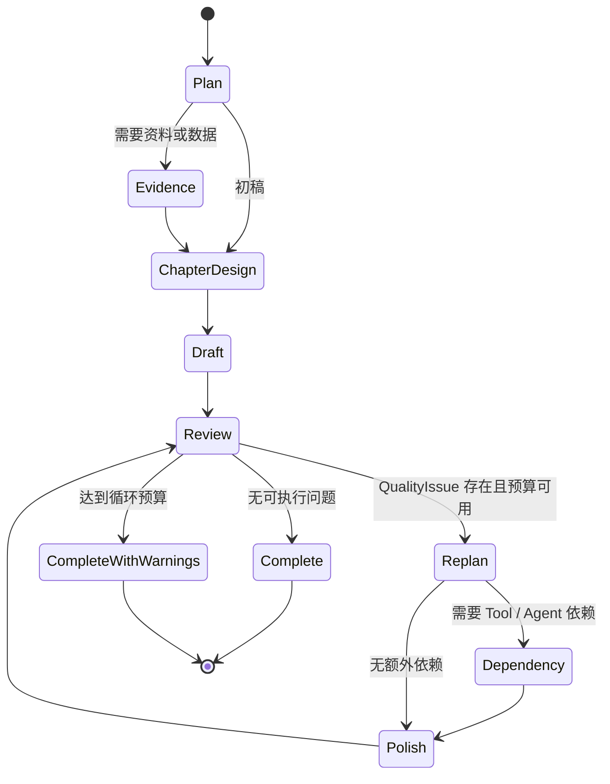

# MemoryBread 创作 Harness + Loop 质检优化规格

> 状态：已实现，等待产品验收  
> 决策阶段：Build-ready 变更规格  
> 最后更新：2026-08-01  
> 影响范围：MemoryBread `ai-sidecar`、创作页面、创作 Skill 契约与架构文档  
> 协议：兼容 `creation.agent.v1`

## 1. 问题与证据

现有创作链路已经具备目标、环境、动态计划、暂停恢复和 Tool 反馈，但文档生成仍主要收束为“文档撰写 Agent → 质量审校 Agent → 最多再写一次”。这会带来三个结果：初稿之前没有独立章节设计；质检只能判断正文长度与结构，不能把问题分派给对应编辑能力；一次笼统重写会同时改动内容、表达和格式，用户难以判断每一步解决了什么。

公开研究给出了可用于本产品的设计依据：

- [CAT-LLM](https://arxiv.org/abs/2401.05707)把中文长文风格拆到词与句子层级，并用显式风格定义驱动迁移，说明“按层分析再改写”比一句“写得像人”更适合作为工程契约。
- [ChatGPT vs Human-authored Text](https://aclanthology.org/2023.acl-srw.1/)发现人类文本的风格变化更大，模型文本在词类分布上存在差异，并提醒风格迁移可能引入事实错误。因此去 AI 味必须与事实保真同时验收。
- [Why Does ChatGPT “Delve” So Much?](https://arxiv.org/abs/2412.11385)用大规模语料识别模型输出中的词汇过度代表现象，支持对高频套话做可观察统计，而不是依赖不透明的“AIGC 概率”。
- [Can You Make It Sound Like You?](https://aclanthology.org/2026.acl-long.2030/)显示人工后编辑能提高个人风格相似度，但成文仍可能保留模型风格痕迹，支持“专项改写后再次质检”的闭环。
- [Codex best practices](https://learn.chatgpt.com/guides/best-practices.md)强调为长任务保留目标、约束、完成定义、工具反馈、测试与复核。本方案把这些原则映射为持久 LoopState、能力白名单、质量问题、执行预算和终止条件。

以上证据用于改善可读性和作者感，不用于规避 AIGC 检测器，也不承诺通过任何第三方检测。

## 2. 目标与非目标

### 2.1 目标

1. 初稿生成之前形成章节蓝图，明确每章目的、问题、证据、表达形式和完成标准。
2. 初稿完成后，把质量问题变成可执行、可追踪的缺陷，并由 Harness 动态选择 Agent、Tool 或 Skill 上下文。
3. 分离内容深度、自然表达、表格、字体强调和代码图示的编辑职责，每次修改后再次质检。
4. 保持本地模型与品牌模型使用同一状态机，保留外部模型暂停与恢复能力。
5. 保留事实、来源、数据口径和用户已确认内容；证据不足时记录缺口，不补造事实。

### 2.2 非目标

- 不实现以绕过 AIGC 检测器为目标的对抗改写。
- 不让专项 Agent 绕过 Harness 任意访问网络、文件或未启用 Tool。
- 不在 Markdown 中执行任意 HTML、CSS 或脚本。
- 不要求每份文档都包含表格、字体强调或图示；只有质检命中对应问题时才追加能力。
- 不改变 MemoryBread 客户端的品牌模型边界，不下发供应商模型名、密钥或购买成本。

## 3. 用户、角色与场景

主要用户是使用创作页生成方案、总结、周报、PRD、技术文档和运营材料的个人工作者。用户只需要给出目标和已有材料，系统负责解释计划与修改范围；用户仍可通过后续对话调整约束。

运行角色包括：

| 角色 | 责任 | 输出 |
| --- | --- | --- |
| 创作 Agent / Harness | 维护目标、环境、计划、游标、预算和终止条件 | `harness.decision`、LoopState |
| 章节设计 Agent | 在初稿前设计章节蓝图 | `chapter_design` |
| 文档撰写 Agent | 根据蓝图、证据和 Skill 生成初稿或结构性重写 | 完整 Markdown |
| 质量审校 Agent | 计算可观察指标并生成质量问题 | `quality_review`、`quality_issues[]` |
| 去 AI 味 Agent | 处理套话、机械衔接、装饰性引号、冗长复句和语气同质化 | 完整 Markdown 与 Patch |
| 细节润色 Agent | 补齐对象、边界、依据、动作、结果和验证 | 完整 Markdown 与 Patch |
| 表格润色 Agent | 补充或修复逐项比较、职责映射和验收矩阵 | 合法 Markdown 表格 |
| 字体润色 Agent | 对少量关键结论、数字、风险和行动项增加强调 | 使用 `**重点**` 的完整 Markdown |
| 图片润色 Agent | 为复杂关系补充 PlantUML 或 Mermaid 代码图 | 可编辑代码块与说明 |

典型场景：用户要求生成架构方案。Harness 先运行证据 Tool 和方案设计，再运行章节设计与初稿。质检若同时发现章节过薄、缺少架构图、套话密集和没有重点标识，会按依赖与编辑顺序追加“细节 → 图示 → 去 AI 味 → 字体 → 再质检”，而不是重新执行一条固定流水线。

## 4. 状态、接口与动态循环



质量问题采用以下兼容性内部契约；它作为 `environment_patch` 的新增字段，不改变现有事件必填字段：

```text
QualityIssue {
  code: string
  severity: hard | soft
  agent_id: allowlisted agent id
  summary: string
  evidence: object
  required_capabilities: allowlisted tool or agent ids[]
}
```

Harness 每完成一个 Agent、Tool 或 Skill 步骤就重新读取环境。依赖请求不由子 Agent 直接执行：质量问题声明 `required_capabilities`，主 Harness 校验白名单、用户 Tool 开关、已完成步骤、未来计划与预算后插入计划。数据型细节问题可追加数据检索并根据结果继续追加网页刷新或数据分析；图示问题可在 PlantUML Tool 已启用时先生成画图约束，再交给图片润色 Agent；已应用 Skill 若包含匹配的结构、语气、表格、字体或图片规则，则通过独立 `skill.completed` 步骤在本轮动态激活，随后注入专项 Agent 上下文。

终止条件：全局最多 64 步；自动质量优化最多 3 轮；正文缺失、结构缺失或修订无差异只允许一次文档撰写重试；预算用尽时交付当前完整版本并保留问题代码。

## 5. 功能需求

- FR-001 — 当运行模式为通用首次创作且没有明确 Skill 时，Harness 必须把章节设计 Agent 放在首个文档撰写 Agent 之前。
- FR-002 — 章节设计 Agent 必须输出章节顺序、每章目的、关键问题、可用证据、建议表达形式和完成标准，不得编写正文或补造事实。
- FR-003 — 文档撰写 Agent 必须消费 `chapter_design`、Tool 证据、专业 Agent 结论和已应用 Skill，并输出完整 Markdown。
- FR-004 — 通用创作链路每次文档写入或专项润色后，质量审校 Agent 必须产生布尔质检指标和结构化 `quality_issues[]`。
- FR-005 — 通用创作 Harness 必须依据质量问题的 `agent_id` 与 `required_capabilities` 动态插入允许的 Agent、Tool，并在每轮末尾再次插入质量审校 Agent。
- FR-006 — 去 AI 味 Agent 必须处理装饰性引号、高频套话、机械衔接、语义冗余和长句堆叠，同时保持事实、来源、语义强度和目标语域。
- FR-007 — 细节润色 Agent 必须优先补齐质检指出的短章节或跳步论证；当数据证据不足时必须保留口径或待核验项，不得编造数字。
- FR-008 — 表格润色 Agent 必须输出列数一致的标准 Markdown 表格；创作页面必须为表头渲染品牌背景色、边框和对齐，为正文渲染斑马纹。
- FR-009 — 字体润色 Agent 必须使用标准 Markdown `**重点**` 做选择性强调；创作页面必须把 `strong` 渲染为品牌色、加粗和下划线。
- FR-010 — 图片润色 Agent 必须只为复杂关系、状态、流程或时序补充可编辑代码图；PlantUML Tool 可用时优先 PlantUML，否则使用 Mermaid。
- FR-011 — 任一文档修改 Agent 必须输出完整 Markdown；运行时必须计算相对上一版本的 Patch，并在页面流式替换当前预览。
- FR-012 — 外部品牌模型执行章节设计、初稿和专项润色时，Loop 必须支持 `model.request → run.paused → run.resumed`，恢复后继续原计划。
- FR-013 — 质量问题无法在预算内清除时，运行必须以当前完整文档结束，并在 `quality_warnings` 中返回剩余问题代码。
- FR-014 — Skill 编辑器必须把章节设计和五类专项润色 Agent 作为受控可选能力；默认生成的创作工作流必须包含章节设计、初稿和质检步骤，不预置固定润色链。
- FR-015 — 明确 Skill 的 `execution_steps` 必须作为唯一初始执行契约。Harness 只能调用步骤中声明且已启用的 Tool/Agent，不得追加通用章节设计、Writer、质量审校或专项润色；但步骤声明的 `data_search` 命中实时报表时，允许在同一步追加取得当前快照所必需的 `webpage_scrape`，不得继续隐式追加数据分析 Agent。网页刷新只把本轮 AX/DOM 程序化验证通过的指标写回环境；`retain_webpage_screenshot` 只控制截图附件并缺省为 `true`，不得改变取数和可用性判断。本轮已尝试刷新的报表不得再从同 URL 历史派生数据回退。没有声明子 Agent 的步骤由创作 Agent 自己完成并按顺序组装。
- FR-016 — Skill 的 `example_document` 只用于编辑器预览与人工理解风格，不得进入运行时 `applied_skills`、模型事实环境、检索词、章节义务或证据缺口。`field_examples` 可用于复刻句式与排版，但其中的虚构业务主题同样不得形成事实要求。证据缺口只能来自用户原始需求、当前 `execution_steps` 明确写出的目标/产出，或已有证据之间可观察的不一致。

## 6. 非功能、隐私与兼容要求

- NFR-001 — `creation.agent.v1` 的现有必填字段和事件类型保持兼容；新增质量字段只能作为可选 `data` 或 `environment_patch` 内容。
- NFR-002 — 计划项必须来自运行时白名单；未知 Agent、Tool 和 Skill 资源不得执行。
- NFR-003 — Tool 仍受用户启用状态、现有权限和错误码约束；专项 Agent 不获得额外文件、网络或凭据权限。
- NFR-004 — 日志、事件和历史轨迹不得保存 prompt、外部模型密钥、供应商模型名、购买成本或本地敏感正文；文档内容沿用现有历史存储边界。
- NFR-005 — 去 AI 味判断必须暴露可观察信号及阈值，不输出第三方检测概率，不把检测器结果作为完成条件。
- NFR-006 — 质量循环必须由 `MAX_LOOP_STEPS=64`、`MAX_QUALITY_CYCLES=3` 和单次硬失败重试限制共同约束。

## 7. 可观察性

- OBS-001 — 每次质量审校事件必须包含问题数量、问题代码和质量轮次。
- OBS-002 — 每次动态规划必须产生 `harness.decision`，记录触发步骤、状态、原因代码、追加能力和错误码。
- OBS-003 — 每个专项润色必须产生 `document.patch.planned`、流式 delta、`document.patch.applied` 和 `agent.completed`，历史轨迹保存脱敏后的 Patch 摘要。
- OBS-004 — 运行完成事件必须返回最终文档、Tool 结果、Skill、Patch、目标和剩余质量警告。

## 8. 验收标准与追踪

- AC-001 — 给定一个没有明确 Skill 的首次创作请求，当构建计划时，验证 `chapter_design_agent` 位于首个 `document_writer_agent` 之前，覆盖 FR-001、FR-002、FR-003。
- AC-002 — 给定包含装饰性引号、重复套话和机械衔接的长文，当质量审校执行时，必须观察到 `ai_style_signals` 并路由 `anti_ai_style_agent`，覆盖 FR-004、FR-005、FR-006。
- AC-003 — 给定同时包含细节、表格、图示、自然表达和重点标识问题的质量反馈，当 Harness 重规划时，验证匹配 Skill、依赖与专项 Agent 按受控顺序插入且最后再次质检，覆盖 FR-005、FR-007、FR-008、FR-009、FR-010。
- AC-004 — 给定数据型短章节且没有可用数据分析，当质量问题声明数据依赖时，必须先观察数据检索反馈，再由 Harness 决定是否调用网页刷新和数据分析，覆盖 FR-005、FR-007。
- AC-005 — 给定一个专项润色模型返回的完整 Markdown，当应用结果时，必须观察相对上一版本的 Patch、更新后的预览和完整文档，覆盖 FR-011。
- AC-006 — 给定外部品牌模型模式，当章节设计或任一文档修改 Agent 请求推理时，必须暂停并携带 continuation；恢复后必须从原步骤继续，覆盖 FR-012。
- AC-007 — 给定同一问题连续 3 轮未清除，当再次质检时，必须停止追加能力并在完成事件中保留问题代码，覆盖 FR-013。
- AC-008 — 给定 Skill 编辑器，当读取 Agent 选项与默认步骤时，必须观察章节设计、五类专项润色能力以及“章节设计 → 初稿 → 质检”，覆盖 FR-014。
- AC-009 — 给定包含合法 Markdown 表格和 `**重点**` 的文档，当创作预览渲染时，验证表头具有品牌背景色且重点文字具有品牌色、加粗和下划线，覆盖 FR-008、FR-009。
- AC-010 — 给定旧版 `creation.agent.v1` 事件与历史记录，当新版页面读取时，必须继续展示文档和执行轨迹；给定未知能力 ID，运行时必须跳过而不是执行，覆盖 FR-012、FR-014。
- AC-011 — 给定一个只声明三步和 `memory_search`、`data_search` 的明确 Skill，当执行完成时，验证步骤顺序不变，未出现章节设计、Writer、质量审校、数据分析或网页刷新，最终 Markdown 仅有这三个步骤标题，覆盖 FR-015。
- AC-012 — 给定 `example_document` 含“国产卡切换、潮汐调度、推理引擎优化”，但用户请求与 `execution_steps` 均未包含这些主题，验证运行时 Prompt、检索词、最终文档和证据缺口均不出现三个主题，覆盖 FR-016。
- AC-013 — 给定声明 `data_search` 的 Skill 步骤，旧数据或未配置时验证默认保留分段长截图；显式设置 `retain_webpage_screenshot=false` 时验证仍执行 AX/DOM 网页读取且指标可用，但不发预览事件、不创建图片资产、不插入证据卡，覆盖 FR-015。

## 9. 发布、迁移与回滚

- ROLL-001 — 首先发布 Sidecar 的 Agent 白名单、质量问题与 Harness 重规划，再发布前端 Agent 目录和样式；同一桌面安装包内保持版本一致。
- ROLL-002 — 现有创作记录无需迁移。`LoopState.restore` 为旧 continuation 补 `quality_cycles=0`，旧事件缺少新增字段时页面按空值处理。
- ROLL-003 — 回滚时可恢复旧的质量重试分支和前端 Agent 目录；数据库与 `creation.agent.v1` 不需要降级。
- ROLL-004 — 发布前必须通过 Creation Loop 定向测试、Skill 测试、前端类型检查和产品规格审计；失败时不得把状态标记为已验收。

## 10. 风险与保护措施

| 风险 | 可观察信号 | 保护措施 |
| --- | --- | --- |
| 多个润色 Agent 相互覆盖 | 同一轮 Patch 大范围反复变更 | 每个 Agent 输出完整文档但只处理分派问题；每轮结束统一质检 |
| 去 AI 味损伤事实 | 数字、来源或语义强度变化 | Prompt 明确保真；数据和来源继续进入环境；质检保留证据缺口 |
| 文档被过度格式化 | 粗体占比高、无必要图表 | 粗体比例阈值、表格与图示意图判断、最多 3 轮 |
| Tool 失败导致死循环 | 相同错误码重复出现 | 已完成键去重、错误码写回环境、64 步总限制 |
| 旧 continuation 无法恢复 | 恢复时报字段缺失 | `restore` 为新增状态字段提供默认值 |

## 11. 开放问题与决策

当前没有阻断发布的开放决策。后续可评估两项增强：基于用户历史文档建立本地风格向量，用于比较润色前后的作者风格相似度；允许质量审校模型提出候选问题，但候选仍必须经过确定性白名单、阈值与预算校验。两项都不在本次范围内。

## 12. 变更记录

| 日期 | 变更 |
| --- | --- |
| 2026-08-01 | 建立章节设计、结构化质量问题、五类专项润色、动态依赖、循环预算、前端样式与验收追踪。 |
