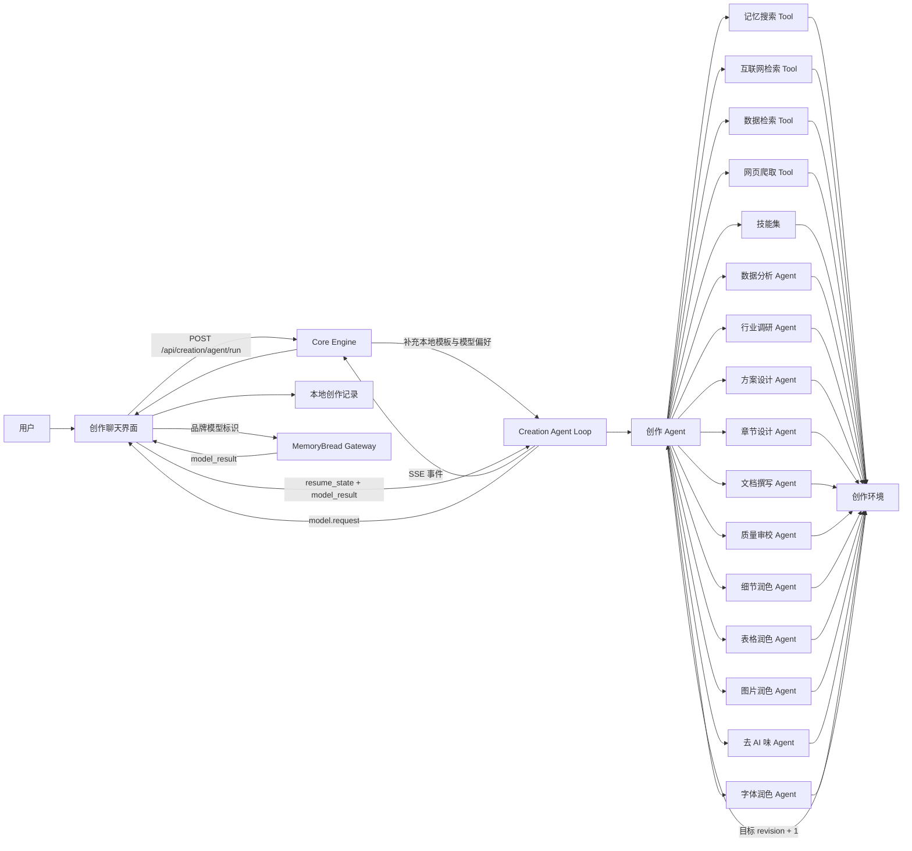

# MemoryBread 创作功能 Agent 架构设计方案

> 状态：已落地
> 日期：2026-08-01
> 协议版本：`creation.agent.v1`

## 1. 摘要

创作功能已从“一次输入、一次生成”的单模型调用升级为目标驱动的 Loop Agent：

- 创作 Agent 维护目标、验收条件、环境、动态计划和执行游标；
- 数据分析、行业调研、方案设计、章节设计、文档撰写、质量审校和五类专项润色 Agent 各自只负责一个专业结果；
- 记忆搜索、互联网检索、数据检索与网页爬取 Tool 为 Agent 提供可追溯证据；
- 已安装的技能同时提供触发描述、执行工作流和风格指纹；命中 Skill 的有序步骤可以编排其明确声明的受控 Agent、已启用 Tool 和本轮协同 Skill；
- 每次 Agent、Tool、Skill 完成后都会把结果写回环境、递增目标修订号，再由创作 Agent 执行或插入下一步；
- 没有明确 Skill 时，初稿前先由章节设计 Agent 生成章节蓝图，初稿后质量审校输出结构化问题，Harness 按问题动态追加依赖、专项润色与再次质检，最多自动优化三轮；明确 Skill 时只执行 Skill 步骤中声明的 Agent/Tool，`data_search` 命中实时报表时仅补齐同一步的 `webpage_scrape` 采集依赖；
- 会话把首轮完整要求固化为 `root_request`；客户端遗漏上下文时，Core 也会按 `session_id` 从本地历史恢复原始需求、最近文档和对话；
- 后续“补充、修改、删除”会先形成可解释的编辑意图，再由 Writer 在完整文档上下文中判断所有受影响位置；目标章节只是线索，目录、摘要、编号、交叉引用、方案、计划、风险和验收可在同一轮联动修订；
- 修订完成后由 Sidecar 计算逐行差异，Patch 同时记录新增、修改、删除的章节与行号，页面据此标出本轮改动；
- 云端品牌模型通过“暂停、调用、恢复”模式接入，不向客户端暴露供应商模型名、供应商密钥或购买成本；
- 创作页面支持多轮对话、文档持续修订、执行轨迹、意图与判断摘要、局部变更范围、用户确认、参考资料、创作记录和 Skill 沉淀。

本次实现保留原 `/api/creation/generate`，新客户端优先调用 Agent 接口；旧 Core 未升级时仍可回退到原生成链路。

## 2. 设计目标与边界

### 2.1 目标

1. 用户点击“开始创作”后，必须经过创作 Agent 对 Agent、Tool、Skill 的动态编排，而不是把全部能力塞进一个固定提示词。
2. 任一能力的执行结果必须成为下一步可消费的环境状态，并同步更新目标。
3. 本地模型和品牌模型共用同一套 Loop，不复制两套业务编排。
4. 首次创作和后续修订使用同一会话模型；原始需求必须独立于滑动对话窗口持久保存。
5. 后续指令始终在完整文档上下文中修订，尽量保留未受影响内容，同时允许一轮修改多个章节。
6. 执行过程对用户可观察；展示意图、决策摘要、能力调用、结果和变更范围，不展示模型私有思维链。
7. 参考资料、脱敏 Agent 轨迹、完整会话、最新文档快照和目标随创作记录持久化，可恢复后继续优化。
8. 遵循 Local First，并保持客户端只识别 MemoryBread 品牌模型。

### 2.2 非目标

- 本期不把创作 Agent 做成可任意执行代码或任意访问网络的通用自治 Agent。
- 本期不允许 Skill 自己声明未审核的系统权限；Skill 可以声明工作流资源，但 Agent/Tool 必须来自运行时白名单，Tool 还必须由用户启用，引用 Skill 只有在本轮已选中或命中时才会进入环境。
- 本期不做跨设备实时续跑。创作记录可随现有资产机制备份，但运行中的 continuation 只用于当前请求链。
- 本期不承诺对重复 `run_id` 自动去重。事件 ID、会话 ID 和运行 ID 已具备，服务端幂等执行可作为后续增强。

## 3. 全局架构



### 3.1 分层职责

| 层 | 职责 | 不负责 |
| --- | --- | --- |
| Desktop UI | 会话输入、事件展示、确认、外部模型暂停恢复、文档预览、历史持久化 | 决定业务编排、解析供应商模型 |
| Core Engine | 稳定本地 API、补充模板和偏好、SSE 透传、本地数据库迁移与历史存储 | 在 Rust 层复制 Agent 规划 |
| Creation Sidecar | 目标状态机、动态计划、Tool/Skill/Agent 执行、质量回路 | 保存用户账号或云端凭证 |
| Gateway | 使用稳定品牌模型标识完成受控推理 | 接收本地供应商密钥、返回供应商信息给客户端 |
| Storage | 保存会话、文档、参考资料、轨迹和目标快照 | 保存外部模型提示、continuation 或供应商成本 |

## 4. Agent 设计

### 4.1 Agent 目录

| Agent | 触发条件 | 输入 | 输出到环境 | 完成标准 |
| --- | --- | --- | --- | --- |
| 创作 Agent | 每轮必选 | 用户本轮要求、当前文档、选项、Skill | `plan_summary`、目标状态 | 形成剩余能力计划 |
| 数据分析 Agent | 数据型文档，或指令包含数据、指标、分析、统计、趋势、成本或收益 | 数据检索与网页刷新结果、目标、资料、现有文档 | `data_analysis` | 核对口径、周期、采集时间和 `can_use`，给出结论与证据缺口，不编造数字 |
| 行业调研 Agent | 开启互联网检索或任务需要最新信息 | Web Tool 结果、目标 | `industry_research` | 结论保留来源 URL，标出待核验信息 |
| 方案设计 Agent | 指令或文档类型包含方案、架构、PRD、设计、规划、建设 | 约束、参考、分析、Skill | `solution_design` | 明确边界、关键决策、组件、步骤、风险和验证 |
| 章节设计 Agent | 通用首次创作，或明确 Skill 的步骤显式声明 | 目标、读者、文档类型、证据、Skill | `chapter_design` | 每章包含目的、问题、证据、形式和完成标准 |
| 文档撰写 Agent | 通用创作每轮必选；明确 Skill 仅在步骤显式声明时调用 | 原始需求、编辑意图、完整现有文档、分析结论 | `document` 和 `last_document_patch` | 首轮输出完整 Markdown；后续输出联动修订后的完整 Markdown |
| 质量审校 Agent | 通用创作文档完成后必选；明确 Skill 仅在步骤显式声明时调用 | 文档、修订基线、目标和验收条件 | `quality_review`、`quality_issues` | 输出布尔指标、问题代码、目标 Agent、证据和依赖能力 |
| 去 AI 味 Agent | 命中模板词、机械衔接、装饰性引号或长句堆叠 | 完整文档、风格信号、Skill 语气 | 完整 Markdown 与 Patch | 表达自然且事实、来源、语义强度不变 |
| 细节润色 Agent | 章节过短、存在占位或观点缺少依据与动作 | 完整文档、短章节、证据与分析 | 完整 Markdown 与 Patch | 补齐对象、边界、依据、动作、结果或验证 |
| 表格润色 Agent | 表格结构损坏，或比较型内容缺少表格 | 完整文档、表格问题 | 完整 Markdown 与 Patch | 输出列数一致的标准 Markdown 表格 |
| 字体润色 Agent | 长文没有重点，或粗体覆盖过多 | 完整文档、强调密度 | 完整 Markdown 与 Patch | 只对关键结论、数字、风险和行动项使用 `**重点**` |
| 图片润色 Agent | 架构、流程、状态或时序关系缺少图示 | 完整文档、PlantUML 约束 | 完整 Markdown 与 Patch | 输出正文已有对象组成的 PlantUML 或 Mermaid 代码图 |

通用创作链路的质量审校不再只给“通过/失败”。每个问题都声明 `code`、`severity`、`agent_id`、`evidence` 和 `required_capabilities`。Harness 再补齐 Tool/Agent 依赖，随后按内容与形式顺序调用专项 Agent，最后再次质检。明确 Skill 的链路不执行这套动态补齐，除非 Skill 步骤本身声明对应 Agent/Tool；`data_search` 命中实时报表后的 `webpage_scrape` 是取得当前快照的受控采集依赖，不视为通用质量链路扩展。自动质量优化最多三轮；正文缺失、结构缺失或修订无差异只允许一次 Writer 重试；全局仍以 64 步防止失控循环。

### 4.2 为什么保留确定性创作 Agent

创作 Agent 的路由和状态变更由代码状态机负责，专业推理由模型负责。这样可以获得：

- 可测试的能力选择和执行顺序；
- 可序列化的暂停状态；
- 确定的最大步数、确认点和隐私边界；
- 模型输出异常时仍可识别当前失败步骤；
- 不依赖某个供应商特有的 Tool Calling 协议。

后续可以给创作 Agent 增加模型辅助规划，但模型只能提出候选步骤，最终仍需通过能力注册表、权限和预算校验。

## 5. Tool 设计

### 5.1 Tool 目录

| Tool | 实现 | 输入 | 结果 | 环境更新 |
| --- | --- | --- | --- | --- |
| 记忆搜索 Tool | 复用 `CreationService.retrieve_references` | 用户要求、任务画像、权重、最大参考数 | 本地文档摘要、来源、相关性和质量分 | `references`、`reference_summaries` |
| 互联网检索 Tool | 复用 `CreationService.collect_web_context` | 用户要求、任务画像 | 标题、URL、摘要 | `web_results` |
| 数据检索 Tool | 调用 Core Engine `/api/tools/data-search` | 用户要求、任务画像、实时性要求 | 数据源、快照摘要、时效与来源证据 | `data_results` |
| 网页爬取 Tool | 调用 Core Engine 数据源刷新端点 | 数据检索返回的过期可刷新报表 | 浏览器会话/HTTP 刷新状态与新快照 | `webpage_scrapes`、更新后的 `data_results` |

### 5.2 Tool 统一契约

每个 Tool 逻辑上遵循以下契约：

```text
ToolRequest {
  tool_id
  goal
  environment
  arguments
}

ToolResult {
  status
  summary
  evidence[]
  environment_patch
  retryable
}
```

当前 Python 实现直接在 Loop 内调用既有服务方法，但已经通过事件协议把结果统一成 `tool.started`、`tool.completed` 和 `environment_patch`。后续把 Tool 移入注册表或 MCP 时，创作 Agent 和前端协议无需变化。

### 5.3 证据原则

- 本地资料保留本地记录 ID、标题、类型、摘要、来源 URL 和各维度评分；
- 互联网资料保留标题和 URL；
- 专业 Agent 只能基于 Tool 结果形成结论，并明确证据缺口；
- 文档撰写 Agent 被要求不得编造政策编号、指标和来源；
- “没有证据”本身是可写回环境的有效结果，不会阻断后续文档产出。
- 数据、文档、知识、操作和互联网资料是平权证据，不因模块类型获得额外优先级；数据模块内部的新鲜度只用于判断数据能否作为当前事实。
- 日报、周报、项目总结和数据分析类文档可先执行数据检索探针；Harness 根据 `refresh_required`、快照内容和失败码动态追加网页刷新或数据分析，过期或刷新失败的数据只能作为历史参考或待核验内容。

## 6. Skill 设计

### 6.1 Skill 来源

1. 已安装的个人或市场技能：由现有技能市场、安装和自动匹配能力提供。
2. 内置创作模板 Skill：作为基础能力随 Loop 提供，在没有安装对应市场 Skill 时仍可动态命中。

### 6.2 已落地的内置 Skill

| Skill | 主要触发词 | 核心章节 |
| --- | --- | --- |
| 技术方案模板 Skill | 技术方案、技术设计、接口、模块、研发、实现 | 背景与目标、需求与约束、总体方案、详细设计、实施计划、风险与验证 |
| 架构方案模板 Skill | 架构、平台、系统设计、服务边界、高可用、扩展性 | 目标与原则、现状与约束、总体架构、组件与数据流、关键决策、演进与验证 |
| 产品 PRD 方案模板 Skill | PRD、产品需求、用户故事、功能需求、产品方案 | 背景与目标、用户与场景、范围与优先级、功能设计、交互与状态、验收与指标 |

### 6.3 匹配与优先级

1. 用户通过 `@Skill` 显式选择或客户端自动匹配的已安装 Skill 进入 `selected_skills`；
   - 自动匹配同时比较 `skill_description` 的能力目标、文档类型、问题、领域和交付物，不再只依赖标题与简介；
2. 存在已安装 Skill 时不再叠加隐式内置模板；只有没有明确 Skill 时才可按用户要求和文档类型匹配一个内置模板；
3. 按 Skill ID 去重，当前单轮最多使用 4 个 Skill；
4. Skill 完成后，把能力描述、执行步骤、写作规则、简介和来源写入 `applied_skills`；
5. Skill 声明文档撰写 Agent 时由它读取已应用 Skill；否则由创作 Agent 完成每个步骤并组装文档。事实内容仍必须来自用户、现有文档或 Tool 证据。

### 6.4 可执行 Skill 工作流

每个结构化 Skill 的 `execution_steps[]` 使用以下契约：

```text
SkillExecutionStep {
  id
  title
  objective
  output
  agents[]
  skills[]
  tools[]
}
```

明确 Skill 的工作流按提交顺序执行，且不会与通用创作链路混合。规划规则如下：

1. 客户端先从主 Skill 的 `skills[]` 引用解析本机已安装 Skill，连同显式选择/自动命中的 Skill 一起提交；运行时再把它们写入环境，使风格和协同 Skill 在专业分析前可见；
2. 按主工作流的声明顺序遍历步骤，跳过未知 Agent/Tool；
3. Tool 只有同时位于步骤声明和用户 `enabled_tools` 中才会进入计划；
4. 步骤目标、预期产出和协同 Skill 会随计划项进入检索查询或专业 Agent 提示；
5. 同一步内的重复资源去重，但同一 Agent/Tool 可以在不同步骤再次执行，以支持“初查 → 复核”等真实流程；
6. 没有 Agent/Tool 的逻辑步骤由创作 Agent 自己执行，生成可观察的步骤结果，并按 Skill 顺序组装成 Markdown；
7. 运行时不自动追加章节设计、文档撰写、质量审校、专项润色、路由模型推荐或数据分析 Agent；只有步骤显式声明的子 Agent 才会触发。步骤声明的 `data_search` 命中实时报表时，可在同一步追加 `webpage_scrape` 采集依赖；
8. 没有 `execution_steps` 的明确 Skill 由创作 Agent 单独执行，不进入通用启发式子 Agent 计划。
9. 章节展开、内容维度和篇幅要求直接写入步骤的 `objective`（界面名称为“执行动作”），不再增加专用开关或阈值字段。例如：“总体架构后展开关键组件，至少形成 3 个三级或四级子章节，每个子章节正文不少于 80 字，并说明职责边界、输入输出、依赖、风险和回退。”运行时从执行动作中提取可确定校验的最少子章节数与每节最少字数，用于提示和质检；其余语义要求由模型逐字执行。未写数量或字数时不额外推断。

因此 Skill 本身仍不绕过 Creation Agent 直接执行模型或访问网络；它声明的是可审计的计划配方，真正执行仍受能力注册表、用户开关、每步资源上限、全局六十四步上限和现有事件协议约束。

## 7. Loop 状态模型

### 7.1 核心状态

```text
LoopState
├── session_id
├── run_id
├── mode: initial | revision
├── model_mode: local | external
├── user_message
├── root_request
├── current_document
├── conversation[]
├── selected_skills[]
├── options
├── goal
│   ├── objective
│   ├── status
│   ├── revision
│   ├── acceptance_criteria[]
│   ├── remaining_steps[]
│   └── outcome
├── environment
├── plan[]
├── cursor
├── pending_model_step
├── writer_revisions
└── quality_cycles
```

`LoopState` 可以完整 JSON 序列化。外部模型模式每次暂停都把它作为 continuation 返回，恢复时不重新规划已经完成的步骤。

### 7.2 环境

当前环境可能包含：

- `requirement`：任务画像；
- `context_query`：由原始需求和本轮要求组成的检索上下文；
- `edit_intent`：首轮为 `create_document`，普通后续轮为 `revise_document`，明确全文推倒重来为 `rewrite_document`；旧的章节级操作继续兼容历史记录；
- `plan_summary`：创作 Agent 选择的后续能力；
- `references` / `reference_summaries`：本地证据；
- `web_results`：互联网证据；
- `applied_skills`：本轮写作规则；
- `data_analysis`：数据分析结论；
- `industry_research`：行业调研结论；
- `solution_design`：方案设计结论；
- `chapter_design`：章节顺序、每章目的、证据和完成标准；
- `document`：当前完整文档；
- `last_document_patch`：本轮操作、用户要求线索、实际改动章节、逐行 `changes[]`、前后哈希和保留范围；
- `quality_review`：布尔质检指标、轮次和问题摘要；
- `quality_issues`：可路由的问题代码、严重度、目标 Agent、证据和依赖能力；
- `harness_decisions`：每次根据 Tool 或质检反馈形成的追加、跳过和停止决策；
- `quality_mutations`：专项润色 Agent、问题代码、轮次和结果哈希。

每个能力完成时执行以下原子语义：

```text
result -> environment[key] = result
goal.revision += 1
goal.status = active
goal.remaining_steps = plan[cursor:]
emit completed(environment_patch, goal_snapshot)
```

因此下一能力读取到的永远是前序能力更新后的环境和目标快照。

### 7.3 主循环

```text
建立或恢复 LoopState
发送 run.started / run.resumed
发送 intent.interpreted（原始需求、本轮要求、操作类型、目标章节、判断摘要）

如果首次目标过于简略且未确认：
    发送 confirmation.required
    发送 run.paused
    返回

while cursor < plan.length and steps < 64:
    step = plan[cursor]
    cursor += 1
    发送 <kind>.started
    result = 执行 Agent / Tool / Skill

    如果需要外部品牌模型：
        保存 pending_model_step
        发送 model.request
        发送 run.paused(continuation)
        返回

    如果是后续修订：
        带完整文档生成联动修订后的完整 Markdown
        对修订基线与结果执行逐行 Diff
        记录所有新增、修改、删除的章节和行号
        发送 document.patch.applied
    否则写回完整 document
    更新 goal revision 与 remaining_steps
    发送 <kind>.completed

    如果 Tool 或质量审校产生反馈：
        生成 harness.decision
        校验能力白名单、Tool 开关、已完成步骤和预算
        在当前 cursor 动态插入依赖、专项 Agent 与 reviewer

    如果质量无可执行问题：
        结束质量循环

    如果质量循环达到 3 轮：
        停止追加步骤，保留问题代码

全部完成：
    goal.status = complete
    发送 goal.updated
    发送 run.completed(document, references, skills, goal)
```

## 8. 动态调用规则

| 条件 | 动态加入能力 |
| --- | --- |
| `enable_rag=true` | 记忆搜索 Tool |
| `enable_web_search=true` 或任务画像要求最新信息 | 互联网检索 Tool、行业调研 Agent |
| 指令包含数据证据需求 | 数据检索 Tool；后续能力由 Tool 反馈决定 |
| 数据检索返回过期可刷新报表 | 网页爬取 Tool |
| 数据检索或网页刷新后存在可分析快照 | 数据分析 Agent |
| 数据检索无结果或只有无快照元数据 | 跳过网页刷新和数据分析，保留证据缺口 |
| 指令或文档类型包含方案、架构、PRD、设计、规划、建设 | 方案设计 Agent |
| 命中已安装 Skill | 对应市场/个人 Skill |
| 命中内置模板触发词 | 得分最高的模板 Skill |
| 通用首次创作（无明确 Skill） | 创作 Agent；首个文档撰写 Agent 前加入章节设计 Agent；文档完成后加入质量审校 Agent |
| 明确 Skill | 严格按 `execution_steps` 调用声明的 Tool/Agent；`data_search` 命中实时报表时同一步补充 `webpage_scrape`；未声明资源的步骤由创作 Agent 执行并组装 |
| 质检发现正文或结构硬失败 | 最多一次文档撰写 Agent，再次质量审校 |
| 质检发现章节细节不足 | 细节润色 Agent；数据型问题可先追加数据检索或数据分析 |
| 质检发现表格缺失或损坏 | 表格润色 Agent |
| 质检发现复杂关系缺少图示 | PlantUML Tool（已启用时）、图片润色 Agent |
| 质检发现模板化表达 | 去 AI 味 Agent |
| 质检发现重点不足或强调过量 | 字体润色 Agent |
| 专项润色完成 | 再次质量审校，直到通过或达到三轮预算 |
| 初始要求去空白后少于 8 个字符 | 暂停并请求用户确认 |

规则不是固定流水线：不同目标会得到不同计划，质量结果还可以在执行中改变后续计划。

多轮场景下，需求解析、Skill 匹配、记忆召回和互联网检索都使用“`root_request` + 本轮要求”的组合上下文，避免“补充行业调研”只检索“行业调研”而忘记原文档主题。

## 9. 事件协议

### 9.1 事件信封

```json
{
  "schema_version": "creation.agent.v1",
  "event_id": "event-...",
  "session_id": "session-...",
  "run_id": "run-...",
  "sequence": 7,
  "timestamp": 1785000000000,
  "type": "tool.completed",
  "status": "completed",
  "actor": {
    "kind": "tool",
    "id": "memory_search",
    "name": "记忆搜索 Tool"
  },
  "summary": "记忆搜索完成，召回 3 条本地资料",
  "goal": {
    "objective": "生成一份可直接使用的文档：...",
    "status": "active",
    "revision": 2,
    "remaining_steps": ["架构方案模板 Skill", "方案设计 Agent", "文档撰写 Agent"]
  },
  "environment_patch": {
    "references": []
  },
  "data": {
    "result_count": 3
  }
}
```

### 9.2 事件类型

| 类型 | 用途 |
| --- | --- |
| `run.started` / `run.resumed` | 新建或恢复一轮 Loop |
| `goal.updated` | 目标建立、修订或完成 |
| `intent.interpreted` | 用户意图、原始需求、本轮要求和安全的判断摘要 |
| `thinking.started` / `thinking.completed` | 深度思考事件对，包裹意图理解（intent）、链路决策（routing）、内容生成（generation，文档撰写/润色等大模型内容调用）和反馈规划（planning）四个阶段；completed 携带面向用户的推理摘要，展示层用两者时间戳差计算思考时长，思考中展示呼吸灯。无 Skill 流程在规划阶段还会宏观总结接下来要执行的步骤 |
| `phase.started` / `phase.completed` | 顶层执行阶段事件对：Skill 流程里同一个 Skill 步骤的 Tool/Agent/Writer 归入同一阶段（phase_kind=skill_step），无 Skill 时每个计划步骤自成一个宏观阶段（phase_kind=plan_step）；展示层据此把执行过程分成“阶段 → 思考/动作 → 明细”三层 |
| `agent.started` / `agent.completed` | 子 Agent 生命周期 |
| `tool.started` / `tool.completed` | Tool 生命周期；检索类 Tool 的 completed 摘要会带上步骤目的（如“检索「AIGC进度总结」相关资料，召回 10 条本地资料”） |
| `skill.started` / `skill.completed` | Skill 生命周期 |
| `model.request` | 请求客户端调用品牌模型 |
| `document.delta` | 本地文档流式增量 |
| `document.replaced` | 完整文档版本校准 |
| `document.patch.planned` / `document.patch.delta` / `document.patch.applied` | 全文联动修订计划、流式内容和带逐行差异的最终结果 |
| `confirmation.required` | 需要用户确认 |
| `run.paused` | 等待用户或外部模型 |
| `run.completed` / `run.failed` | 本轮终态 |

客户端忽略未知事件类型，使后续增加 Agent 或 Tool 时保持向前兼容。旧历史记录可能不包含 `thinking.*` 事件，展示层必须容忍无思考块的执行轨迹。

## 10. 本地与品牌模型执行

### 10.1 本地模式

Sidecar 直接执行专业 Agent 和文档撰写 Agent：

- 专业 Agent 使用较低温度和受限输出长度；
- 首轮通过 `document.delta` 流式更新页面，并以 `document.replaced` 校准；
- 后续修订向模型提供原始需求、完整现有文档、目录、目标线索及分析证据；
- 后续结果通过 `document.patch.delta` 流式产生，Sidecar 以修订前基线计算 Diff，再用 `document.patch.applied` 返回最终文档、哈希和 `changes[]`。

### 10.2 外部品牌模型模式

```mermaid
sequenceDiagram
    participant UI as 创作页面
    participant Core as Core Engine
    participant Loop as Agent Loop
    participant GW as MemoryBread Gateway

    UI->>Core: agent/run(model_mode=external)
    Core->>Loop: 透传目标和环境
    Loop-->>UI: model.request(messages)
    Loop-->>UI: run.paused(continuation)
    UI->>GW: 品牌模型标识 + messages
    GW-->>UI: model_result
    UI->>Core: agent/run(resume_state, model_result)
    Core->>Loop: 恢复同一 cursor
    Loop-->>UI: 后续事件或下一次 model.request
    Loop-->>UI: run.completed
```

安全边界：

- 客户端请求只使用稳定品牌模型 ID；
- 不向客户端返回供应商模型名、供应商密钥或购买成本；
- Gateway 请求明确关闭内容日志；
- 写入创作历史前，`model.request` 只保留 `request_id`；
- 写入创作历史前，`run.paused` 只保留暂停原因；
- messages、模型结果的内部提示和 continuation 不持久化。

## 11. 多轮对话与文档修订

### 11.1 首轮

1. 用户输入目标，可附加文件并通过 `@` 选择 Skill；
2. 点击“开始创作”；
3. 页面逐条展示 Agent、Tool、Skill 执行情况；
4. 通用创作由章节设计 Agent 先写入章节蓝图，再由文档撰写 Agent 生成初稿；明确 Skill 则严格依序执行内部步骤；
5. 通用创作的质量审校把可执行问题交回 Harness，按需完成专项润色并再次质检；明确 Skill 只有内部步骤声明质量 Agent 时才执行审校；
6. 通过或达到循环预算后保存会话、文档、轨迹、目标和参考资料。

### 11.2 后续轮次

1. 输入框文案切换为“继续告诉 Agent 如何修改当前文档”；
2. 用户按 Enter 发送，Shift+Enter 换行；
3. 请求携带 `root_request`、`current_document` 和已有 `conversation`；
4. Core 按 `session_id` 查询本地最新版本：客户端漏传文档、根需求或较早对话时自动补回；
5. 会话窗口超限时保留最初 4 条和最近消息，`root_request` 永不随尾部截断丢失；
6. 新的 `run_id` 追加到同一个 `session_id`；
7. 创作 Agent 先输出 `intent.interpreted`，明确“原始需求 / 本轮要求 / 影响范围 / 判断摘要”；
8. 文档撰写 Agent 读取全文，自主判断所有受影响位置；新章节必须按叙事逻辑放置，并联动更新受影响内容；
9. 新轨迹和助手完成消息追加到原会话；
10. 每轮更新当前会话对应的同一条创作记录，保存完整对话和最新文档快照；列表不拆分展示轮次。

指令优先级采用“当前明确修改 > 原始需求基线 > 历史隐含偏好”：`root_request` 用来防止遗忘，不用来阻止用户改变最初决定；本轮没有触及的原始约束继续保留。

### 11.3 全文上下文增量修订

当前主要使用三类编辑意图：

| 意图 | 示例 | 模型输出 | 应用方式 |
| --- | --- | --- | --- |
| `create_document` | “生成一份新能源平台方案” | 完整 Markdown | 创建首版 |
| `revise_document` | “增加行业调研”“把目标读者改为董事会” | 修订后的完整 Markdown | 保留有效内容，按影响面联动多个位置 |
| `rewrite_document` | “全文推倒重写” | 新的完整 Markdown | 不要求保留原结构 |

`append_section / replace_section / delete_section` 仅作为旧记录和确定性工具的兼容操作继续保留。

修订规则：

1. 先解析现有 Markdown 目录和本轮目标线索，但不把线索锁定为唯一修改范围；
2. Writer 必须读取完整现有文档，并判断新内容的合理位置；
3. 目录、摘要、编号、交叉引用、方案、计划、风险和验收如受影响必须同步修改；
4. Sidecar 使用 `SequenceMatcher` 对修订基线与最终文档做逐行 Diff；
5. Patch 记录 `operation`、`requested_sections`、实际 `target_sections`、`changes[]`、`change_count`、`base_hash`、`result_hash` 和 `preserved_untouched`；
6. 每条 change 包含 `change_type=added|modified|deleted`、`section_title`、结果文档行号和摘要；删除项保留基线行号；
7. 质量审校验证文档确有变化、原结构得到合理保留，并用章节语义顺序阻止“行业调研”落到实施计划之后；
8. 旧单节插入器也使用语义章节排序，避免兼容路径再次机械追加到文末。

### 11.4 用户确认

初始目标太短时，创作 Agent 不直接猜测：

- 页面显示“需要你确认”；
- “按当前信息继续”会在同一会话中重新执行，并设置 `confirmed=true`；
- “补充要求”会返回输入框；
- 确认不会重复添加用户消息。

## 12. 页面交互设计

### 12.1 主要区域

- 顶部使用“创作 / 创作记录 / 技能 / 工具”；
- 创作页面采用左侧生成内容、右侧对话的双栏结构，中线支持鼠标、触控和键盘拖动；
- 每条用户和 Agent 消息明确区分；
- 执行轨迹按 `run_id` 分组，可展开和收起；
- 每个事件显示 Agent/Tool/Skill 类型、名称、状态、摘要和目标 revision；
- 意图事件显示原始需求、本轮要求和判断摘要；Tool 显示结果数量，专业 Agent 显示结果摘要，Skill 显示来源；
- 修订完成后显示“本轮改动 N 处”、新增/修改/删除章节标签，并在 Markdown 正文对应行使用颜色、字重和左侧标记高亮；
- 创作记录按完整会话展示，一次会话始终只有一条记录；点击后恢复完整对话和最新文档并继续；
- 下方保留实时文档、复制、沉淀 Skill、参考资料和创作参数；
- 历史恢复后，用户可直接在当前文档上继续对话。

### 12.2 窄屏

在窄窗口中：

- 左侧导航收成图标轨道；
- 顶部标签可横向滚动；
- 聊天时间线限制高度，保证发送按钮可见；
- 模型选择独占一行，参考、附件双列，发送按钮整行；
- 文档头部操作允许换行；
- 保留键盘焦点样式并尊重 reduced-motion。

## 13. 数据持久化

迁移 `055_add_creation_agent_history` 为 `creation_history` 增加：

| 字段 | 内容 |
| --- | --- |
| `session_id` | 多轮创作会话 ID |
| `conversation_json` | 用户与 Agent 的可见对话 |
| `agent_trace_json` | 已脱敏的执行轨迹 |
| `goal_json` | 最近目标快照 |

并建立 `(session_id, created_at DESC)` 索引。

迁移 `056_creation_revision_context` 进一步增加：

| 字段 | 内容 |
| --- | --- |
| `root_request` | 首轮完整需求，不受对话尾部截断影响 |
| `parent_history_id` | 当前修订的父版本 |
| `revision_no` | 会话内单调递增的文档版本号 |
| `edit_operation` | 新建、多位置修订、全文改写或旧章节级兼容操作 |
| `document_patch_json` | 要求线索、实际改动章节、逐行差异、前后哈希和保留范围 |

并建立 `(session_id, revision_no DESC, created_at DESC)` 索引。服务端保存历史时自行计算父版本和修订号，不信任客户端提供的版本序号。

Core Engine 同时包含兼容修复：即使旧版本曾错误地把迁移标记为已执行，启动时也会检查并补齐缺失列和索引。

旧记录没有这些字段时，客户端按空会话和空轨迹恢复，不影响现有历史浏览。

## 14. API

### 14.1 新接口

`POST /api/creation/agent/run`

在原生成参数上增加：

```json
{
  "session_id": "session-...",
  "run_id": "run-...",
  "root_request": "生成一份新能源数据平台建设方案，面向集团管理层",
  "current_document": "# 当前文档",
  "conversation": [
    { "role": "user", "content": "补充质量门禁" }
  ],
  "selected_skills": [],
  "model_mode": "local",
  "confirmed": false,
  "resume_state": null,
  "model_result": null
}
```

响应为 `text/event-stream`，每个 `data:` 块是一个 `creation.agent.v1` 事件。

### 14.2 兼容接口

- `POST /api/creation/generate`：继续保留旧单次生成；
- `POST /api/creation/references`：继续提供手动参考预览；
- `GET/POST /api/creation/history`：扩展字段但保持旧数组和分页响应兼容；
- 技能本地和市场接口不变。

## 15. 失败、重试与停止

| 场景 | 行为 |
| --- | --- |
| 参数或 Sidecar 建流失败 | Core 返回 HTTP 错误 |
| SSE 建立后失败 | 发送 `run.failed` |
| 外部模型失败 | 页面保留已完成轨迹和当前文档，展示可读错误 |
| 用户点击“中止” | AbortController 终止当前请求，页面显示已中止 |
| 目标太短 | `confirmation.required` 后安全暂停 |
| 外部模型未返回 continuation | 客户端拒绝盲目续跑并报错 |
| Loop 超过 64 步 | 目标标记 failed，发送 `run.failed` |
| 正文或结构硬失败 | 最多插入一次 Writer 重试，再失败则保留硬问题 |
| 专项质量问题未清除 | 最多三轮自动优化，完成事件返回剩余 `quality_warnings` |
| 新客户端连接旧 Core | Agent 接口 404 时回退到旧生成链路 |

运行失败时不清空已经生成的当前文档，用户可以修改要求后重新发送。

## 16. 隐私与安全

1. Core 只记录提示词长度，不记录提示词正文。
2. 客户端只显示品牌模型名称和品牌模型 ID。
3. Agent 事件和历史不包含供应商密钥、供应商购买成本。
4. 外部模型 messages 与 continuation 仅存在于当前请求内存中，持久化前主动裁剪。
5. 页面展示的是可审计的“意图理解、判断摘要、步骤、证据和结果”，不是模型私有思维链或隐藏推理 token。
6. 实时事件可用于当前界面展示；写入 `agent_trace_json` 前会移除 prompt、完整文档、专业 Agent 正文、参考资料正文、模型 messages 和 continuation，只保留操作、数量、状态、哈希及目标章节等元数据。
7. 本地记忆搜索结果只在本机 Core、Sidecar 和页面内流转；是否把摘要提供给外部模型由用户选择的模型模式和本轮 Agent 请求决定。
8. Skill 继续遵循现有通用化规则，不能把私有原文直接作为公开 Skill 发布。
9. 对互联网事实要求保留 URL；无来源的精确数字不得作为事实写入文档。
10. 附件继续使用现有大小、类型和数量限制，不授予 Agent 任意文件系统访问能力。

## 17. 可观察性

现有可观察维度：

- `session_id`：一次持续创作会话；
- `run_id`：一次用户发送；
- `event_id` 和 `sequence`：事件顺序；
- `actor.kind/id/name`：实际调用的 Agent、Tool 或 Skill；
- `goal.revision`：环境和目标已更新的次数；
- `remaining_steps`：用户可理解的后续能力；
- `summary` / `reasoning_summary`：不暴露私有思维链和内部供应商信息的执行与判断摘要；
- `edit_operation` / `requested_sections` / `target_sections`：本轮修改方式、要求线索与实际影响范围；
- `changes[]` / `change_count`：新增、修改、删除发生的章节与结果行号；
- `base_hash` / `result_hash`：证明局部操作基于哪个版本并产生何种结果；
- `issue_count` / `issue_codes` / `quality_cycle`：质检问题数量、类型和当前轮次；
- `harness.decision.reason_code` / `scheduled[]`：反馈触发的判断原因和追加能力；
- `latency_ms` 和品牌模型 ID：写入创作历史。

建议后续增加的聚合指标：

- 各 Agent/Tool 平均耗时和失败率；
- 首次质量通过率、专项 Agent 调用率和三轮预算耗尽率；
- 用户确认率；
- 单会话平均轮次；
- Skill 命中率与用户继续修改率；
- 参考资料引用率。

## 18. 测试方案与结果

### 18.1 自动测试

| 范围 | 覆盖 | 结果 |
| --- | --- | --- |
| Sidecar 创作 | 动态 Agent/Tool/Skill、章节设计、质检问题路由、去 AI 味信号、根需求保留、Patch、外部模型暂停恢复 | 定向测试通过 |
| Core Engine 创作 | 服务端会话补全、长对话和重复指令、修订谱系、Patch 元数据、旧迁移修复 | 13 项通过 |
| Desktop Agent Loop | 首轮轨迹、多轮局部修订、专项 Agent 流式替换、Harness 决策、历史脱敏 | 定向测试通过 |
| Desktop Skill | 章节设计与专项 Agent 白名单、默认工作流、旧记录归一化 | 定向测试通过 |
| TypeScript | `npx tsc --noEmit` | 通过 |
| Desktop 生产构建 | `npx vite build` | 通过 |

关键命令：

```bash
cd ai-sidecar
PYTHONPATH=.venv/lib/python3.14/site-packages:.:../shared/ipc-protocol/python \
  python3 -m pytest \
  tests/test_creation_agent_loop.py \
  tests/test_creation_queue.py \
  tests/test_creation_cloud.py \
  tests/test_creation_skill.py -q

cd core-engine
$HOME/.cargo/bin/cargo test --lib creation_history

cd desktop-ui
npx tsc --noEmit
npx vitest run
npx vite build
```

### 18.2 浏览器验收

已在真实运行中的创作页面验证：

- 原有创作记录正常加载；带相同 `session_id` 的旧版本按完整会话合并展示；
- 恢复旧记录后显示为用户消息和当前文档；
- 输入框切换为继续优化文档；
- 桌面布局正常；
- 390 × 844 窄屏下侧栏收缩、模型和发送控件可见、文档区可滚动；
- 控制台无错误。

### 18.3 已知的全仓既有阻塞

这些问题不位于本次创作 Agent 变更：

- Sidecar 全量测试在收集 `test_embedding.py` 时，因仓库缺失可选 `embedding.bge` 模块而停止；创作相关测试已独立全部通过。
- Core 全集成测试的 `tests/api_tests.rs` 仍引用已删除的 `NewKnowledgeEntry`；Core 库已编译，创作历史相关测试已独立通过。

## 19. 代码落点

| 能力 | 文件 |
| --- | --- |
| Loop 状态机、Agent/Tool/Skill 编排、局部 Patch | `ai-sidecar/creation/agent_loop.py` |
| 专业 Agent 和 Writer 模型执行 | `ai-sidecar/creation/service.py` |
| Sidecar Agent SSE 接口 | `ai-sidecar/creation/app.py` |
| Core Agent 请求和 SSE 代理 | `core-engine/src/api/handlers/creation.rs` |
| Core 路由 | `core-engine/src/api/server.rs` |
| 创作历史迁移与兼容修复 | `core-engine/src/storage/db.rs` |
| 创作历史仓储 | `core-engine/src/storage/repo/creation_history.rs` |
| 共享数据库迁移 | `shared/db-schema/migrations/055_add_creation_agent_history.sql`、`056_creation_revision_context.sql` |
| 多轮页面和 Agent 轨迹 | `desktop-ui/src/components/CreationPanel.tsx` |
| 创作 Skill Agent 目录与默认章节步骤 | `desktop-ui/src/utils/creationSkills.ts` |
| 创作页响应式与轨迹样式 | `desktop-ui/src/components/CreationPanel.css` |
| 会话和轨迹前端状态 | `desktop-ui/src/store/useAppStore.ts` |
| Sidecar 测试 | `ai-sidecar/tests/test_creation_agent_loop.py`、`test_creation_queue.py` |
| Desktop 测试 | `desktop-ui/src/__tests__/CreationPanelAgentLoop.test.tsx` |

## 20. 后续演进

### 20.1 能力注册表

把当前代码内的 Agent、Tool、Skill 描述提取为统一注册表：

```text
Capability {
  id
  kind
  description
  input_schema
  output_schema
  permissions
  cost_class
  timeout
  retry_policy
  version
}
```

创作 Agent 只能选择注册过的能力。这样可以安全增加财务分析 Agent、合规审查 Agent、图表生成 Tool 等能力。

### 20.2 质量指标的后续增强

当前已按正文、结构、修订差异、自然表达、章节细节、表格、强调与图示做确定性路由。后续可增加事实可追溯率、Skill 结构遵循度、引用完整性和用户定义验收规则；新增指标仍需输出证据、目标能力和阈值，不能只给一个不透明总分。

### 20.3 人机协作检查点

可增加以下受控确认：

- 互联网检索前确认是否允许外发查询；
- 两个互斥方案之间的选型确认；
- 大范围删除现有文档前确认；
- 发布、导出或发送文档前确认。

### 20.4 会话级恢复

将非敏感的 Loop checkpoint 另存本地运行表，实现应用重启后继续；模型 messages、密钥和外部 continuation 仍不得持久化。

## 21. 验收结论

当前实现已经满足本期核心验收：

- “开始创作”走创作 Agent 动态编排；
- 子 Agent、Tool、Skill 均有可观察事件；
- 对话框展示意图、判断摘要、能力调用、结果摘要和局部变更范围，同时不暴露私有思维链；
- 每个执行结果写回环境并更新目标；
- 初稿前固定经过章节设计，Writer 消费章节蓝图；
- 质量结果能够按缺陷类型动态追加 Tool、专业 Agent、专项润色与再次质检；
- 去 AI 味、细节、表格、字体和图片润色均有独立责任、提示和 Patch；
- 本地和品牌模型共用可暂停、可恢复 Loop；
- 页面支持多轮对话、确认、轨迹、参考资料、历史和 Skill；
- 原始需求独立持久化，客户端丢失前文时 Core 可按会话恢复；
- “补充行业调研”等追加要求使用章节 Patch，未涉及章节不重新生成；
- 历史保存父版本、修订号、编辑操作和 Patch 哈希，可恢复继续创作；
- 客户端不暴露供应商模型名、供应商密钥或购买成本；
- 创作链路自动测试、前端全量回归、生产构建和真实页面验收均已完成。
