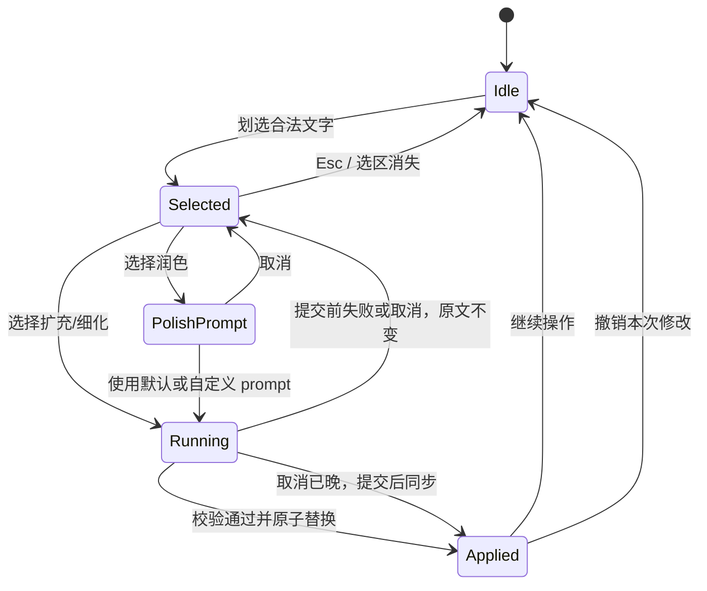

# 创作文档划选润色、扩充与细化产品技术方案

- **状态：** 草案·待产品/技术评审
- **决策阶段：** 对齐草案；Phase 0 可进入契约与映射验证，功能开发/发布需通过本文门禁
- **负责人：** 待指定
- **决策人：** 待指定
- **更新日期：** 2026-08-31

## 1. 方案摘要

在已生成且处于稳定状态的创作文档中，用户划选一段文字后，页面在选区附近显示“润色 / 扩充 / 细化”浮动工具条。“润色”允许用户输入可选的自定义 prompt；“扩充”和“细化”在事实与结构门禁通过后，以单击执行的稳定语义开放。

推荐使用“结构化选区请求 + 选区级 Agent 执行模式 + 原子 Markdown Patch”，不把选中文字拼进普通聊天指令，也不让模型自由改写全文。这样可以直接复用当前的会话、本地/品牌模型、SSE 暂停恢复、`document.patch.applied`、“本轮改动”和创作历史能力，同时保证未选区字节级不变。

## 2. 问题、用户与现状依据

### 2.1 用户问题

当用户只对已生成文档中的一句、一段或几个连续段落不满意时，当前只能在右侧对话中用自然语言描述目标。用户需要重复引用原文或章节，Agent 仍可能把指令理解为全文修订，导致操作成本高、改动边界不可预期。

### 2.2 目标用户

- 已用创作 Agent 完成首稿，需要无需复制原文即可调整局部表达的用户。
- 需要保留整体结构、数据和引用，只希望改进局部文字的用户。
- 对语气、行文风格有明确要求，需要在“润色”时补充自定义要求的用户。

### 2.3 已有能力与缺口

- 当前创作结果以 Markdown 作为真实数据源，页面使用 `ReactMarkdown` 只读渲染；首期不应为本功能引入富文本编辑器或更换存储格式。
- 当前工作区的未提交改动已实现选区期间冻结 Markdown DOM，可避免流式更新破坏浏览器选区；这不能视为已发布能力，且还没有选区快照、源 Markdown 定位、浮动工具条和结构化请求。
- 当前 Agent Loop 已接收 `current_document`、`root_request` 和对话，修订后会返回带 `base_hash` / `result_hash` / `changes[]` 的 Patch，页面已能显示“本轮改动”。
- 当前历史在同一 `session_id` 下更新同一条 `creation_history`：`revision_no` 递增，但旧正文不作为可恢复版本保留。因此首期只承诺当前会话内的一步撤销，不承诺重启后撤销。

## 3. 目标与非目标

### 3.1 目标

- 让用户在文档上直接指定局部修改范围，不再手工复制原文到对话框。
- 提供语义稳定、可理解的“润色 / 扩充 / 细化”操作。
- 支持润色的可选自定义 prompt，并保留事实、引用、数据和选区边界。
- 使模型结果以原子 Patch 替换选区，失败、取消或过期时不修改正文。
- 复用现有本地/品牌模型、运行事件、中止、历史与改动高亮链路。

### 3.2 非目标

- 不在首期引入手工富文本编辑、修订模式或多人协同。
- 不把“润色”变成可绕过事实与隐私约束的任意 Agent prompt 入口。
- 首期不为“扩充”和“细化”增加自定义 prompt，不保存 prompt 预设。
- 首期不在选区操作中自动启动互联网检索、记忆检索、数据检索或网页操作。需要新证据时继续使用右侧对话。
- 首期不支持修改表格结构、代码块、行内代码、链接地址、Mermaid/PlantUML 代码或交互图示。
- 不在本期建设可跨应用重启的完整版本库。

## 4. 产品语义

| 操作 | 用户预期 | 允许的变化 | 必须保留 | 默认不做 |
| --- | --- | --- | --- | --- |
| 润色 | 更自然、清晰、连贯，语气更符合用途 | 措辞、语序、句式、适度长度与局部格式 | 原意、事实强度、数字、日期、实体、引用和来源 | 不增加新事实，不扩展到未选区 |
| 扩充 | 让选中内容更完整、更有解释性 | 补充已有上下文可支持的原因、过渡、解释或例子 | 现有结论边界、数据口径和事实状态 | 不自动研究，不编造精确数字或来源 |
| 细化 | 让抽象表述更具体、可执行 | 补齐对象、条件、步骤、责任、边界、风险或验收维度 | 已有事实、约束、先后关系和不确定性 | 证据不足时不猜测责任人、日期、指标或完成状态 |

润色的自定义 prompt 是“表达要求”，例如“更专业，但不要有官话”或“改成面向管理层的简洁语气”。它的优先级低于安全、事实、选区和已生效 Skill 结构约束；不因为自定义 prompt 而获得新 Tool 权限。

## 5. 用户体验

### 5.1 主流程



1. 用户在已完成生成的“创作文档”中划选非空文字。
2. 系统固化选区快照，在选区上方优先、空间不足时在下方显示浮动工具条。
3. 点击“润色”后展开轻量面板，包含“补充你的润色要求（可选）”输入框与“开始润色”按钮；空值使用系统默认润色语义。
4. 点击“扩充”或“细化”后直接执行。工具提示需说明两者的差异，避免名称相似。
5. 执行期间保留选区视觉锚点，显示“正在润色/扩充/细化所选内容”和中止入口；文档不展示未完整的中间文本。
6. 最终 Patch 通过后一次性替换选区，复用“本轮改动”和行级高亮。
7. 页面提供“撤销本次修改”，直到下一次文档变更、新会话或应用重启。

工具条只渲染能力接口返回的动作：内部 MVP 先显示“润色”，完整门禁通过后再增加“扩充”和“细化”；未开放动作不以灰色占位误导用户。

### 5.2 布局与可访问性

- 浮层使用 portal 挂到 `document.body`，避免被当前文档卡片的 `overflow: hidden` 裁切；在全屏、窄屏、文档滚动和窗口 resize 时重新定位。
- 工具条使用 `role="toolbar"`，所有动作可通过键盘聚焦和触发；`Esc` 关闭并返回文档焦点。
- 用户通过 Tab 进入工具条时，系统使用已固化的选区快照，不依赖当时的 `window.getSelection()`。
- 自定义 prompt 使用独立局部状态，不清空、覆盖或提交右侧主对话框中尚未发送的内容。

## 6. 范围与边界

### 6.1 首期支持

- 标题、普通段落、列表项和引用块中能够安全映射到 Markdown 源的连续文字。
- 在源范围语法完整时，可支持跨连续普通文本块的选区。
- 重复文本不影响定位；定位以文档哈希和 UTF-8 字节范围为准，不使用全文字符串匹配。

### 6.2 首期不支持的选区

- 纯空白、仅包含交互控件或已折叠的选区。
- 导致 Markdown 格式标记不配对的选区，例如从一个粗体片段中间跨到另一个粗体片段中间。
- 表格结构、代码块、行内代码、链接 URL、内部风险标记、Mermaid/PlantUML 代码与图示操作区。
- 跨越上述受保护边界的混合选区。

不支持时显示可操作原因，例如“当前选区跨越表格或代码结构，请选择连续正文”。系统不得静默扩大、缩小或猜测选区范围。

### 6.3 状态边界

- 只有当文档非空、最新运行已到终态、当前会话未终止时才可执行。
- 流式生成、脑暴等待、普通修订、另一个选区操作或外部模型恢复期间不允许并发执行。
- 流式期间仍可保留原有的划选/复制能力，但选区工具条不可执行修改。
- 只有在“建立选区时文档已是终态，且此后源版本未变”时选区才可执行。正文更新、流式运行转终态、历史切换、新会话或全屏重建导致源 DOM 版本变化时，必须使旧选区快照失效，不得在运行结束后突然启用流式期间建立的旧选区。

## 7. 推荐技术方案

### 7.1 设计原则

1. **Markdown 仍是唯一持久化正文。** 可在渲染和修补期间构建临时 AST/源映射，但不引入第二份文档存储。
2. **选区是结构化数据，不是 prompt 片段。** 不得仅传 `selected_text` 后在全文中查找第一个相同字符串。
3. **选区操作与内部 Agent ID 解耦。** 请求中的稳定 `action` 枚举为 `polish | expand | elaborate`，内部可复用现有去 AI 味/细节润色能力或未来更换执行器。
4. **原子应用。** 模型执行时不修改 `generatedContent`，只有最终 Patch 完整通过时才替换。
5. **冲突时拒绝，不猜测。** 当前文档哈希与选区基线不同时，要求用户重新划选。

### 7.2 前端选区映射

在现有 `useSelectionStableContent` 旁新增 `useCreationSelection`，并将选区解析、源映射和 UI 拆分到独立文件，不继续扩大 `CreationPanel.tsx`。

当前渲染链会移除内部标记、拆分并重新组装 Markdown、手工渲染表格，还会注入原文本中不存在的引用图标。因此 Phase 0 必须先建立“规范 Markdown → 可见 DOM 文本”的无损源映射，并将其作为任何模型接入的硬门禁。

推荐对规范 Markdown 只解析一次，在任何显示变换前为真实文本叶子建立源范围；DOM 中用包装 `span` 或独立映射表承载 `data-md-start` / `data-md-end` / `data-md-node-kind`。图标、按钮、引用角标等合成 DOM 节点必须标记为无源区间；选区触及无源区间时明确拒绝。用户完成划选后：

1. 校验选区的两个端点都位于当前 `.creation-document-content` 中。
2. 将 DOM Range 端点映射到同一份原始 Markdown 中的 JS 源偏移。现有 `parseMarkdownBlocks` 需为每个块增加原文档绝对 `startOffset/endOffset`，不能只保留行号；`ReactMarkdown` 节点的相对 offset 必须加上块基准偏移。
3. 检查两端语法包装栈与中间片段，确认替换不会留下未闭合的粗体、链接、代码等标记。
4. 将 JS 偏移显式转换为 UTF-8 字节偏移，避免 JavaScript UTF-16、Rust UTF-8 与 Python Unicode 下标在中文、Emoji 和组合字符上产生歧义。
5. 保存不依赖活选区的快照，包含源字节范围、哈希、显示文本和浮层锚点。

如果渲染前会移除内部标记，源映射必须基于未裁剪的真实 `generatedContent`，并在“显示字符 → 原始偏移”映射中跳过被隐藏区间；不得直接使用 `stripInternalCreationMarkers` 后变短字符串的 offset。选区不得覆盖或删除不可见的 `memorybread:*` 标记。

首期只开放经 round-trip 夹具证明可回映的单个 AST 文本叶或完整连续正文块。实体转义、反斜杠转义、soft break、CRLF、引用角标、内部标记夹层与多 DOM 节点合并必须进入 Phase 0 测试集；任一映射不能往返恢复原始字节时，Phase 1 不得开启对应节点类型。

### 7.3 请求边界

推荐新增专用接口 `POST /api/creation/inline-edit/run`，响应继续使用 `creation.agent.v1` SSE 事件。它不是第二套生成系统：Core 内部复用现有创作请求组装、模型配置、SSE 代理和 Agent Loop，页面复用现有 `readAgentPhase`、中止、外部模型恢复、Patch 应用与结果持久化。

同时新增 `GET /api/creation/inline-edit/capabilities`，返回 `schema_version`、`enabled`、受支持的 `actions`、`max_selection_bytes`、`max_custom_prompt_bytes` 和可选择的 Markdown 节点类型。Core 返回的 `enabled` 必须同时反映 Core 功能开关和 Sidecar 对同版协议的支持，不得在 Sidecar 不可用时仍宣称可用。页面只在能力开启时提供选区动作；旧 Core 对该路由返回 404 时，页面隐藏入口并保留原有创作/复制能力。这一能力接口也是选区与自定义 prompt 上限的唯一 UI 数据源。

创作历史读取结果同时增加本地 `inline_edit_policy`，包含该文档可用动作、受保护范围、约束版本/哈希和不可用原因。页面展示的是全局 capabilities 与当前历史 policy 的交集；历史切换时随已有历史读取刷新，不因用户划选额外请求。Core 根据持久化历史重新计算 policy，页面字段只用于展示，不能绕过服务端门禁。

选择专用接口而不是只向现有 `agent/run` 增加一个可选字段，是为了避免新 UI 连接旧 Core 时，旧 Core 静默忽略选区字段并将请求当成全文改写。旧 Core 对新路由返回 404，页面应隐藏或降级该功能，不降级为普通全文修订。

首次请求示例：

```json
{
  "schema_version": "creation.inline-edit.v1",
  "request_id": "request-...",
  "session_id": "session-...",
  "history_id": 123,
  "root_request": "生成一份项目建设方案",
  "current_document": "# 项目建设方案\n...",
  "action": "polish",
  "custom_prompt": "更专业，但不要有官话",
  "selection": {
    "base_revision_no": 3,
    "base_document_hash": "c20a7d4f86e112ab",
    "start_byte": 128,
    "end_byte": 286,
    "selected_markdown": "当前选中的 **Markdown** 片段",
    "selected_markdown_hash": "2e5b8f...",
    "selected_text": "当前选中的 Markdown 片段",
    "start_line": 8,
    "end_line": 11
  },
  "model_mode": "local",
  "resume_state": null,
  "model_result": null
}
```

字段约束：

- `start_byte` 包含、`end_byte` 不包含，均是精确 `current_document` UTF-8 字节数组中的字符边界。
- `request_id` 是本次操作的稳定追踪标识，首次执行与品牌模型恢复必须沿用同一值。
- `history_id` 必须指向 `session_id` 当前的可写创作历史；正文尚未成功建立历史时不开启选区编辑。
- `base_document_hash` 沿用当前 Patch 哈希算法与表示；`base_revision_no` 用于展示和诊断，哈希才是并发前置条件。
- `selected_markdown` 必须与字节范围完全一致；`selected_text` 用于表示意图和页面预览，不用于定位。
- `custom_prompt` 只允许在 `action=polish` 时出现，空字符串与缺失都表示使用默认润色要求。
- `selection` 中的版本、基线、范围、片段与完整性哈希均为必填；Core 不为缺失字段推断默认值。
- Core 转发给 Sidecar 的内部请求在 `action=expand|elaborate` 时必须包含版本化 `context_constraints`，其中有允许事实、状态/时间限定、来源 ID 和适用的 Skill 不变式；这些约束由 Core 从当前历史与已生效契约恢复，不能信任页面自行声明。
- 对有明确 Skill 来源的文档，即使 `action=polish`，Core 也必须恢复并下发 `context_constraints.skill_invariants`。约束不可恢复时，该文档的历史载荷应将润色标记为不可用；页面不显示入口，Core 仍执行拒绝兜底。普通文档的润色继续执行数字、日期、URL、引用和结构的确定性保护；无法确定性验证的语义事实保持通过质量评测监控，不作绝对程序保证。
- 选区字节上限由 Core/Sidecar 的共享契约统一定义，不在 UI 和 Python 中各自写死；具体默认值在代表性文档上完成延迟与质量基线后决定。

`action` 是用户意图，Patch/历史中的 `operation` 是已应用变更类型，两者使用下列固定映射，不由模型推断：

| 用户动作 | 请求 `action` | Patch/历史 `operation` |
| --- | --- | --- |
| 润色 | `polish` | `polish_selection` |
| 扩充 | `expand` | `expand_selection` |
| 细化 | `elaborate` | `elaborate_selection` |
| 撤销 | 无模型请求 | `undo_inline_edit` |

`intent.interpreted.data.action` 保留请求枚举，`document.patch.applied.data.patch.operation` 和历史 `edit_operation` 使用映射后枚举。Core 的 `normalize_edit_operation` 必须显式加入这四个值，不得将它们降级为 `rewrite_document`。

Core 调用 Sidecar 时必须使用 `AppState.creation_sidecar_url`，不继续复制当前部分创作路由对 `127.0.0.1:8001` 的硬编码。新 Core 连接旧 Sidecar 而获得 404 时，必须返回稳定的“选区能力不可用”错误，不降级到现有 `agent/run` 或 `generate`。

### 7.4 Core 校验和稳定错误

Core 必须在任何模型调用或品牌模型内容出站之前校验：

1. 协议版本与操作枚举受支持。
2. 从本地存储读取的 `history_id` 属于 `session_id`、仍可写，且其 `revision_no`、正文和正文哈希分别等于请求的 `base_revision_no`、`current_document` 和 `base_document_hash`；不能只验证客户端字段彼此自洽。
3. 文档非空，字节范围有序、未越界，且两端都在 UTF-8 字符边界。
4. 范围切片等于 `selected_markdown`，并且哈希一致。
5. 范围不包含受保护的内部标记、代码或图示结构。
6. `custom_prompt` 的操作范围和契约长度合法。
7. 当前历史的事实、证据和 Skill 约束满足该动作的能力门禁。

Core 必须为普通生成、普通修订、脑暴等待/恢复和选区操作使用同一个会话级租约，并以 `(session_id, request_id)` 提供幂等语义：

- 首次请求在调用模型前写入本地运行记录，保存 `operation_fingerprint` 和状态；不得在页面内仅靠按钮禁用实现并发控制。
- `operation_fingerprint` 由 Core 对共享契约规定的不可变字段对象执行 RFC 8785 JSON Canonicalization Scheme，再对 UTF-8 字节计算 SHA-256 小写十六进制值。字段覆盖协议版本、会话/历史、动作、模型模式、基线修订和正文哈希、选区范围与片段哈希、自定义 prompt 哈希、原始需求哈希及约束版本/哈希；明确排除会变化的 `resume_state`、`model_result`、continuation nonce 和传输字段。共享目录必须提供三端一致的指纹夹具。
- 该指纹只在本地 Core、页面最终事件和幂等运行状态中使用，不发送给 Gateway 或远程遥测。
- 相同 `request_id` 与相同 `operation_fingerprint` 重试时，复用正在运行、等待恢复、候选已就绪或已完成的状态，不得再次调用模型；品牌模型 `resume` 必须沿用该 ID 和指纹。
- 品牌模型恢复另用 Core 签发的 continuation nonce 与单调 `state_version` 校验。相同 nonce 和相同结果哈希的重复恢复幂等返回原状态；相同 nonce 携带不同结果，或旧版本覆盖新版本时拒绝。
- 相同 `request_id` 携带不同 `operation_fingerprint` 时拒绝；同一会话在租约有效期内收到不同 `request_id` 的写操作时也拒绝。
- 运行记录不得把选中文字或自定义 prompt 另存为独立字段。为支持落库重试、最终响应同步和完整性补偿，可在本地临时保存基线快照与候选替换片段；其生命周期绑定创作历史，在客户端确认同步、下一次成功变更或到达短期保留上限时清理，失败/中断后按同一本地保留策略清理。
- 进程异常退出后，Core 启动恢复只能把没有活动任务的旧租约标记为“需恢复/已中断”，不得悄悄重放模型调用。
- 现有 `/agent/run`、普通修订和脑暴/品牌模型恢复入口必须接入同一个 Core 租约服务。旧客户端未提供 `request_id` 时由 Core 生成并在首个运行事件中返回；已有 `run_id`/恢复令牌映射到该 ID。租约在完成、失败或提交前取消时释放，在 `run.paused` 期间保留；崩溃恢复按上一条处理。

| HTTP / 事件状态 | 稳定错误码 | 用户行为 |
| --- | --- | --- |
| 400 | `CREATION_INLINE_EDIT_INVALID` | 保留原文，提示重新选择 |
| 409 | `CREATION_SELECTION_BASE_CHANGED` | 保留最新文档，清理旧选区并要求重新划选 |
| 409 | `CREATION_INLINE_EDIT_BUSY` | 保留原文，等待当前生成或修订结束 |
| 409 | `CREATION_INLINE_EDIT_IDEMPOTENCY_CONFLICT` | 保留原文，拒绝同一请求 ID 的不同内容 |
| 409 | `CREATION_INLINE_EDIT_RESUME_CONFLICT` | 保留当前运行，拒绝冲突或过期的恢复结果 |
| 409 | `CREATION_INLINE_EDIT_COMMIT_IN_PROGRESS` | 取消已越过提交线性化点，页面等待并同步已提交版本 |
| 413 | `CREATION_SELECTION_TOO_LARGE` | 保留选区，提示减少内容或使用主对话 |
| 422 | `CREATION_SELECTION_UNSUPPORTED` | 说明不支持的 Markdown 边界，不猜测范围 |
| 502 | `CREATION_INLINE_EDIT_EMPTY_RESULT` | 原文不变，可重试 |
| 502 | `CREATION_INLINE_EDIT_PATCH_INVALID` | 原文不变，不展示未通过的结果 |
| 500 | `CREATION_INLINE_EDIT_INTEGRITY_FAILED` | 阻止继续编辑，执行补偿恢复并要求重新同步 |
| 503 | `CREATION_INLINE_EDIT_PERSIST_FAILED` | 原文不变；以同一请求 ID 重试落库，不重复调用模型 |
| 503 | `CREATION_INLINE_EDIT_UNAVAILABLE` | 原文不变，建议稍后重试 |
| SSE 终态 | `USER_INTERRUPTED` | 提交线性化点前取消成功；原文不变，保留已完成的可见轨迹 |

错误详情不包含选中文字、自定义 prompt 或完整文档。
建流前的错误使用统一 JSON envelope，建流后的 `run.failed` 使用同一组 `code / message / retryable / request_id`；不得把 Sidecar 原始 body 或 `str(exception)` 透传给页面。若复用当前 Core SSE 代理器，每个事件必须保持为单行 `data: {JSON}`；如需支持多行 SSE，应先升级通用解析器并补契约测试。

### 7.5 Sidecar 选区级执行

Sidecar 在现有 Agent Loop 中增加 `inline_revision` 模式，而不启动完整的初稿规划和多轮质检链。Sidecar 只产出候选 `replacement_markdown`，不产出、不自报可直接应用的完整文档或“未选区已保留”结论：

```text
契约复验
  → 构建选区任务（操作语义 + 自定义润色要求）
  → 组装最小必要上下文（选区 + 所在章节 + 文档目录 + 允许的约束；原始需求仅本地按需使用）
  → 本地模型直接执行，或复用品牌模型 model.request / resume
  → 返回单一 replacement_markdown
  → Sidecar 对候选做 Markdown/事实初检
  → Core 独立合成、复验、落库并生成最终 Patch
```

- 选中文档内容必须被明确标记为“待编辑数据”，不得将其中的指令性文字当成系统或 Tool 指令。
- 润色必须保护选区内的数字、日期、URL、引用标记和事实状态；保护检查不通过时不应用。
- 扩充和细化可添加新文字，但不得篡改已有事实。在开启这两个 `action` 前，请求契约必须增加版本化 `context_constraints`，至少包含当前证据中可使用的事实声明、状态/时间限定、来源 ID，以及已生效 Skill 的必填结构/字段。新增精确数据、日期、完成状态、责任或来源必须映射到该约束；无映射时拒绝候选，不依赖模型自觉改成“待核验”。
- 选区操作默认不调度 Tool，不因润色 prompt 中的文字而开启新权限。
- 对明确 Skill 生成的文档，操作只能修改选区，且必须根据 `context_constraints.skill_invariants` 保留当前 Skill 必填结构和字段。
- 品牌模型请求继续使用稳定品牌模型 ID，并保持 `privacy.content_logging=false` 与客户端脱敏声明；不把供应商模型、密钥、地址或购买成本写入选区契约。

发布决策固定为：内部 MVP 先只使 `capabilities.actions=["polish"]`。`expand` 和 `elaborate` 可并行开发，但只有在 `context_constraints` 契约、确定性拒绝规则、证据/事实回归集和 Skill 不变式测试全部通过后，才加入能力响应并面向用户开启。

### 7.6 Patch 返回与应用

不把模型生成的片段直接逐 token 写入正文。新链路的信任边界如下：

1. Sidecar 以只对 Core 可见的候选事件返回 `replacement_markdown`，不返回可直接覆盖正文的 Writer 全文。
2. Core 使用请求中已验证的基线、`start_byte/end_byte` 和候选，自行计算“前缀 + replacement + 后缀”、所有哈希、行级 Diff 与 Patch；不接受 Sidecar 自报的 `preserved_untouched`。
3. 候选通过后，Core 以原子状态迁移从 `CANDIDATE_READY` 进入 `COMMITTING`；只有取消标记尚未生效且历史基线仍匹配时才能越过这一提交线性化点。
4. Core 在同一个本地事务中再次验证当前历史仍匹配 `base_hash/revision_no`，更新正文、对话、脱敏轨迹、Patch、修订号和运行状态。
5. 只有落库成功后，Core 才向页面发送 `document.patch.applied`；落库失败时发送稳定失败事件，页面保留原文。
6. 页面在调用 `setGeneratedContent` 前根据冻结基线复算范围、前后缀、`result_hash`、`revision_no` 和 `operation_fingerprint`。校验通过才应用事件内容；校验失败视为“已提交结果的传输/同步故障”，不能假设数据库未变。
7. 同步故障时页面按 `request_id` 调用只读运行状态/历史读取接口。Core 重新验证已持久化正文和 Patch：有效则页面同步该精确修订；若持久化内容也不满足完整性约束，Core 使用运行记录中的基线快照执行补偿恢复、标记 `INTEGRITY_FAILED` 并阻止后续编辑，直到页面重新同步。

候选、Patch 或持久化校验在进入 `COMMITTING` 前失败时不产生成功修订。提交后发生完整性补偿时不得倒退 `revision_no`：Core 以新的 `undo_inline_edit` 修订恢复基线，并在脱敏 Patch 元数据中标记 `reason=integrity_recovery`。

Core 最终发出的 `document.patch.applied.data` 必须同时包含已持久化的完整 `content`、本轮 `replacement_markdown`、`revision_no`、`request_id`、`operation_fingerprint` 和下列由 Core 生成的 `patch`。`content` 和 `replacement_markdown` 只在当前实时响应与短期恢复状态中使用，持久化 `agent_trace_json` 前必须移除；`document_patch_json` 只保存下列脱敏元数据：

```json
{
  "operation": "polish_selection",
  "target_sections": ["实施计划"],
  "base_hash": "c20a7d4f86e112ab",
  "result_hash": "a3d498...",
  "preserved_untouched": true,
  "selection": {
    "start_byte": 128,
    "end_byte": 286,
    "selected_markdown_hash": "2e5b8f..."
  },
  "replacement": {
    "start_byte": 128,
    "end_byte": 342,
    "replacement_markdown_hash": "be8721..."
  },
  "prefix_hash": "...",
  "suffix_hash": "...",
  "changes": [
    {
      "change_type": "modified",
      "section_title": "实施计划",
      "start_line": 8,
      "end_line": 11,
      "summary": "润色所选内容"
    }
  ],
  "change_count": 1,
  "summary": "已润色所选内容，其余文档保持不变"
}
```

应用前后必须满足：

- 应用前页面中的当前文档哈希仍等于 `base_hash`。
- 新文档 = 原文档前缀 + `replacement_markdown` + 原文档后缀。
- 原文档前缀与后缀哈希必须与 Patch 一致；不允许全文 Writer 结果覆盖未选内容。
- 合成后的 Markdown 必须可被现有渲染器解析，受保护标记数量和位置保持合法。
- 没有实际差异时返回“所选内容已符合要求”，不生成空 Patch，不增加 `revision_no`。

### 7.7 历史、对话与撤销

- 选区操作完成后继续更新当前会话的同一条创作历史，`revision_no` 递增。
- `edit_operation` 新增 `polish_selection | expand_selection | elaborate_selection | undo_inline_edit`；老客户端可按普通修订展示未知枚举。
- 可见对话新增一条类型化操作摘要，例如“对所选 86 字执行润色·已使用自定义要求”，并在该条记录的可展开详情中以转义后的纯文本向用户显示其完整自定义 prompt。本地 `conversation_json` 保存这份 prompt 以便恢复语境，但不重复保存选中正文。
- 自定义 prompt 跟随当前创作历史进入用户发起的导出和客户端备份，并受同一敏感内容提示约束。删除历史时立即清理实时数据库和运行暂存，后续备份不再包含它；已经由用户导出的文件或既有加密快照不能被逐条回写，按各自保留周期或由用户显式删除，且恢复旧备份可能重新引入该 prompt。
- `agent_trace_json`、普通日志、错误详情和遥测不保存选中文字、替换文字或自定义 prompt；Patch 哈希只保存在本地 `document_patch_json` 与幂等完整性状态中，不发送到远程遥测。
- 页面在当前会话内暂存上一版完整 Markdown 和结果哈希。用户点击撤销时，只在当前文档仍为该结果哈希时恢复，并将撤销结果写回历史。
- 如果用户已发起下一次文档变更、新会话或应用重启，一步撤销入口消失。持久化版本恢复是后续能力。

### 7.8 中止边界

页面中止时必须先调用 `POST /api/creation/inline-edit/cancel` 并携带 `request_id`，再关闭本地 SSE/`AbortController`；只关闭读取连接不能作为取消提交的依据。Core 使用幂等运行表按同一线性化顺序处理取消与提交：

- `RUNNING`、`MODEL_WAITING` 或 `CANDIDATE_READY` 状态收到取消时，原子写入 `CANCELLED`，禁止进入 `COMMITTING`，最终正文和修订号不变。
- 取消与提交竞争时，以第 7.6 节 `CANDIDATE_READY → COMMITTING` 的原子迁移为线性化点。取消先成功则不提交；提交先成功则取消接口返回 `CREATION_INLINE_EDIT_COMMIT_IN_PROGRESS`，页面提示“修改已保存，正在同步”并读取已提交修订。
- `COMMITTED` 状态的重复取消返回已提交状态，不生成撤销；用户如需恢复，使用独立的一步撤销动作。
- 所有重复取消都幂等，租约只在 `CANCELLED`、`COMMITTED`、`FAILED` 等终态释放。

首期仍复用 Sidecar 协作式取消来尽力停止计算，但不得对用户承诺已经强制终止正在运行的本地线程或品牌模型非流式请求。若要承诺停止计算或计量，还需要 Gateway 提供可验证的远程取消能力；无论底层计算是否及时停止，Core 的状态机都必须保证提交语义明确。

### 7.9 数据流与隐私边界

品牌模型链路采用字段白名单，而不是把本地选区请求整体序列化到 Gateway。`current_document`、隐藏内部标记、无关章节和完整原始需求默认只在本机流转；润色 MVP 不需要把完整 `root_request` 发给品牌模型。

| 数据 | 本地模型模式 | 品牌模型出站 | 本地持久化 | 远程日志/遥测 |
| --- | --- | --- | --- | --- |
| 完整当前文档 | UI、Core、Sidecar 本机使用 | 禁止 | 作为创作历史正文保存；基线仅在运行记录中短期暂存 | 禁止 |
| 选中 Markdown | 本机推理使用 | 允许，属于完成操作的必要内容 | 不另行复制；已包含在文档版本中 | 禁止 |
| 所在章节与目录 | 本机使用 | 仅发送最小必要章节及标题目录 | 不新增副本 | 禁止 |
| 原始需求 | 本机使用 | 默认禁止；未来只能发送版本化白名单中的最小目标摘要 | 沿用现有会话数据 | 禁止 |
| 自定义润色 prompt | 本机推理使用 | 用户选择品牌模型执行时允许 | 在用户可见的对话详情中保存 | 禁止 |
| 证据与 Skill 约束 | 本机校验使用 | 仅发送允许使用的事实声明、来源 ID 和结构不变式 | 沿用现有证据/会话数据 | 禁止原文，仅可记录是否存在 |
| 请求 ID、动作、长度分桶、状态、耗时 | 本机使用 | Gateway 请求只携带完成调用所需的请求 ID | 可保存脱敏运行状态 | 允许 |
| 文档、选区、替换和前后缀哈希 | 本机完整性校验 | 禁止 | 只允许保存在 Patch 与幂等完整性状态中 | 禁止 |

本地模型模式不得产生模型内容出站流量。品牌模型出站白名单必须有 Core/Sidecar 契约测试；新增字段默认不出站，只有提高协议版本并完成隐私评审后才能加入。页面设置与错误文案继续只显示稳定品牌模型标识，不显示供应商模型、密钥、地址或购买成本。

## 8. 需求

### 8.1 功能需求

- **FR-001** — 当选区能力已开启，且用户在文档已经到达终态后建立合法、非空、可安全定位的文本选区时，页面必须在文档卡片可见范围附近显示选区工具条。
- **FR-002** — 完整功能的选区工具条必须提供“润色”、“扩充”和“细化”三个产品动作，并通过帮助文案说明三者语义边界；分阶段发布时页面只能显示能力接口当前声明的动作。
- **FR-003** — 用户选择“润色”时，页面必须提供不影响主对话草稿的可选自定义 prompt；未填写时必须使用默认润色语义。
- **FR-004** — 系统必须按第 4 节定义区分润色、扩充和细化，不得将三个动作映射为相同的通用“重写” prompt。
- **FR-005** — 每个选区请求必须包含源 Markdown 字节范围、选区哈希、基线文档哈希和协议版本，不得使用选中文字的首次全文匹配作为定位。
- **FR-006** — Core 必须在模型调用前验证文档哈希、字节范围、选区内容和受保护边界；任一前置条件不成立时必须拒绝执行。
- **FR-007** — 完成选区操作时，Sidecar 只能提交候选替换片段，Core 必须自行合成全文并证明未选前缀和后缀与基线字节级相同，不得信任模型自报的完整文档或保护结论。
- **FR-008** — 只有 Core 原子持久化成功并发出最终 Patch，且页面独立复验基线、范围、前后缀、结果哈希、修订号和操作指纹后，页面才能一次性应用结果；最终事件复验失败时必须读取并验证已提交修订，不能再假设数据库未变。
- **FR-009** — 当请求失败、选区过期、提交线性化点前的用户中止或 Core 候选/Patch 校验失败时，系统必须保留当前正文和已完成轨迹，不增加成功修订记录；提交后的同步故障按第 7.6 节恢复或补偿，不伪装成“未提交”。
- **FR-010** — Core 必须以共享会话级租约保证同一创作会话同时最多只有一个普通生成、普通修订、脑暴等待/恢复或选区操作运行，并以请求 ID、操作指纹和 continuation 版本保证重试、品牌模型恢复和最终落库不重复调用模型或重复提交；旧创作入口也必须接入该租约。
- **FR-011** — 成功的选区操作必须沿用当前 `session_id`，在发送成功事件前以一个事务更新创作历史、`revision_no`、类型化 `edit_operation`、用户可见的对话详情和脱敏 Patch 元数据；持久化失败不改变页面正文或产生成功修订。
- **FR-012** — 页面必须在当前会话内提供一步撤销；只有当当前文档仍等于上次选区操作的 `result_hash` 时才能恢复基线。
- **FR-013** — 本地模型和品牌模型必须使用相同的选区语义、校验、Patch 和失败行为；品牌模型继续只向客户端暴露稳定品牌标识。
- **FR-014** — 对不支持的 Markdown 边界，页面必须显示具体原因，不得静默改变选区范围或降级为全文改写。
- **FR-015** — 选区操作默认必须只消费当前文档、原始需求、所在章节和已有证据摘要，不得自动调度检索、浏览器或图像 Tool。
- **FR-016** — 能力接口在 `context_constraints` 契约、确定性事实拒绝规则、证据回归集和 Skill 不变式测试全部通过前只能声明 `polish`；满足门禁后才可声明 `expand` 和 `elaborate`。
- **FR-017** — 对有明确 Skill 来源的文档，Core 必须从持久化历史恢复 `skill_invariants` 后才允许润色，并将其发送给 Sidecar；无法恢复时页面隐藏润色入口，Core 同时拒绝直接请求。

### 8.2 非功能需求

- **NFR-001** — 除创作页初始化时一次本地能力读取外，选区检测、合法性判断、工具条展示和润色 prompt 面板必须在页面内完成，用户确认动作前不得因选区交互发起新的模型或网络请求。
- **NFR-002** — 浮动工具条、润色 prompt 面板、进度、错误和撤销必须可通过键盘与读屏器操作，并覆盖常规、全屏和窄屏布局。
- **NFR-003** — 除用户可见的本地创作历史外，日志、trace、错误详情和遥测不得包含选中文字、替换文字、自定义 prompt、模型 messages、内容哈希、密钥或供应商信息。
- **NFR-004** — 选区映射和 Patch 应用必须覆盖中文、Emoji、组合字符、重复文本和 CRLF/LF 文本，不得依赖跨语言默认字符串下标。
- **NFR-005** — `creation.inline-edit.v1` 的定位、基线、动作和完整性字段必须为必填且版本化；只有追加到既有历史/Patch 中的非关键展示元数据可以是可选字段。旧客户端必须忽略新展示元数据，新客户端不得将旧 Core 降级成不受控的全文修订。
- **NFR-006** — 选区级 Sidecar Python 必须以 Python 3.9 语法为兼容基线，不得使用 Python 3.10 及以上专属语法。
- **NFR-007** — 本地模型模式不得产生内容出站流量；品牌模型只能发送第 7.9 节白名单字段。自定义 prompt 必须在本地历史中可见，随历史导出和备份；删除历史立即清理实时库与运行暂存，但既有导出/快照按独立保留周期或由用户删除，恢复旧备份时必须按普通历史恢复处理。

## 9. 验收标准

- **AC-001** — 验证 **FR-001**。给定已完成的创作文档，当用户划选一段普通正文时，选区附近显示未被文档卡片裁切的工具条；空选区不显示。
- **AC-002** — 验证 **FR-001、NFR-002**。给定全屏、窄窗口和已滚动的文档，工具条仍保持在可见区并能通过键盘聚焦，`Esc` 关闭后焦点回到文档。
- **AC-003** — 验证 **FR-002、FR-004**。当能力接口已声明三个动作时，分别对同一选区执行三个动作，请求枚举、用户提示、模型指令与结果约束分别符合第 4 节，不是同一通用重写。
- **AC-004** — 验证 **FR-003**。给定主对话框已有未发送草稿，当用户填写润色自定义 prompt 并执行时，请求携带该 prompt，主对话草稿保持不变；空 prompt 使用默认语义。
- **AC-005** — 验证 **FR-005、NFR-004**。给定包含重复中文、Emoji 和组合字符的文档，当选中第二个重复片段时，请求中的 UTF-8 字节范围精确指向该片段，未命中第一个片段。
- **AC-006** — 验证 **FR-006**。给定客户端请求内部自洽，但 `history_id` 当前持久化正文或修订号已经变化，Core 在任何模型调用或品牌模型内容出站之前返回 `409 CREATION_SELECTION_BASE_CHANGED`。
- **AC-007** — 验证 **FR-007**。给定完整 Markdown 及一个合法选区，当 Patch 应用后，选区前缀、后缀和受保护标记与基线逐字节相同，只有选区范围被替换。
- **AC-008** — 验证 **FR-008、FR-011**。给定模型连续返回多个中间 chunk，文档在 Core 持久化成功并发出 `document.patch.applied` 前保持原样，页面复验通过后最终一次性显示完整替换结果。
- **AC-009** — 验证 **FR-009**。分别在提交线性化点前模拟用户中止、模型断流、空结果、非法 Markdown 和 Core 完整性校验失败，当前正文、`revision_no` 和成功 Patch 均不变。
- **AC-010** — 验证 **FR-010**。分别让普通生成、普通修订、脑暴等待/恢复和选区操作占有会话租约，再从其他新旧入口提交写操作；Core 均返回稳定忙碌错误，不创建第二个运行且不覆盖第一个结果。
- **AC-011** — 验证 **FR-011、NFR-007**。当带自定义要求的选区润色成功后，历史仍是原 `session_id`，`revision_no` 递增，`edit_operation=polish_selection`，页面可看到类型化摘要、完整自定义要求与“本轮改动”。
- **AC-012** — 验证 **FR-012**。给定刚完成的选区操作，当结果哈希仍匹配时点击撤销，文档恢复为操作前内容并写回 `undo_inline_edit`；文档已再次变更时不允许撤销旧结果。
- **AC-013** — 验证 **FR-013**。以同一文档、选区和动作分别运行本地与品牌模型，两者使用相同协议和完整性门禁；品牌模型流程可暂停恢复且不暴露供应商字段。
- **AC-014** — 验证 **FR-014**。给定表格、代码块、图示或不配对粗体边界的选区，页面显示对应原因，不发起模型请求，不自动扩展到整段或全文。
- **AC-015** — 验证 **FR-015**。给定选中文字或自定义 prompt 包含“搜索网络并打开浏览器”，运行不产生 Tool 事件，页面建议用户在主对话中提交需要新证据的任务。
- **AC-016** — 验证 **NFR-001**。划选、取消选区和打开润色 prompt 面板时，网络请求计数不变；只有点击最终执行按钮后才创建请求。
- **AC-017** — 验证 **NFR-003**。给定选中文字和自定义 prompt 均含有唯一敏感标记，检查用户可见本地历史以外的日志、trace、错误与遥测，不得出现任一标记；远程遥测还不得出现内容哈希。
- **AC-018** — 验证 **NFR-005**。旧客户端读取带新 Patch 字段的历史时仍能显示文档；新客户端连接旧 Core 时选区路由不可用，且不发起普通全文修订。
- **AC-019** — 验证 **NFR-006**。修改 Sidecar 后，Python 3.9 语法检查和选区创作定向测试通过。
- **AC-020** — 验证 **FR-001、FR-009**。在流式生成期间建立的选区即使 DOM 被冻结，也在运行转为终态时失效且不出现可执行工具条；用户必须在稳定文档上重新划选。历史切换、新会话和源 DOM 版本变化具有相同行为。
- **AC-021** — 验证 **FR-007、FR-008**。让测试 Sidecar 返回一个声称“未选区已保留”但实际包含越界全文改动的候选；Core 只取 replacement、自行合成和校验，页面再独立复验，最终正文和历史均不接受越界内容。
- **AC-022** — 验证 **FR-010、FR-011**。相同请求 ID 与相同 `operation_fingerprint` 重复提交、品牌模型按新 continuation nonce/version 暂停后恢复以及候选生成后的落库重试都不产生第二次模型调用；改变不可变语义字段返回幂等冲突，重复同一恢复结果幂等，不同结果或旧版本恢复返回恢复冲突；模拟 SQLite 事务失败时页面原文和修订号不变。
- **AC-023** — 验证 **NFR-003、NFR-007**。本地模型执行时模型内容出站请求数为零；品牌模型请求仅含第 7.9 节白名单。历史详情与导出包含完整自定义要求；删除后实时库、运行暂存和后续备份不再包含它，既有导出/快照保持独立并在恢复后重新受历史删除规则管理。
- **AC-024** — 验证 **FR-016**。缺少任一事实/证据/Skill 门禁时，能力接口只返回 `polish` 且页面不显示扩充、细化；全部门禁和回归集通过后，能力接口才返回 `expand` 与 `elaborate`。
- **AC-025** — 验证 **FR-008、FR-009**。Core 已提交后截断或篡改最终 SSE，页面不直接应用事件内容，而是按请求 ID 读取并验证精确修订；持久化内容有效时同步且不增加第二个修订，模拟持久化完整性损坏时自动产生带 `reason=integrity_recovery` 的补偿修订并恢复基线。
- **AC-026** — 验证 **FR-009、FR-010**。取消先于 `COMMITTING` 时运行进入 `CANCELLED` 且正文/修订不变；提交先越过线性化点时取消返回 `CREATION_INLINE_EDIT_COMMIT_IN_PROGRESS`，页面提示已保存并同步提交结果；重复取消不新增修订。
- **AC-027** — 验证 **FR-017**。对有 Skill 来源的文档，历史约束存在时润色请求向 Sidecar 携带匹配的 `skill_invariants` 并保持必填结构；约束缺失时历史策略隐藏入口，直接调用接口也在模型前被拒绝。

## 10. 观测与隐私

- **OBS-001** — `creation.inline_edit.requested`：记录操作枚举、选区字节长度分桶、是否使用自定义 prompt、模型模式和请求 ID，用于判断使用分布。
- **OBS-002** — `creation.inline_edit.completed`：记录操作枚举、耗时、前后长度分桶、变更行数分桶和是否无差异，用于判断稳定性和效果；基线/结果哈希只留在本地 Patch 与幂等完整性状态中。
- **OBS-003** — `creation.inline_edit.failed`：只记录稳定错误码、执行阶段、是否可重试和耗时，用于区分映射、并发、模型和 Patch 问题。
- **OBS-004** — `creation.inline_edit.undone`：记录动作枚举、操作到撤销的间隔分桶和当前会话修订次数，用于识别低质量或语义不符的动作。

所有观测都不包含选中文字、替换文字、自定义 prompt、文档标题、本地文档 ID、未脱敏 URL、模型 messages 或供应商信息。首期不预设成功率、撤销率或延迟目标；先以内部测试和脱敏基线确定阈值。

## 11. 分阶段实施与代码落点

### Phase 0：契约与选区映射夹具

- 在 `shared/creation-inline-edit/` 先新增 `creation-inline-edit.schema.json` 与 README，定义 `creation.inline-edit.v1` 能力、请求、Patch 和错误码契约。
- 契约同时固定 `operation_fingerprint` 规范化字段、continuation nonce/version、运行状态机、取消线性化点、提交后同步/补偿语义与隐私白名单；这些定义完成前不冻结 v1。
- 建立 Markdown 夹具：中英文、Emoji、组合字符、CRLF/LF、重复文本、标题、列表、粗体、链接、表格、代码、图示与内部标记。
- 仅验证渲染选区↔Markdown 源映射，不调用模型。

### Phase 1：本地润色 MVP

- `desktop-ui/src/components/creation-selection/`：新增选区 Hook、源映射、浮动工具条和润色 prompt 面板。
- `desktop-ui/src/components/CreationPanel.tsx`：接入选区状态，复用现有运行、Patch、历史与本轮改动逻辑，并接入 Core 取消、提交后同步和补偿结果处理。
- `core-engine/src/api/handlers/creation.rs`：新增专用运行/取消/状态读取路由、契约验证、Core 合成 Patch、原子历史事务和稳定错误码；现有 `/agent/run`、修订、脑暴与恢复入口同时迁移到共享会话租约。
- `core-engine/src/storage/`：增加选区运行幂等记录的迁移与仓储，唯一键为 `(session_id, request_id)`；短期基线/候选仅用于待落库恢复、同步和补偿并按第 7.4、7.9 节清理。
- 创作历史读取载荷增加 `inline_edit_policy`，Core 从历史事实/Skill 契约计算，页面只渲染 capabilities 与该 policy 的动作交集。
- `ai-sidecar/creation/app.py`：新增 Python 3.9 兼容的请求模型和 SSE 入口。
- `ai-sidecar/creation/agent_loop.py` / `service.py`：新增 `inline_revision` 路由、润色稳定指令、replacement 输出和候选初检。
- 只声明 `polish`，开放经验证的连续正文选区；语法不安全时明确拒绝。同步上线当前会话一步撤销和本地历史可见的自定义 prompt。

### Phase 2：受约束的扩充与细化

- 增加版本化 `context_constraints`、允许事实声明、来源 ID 与 Skill 结构不变式。
- 建立确定性拒绝规则和证据/事实/Skill 回归集；全部门禁通过后才在能力接口增加 `expand`、`elaborate`。
- 继续使用同一 Core 合成、持久化和撤销链路，不为两个动作增加全文改写旁路。

### Phase 3：品牌模型

- 按第 7.9 节出站白名单复用 `model.request → run.paused → run.resumed`，通过同一请求 ID 的幂等与恢复测试。
- 验证稳定品牌模型 ID、内容日志关闭、错误脱敏和中止边界后逐步开启；不得把本地完整文档透传给 Gateway。

### Phase 4：扩大选区与版本能力

- 在无数据损伤的前提下，评估表格单元格、跨复杂行内格式和代码块的专用操作。
- 如果需要跨重启撤销或多级版本恢复，再设计不可变创作版本表，不在现有单行历史上堆叠临时字段。

## 12. 发布、回滚与迁移

- **ROLL-001** — 契约、映射夹具和 Core/Sidecar 校验先合入，路由由本地功能开关关闭，不改变现有创作行为。
- **ROLL-002** — 内部只开启普通段落的本地润色，以夹具与真实文档检查映射、字节保护、幂等、落库失败不变与一步撤销。
- **ROLL-003** — `context_constraints` 与事实/Skill 回归门禁通过后，再依次对内部用户开启本地扩充和细化；任一动作可独立关闭。
- **ROLL-004** — 三个动作的本地链路达到评审基线后再开启品牌模型；若暂停恢复、出站白名单、隐私脱敏或 Patch 完整性失败，只回退品牌模型开关。
- **ROLL-005** — 全量前观察操作分布、失败码、无差异率与撤销率；具体门槛在内部基线后由决策人确认。
- **ROLL-006** — 回滚时关闭对应动作或整个选区功能开关并隐藏入口。已存文档仍是标准 Markdown，新 Patch 元数据由旧客户端忽略，不需要正文数据迁移。

## 13. 风险与缓解

| 风险 | 后果 | 缓解 |
| --- | --- | --- |
| DOM 选区与 Markdown 源不一致 | 替换错段、破坏格式 | 源位置映射 + UTF-8 字节范围 + 哈希前置条件 + 语法不安全时拒绝 |
| 选区后文档继续变更 | 旧结果覆盖新文档 | 仅终态开放、单运行锁、提交和应用前双重哈希检查 |
| 模型返回全文或附带解释 | 未选区被改写 | 只接受 replacement 契约，由程序合成完整文档，前后缀哈希不等即拒绝 |
| 重复提交或恢复竞态 | 重复调用模型、重复计量或覆盖历史 | Core 会话租约 + 操作指纹幂等 + continuation 版本校验 + 事务唯一约束 |
| 模型成功但历史落库失败 | 页面与持久化正文不一致 | Core 落库成功后才发最终事件；候选就绪态支持同 ID 重试落库，不重复调用模型 |
| 最终 SSE 截断、乱序或被篡改 | 数据库已提交但页面仍显示旧内容 | 页面复验 revision/指纹/哈希，失败后按请求 ID 读取精确修订；本地持久化损坏时补偿恢复 |
| 用户取消与提交同时发生 | 页面宣称已取消但历史实际已改变 | Core 取消接口 + 原子 `CANDIDATE_READY → COMMITTING` 线性化点 + 提交后强制同步 |
| 旧创作入口不持有新租约 | 普通生成与选区编辑并发写同一历史 | Phase 1 同步迁移 `/agent/run`、修订、脑暴等待/恢复，并为旧客户端生成请求 ID |
| 自定义 prompt 要求改变事实或开启 Tool | 润色越界或权限扩张 | 固定系统约束优先，事实令牌检查，选区路由不调度 Tool |
| 选中文字含 prompt injection | 文档内容被当成 Agent 指令 | 在模型上下文中将其标记为不可信待编辑数据，Tool 和权限只由结构化契约决定 |
| 扩充/细化编造业务细节 | 文档看似更具体但不可信 | 未完成约束/证据/Skill 门禁时不发布；新事实无法映射到约束时直接拒绝候选 |
| 品牌模型收到过量上下文 | 无关正文或敏感信息出站 | 字段白名单 + 默认不发送全文/原始需求 + 出站契约测试 + 新字段默认禁止 |
| 引入富文本编辑器造成双模型 | 存储、复制、历史和图示渲染复杂化 | 保持 Markdown 为唯一真实数源，AST 只用于临时映射和校验 |
| 当前历史不保留旧正文 | 应用重启后不能撤销 | 首期明确为当前会话内一步撤销；完整版本化单独设计 |
| 用户中止后底层计算仍可能继续 | 本地资源仍被占用，品牌模型请求可能继续计量 | Core 明确提交语义，Sidecar 尽力协作取消；用户文案不宣称远程计算已停止，Gateway 强取消单独建设 |
| `CreationPanel.tsx` 体积继续增大 | 状态耦合和回归风险上升 | 选区映射、工具条、prompt 面板和 API 组装拆分为独立模块 |

## 14. 开放问题与待决策

1. **选区上限：** 需在中文长文、复杂 Markdown 和两类模型上建立延迟/质量基线后确定，最终值由共享契约统一提供。
2. **撤销范围：** 本方案推荐首期只支持当前会话内一步撤销；若产品要求重启后仍可撤销，必须在开发前改为不可变版本快照方案。
3. **无差异结果文案：** 建议显示“所选内容已符合要求”并保留选区；需由产品确认是否还提供“重试一次”。
4. **发布门槛：** 成功率、撤销率、无差异率和延迟阈值需在内部基线完成后由决策人确认，本草案不虚构阈值。
5. **强取消：** 是否在首期同步建设按 `request_id` 取消的本地任务注册表；这会提高中止时的资源可控性，但仍不能单方面承诺远程模型已停止计算。

## 15. 变更历史

- 2026-08-31：创建初版方案，基于当前创作页、Agent Loop、Patch 与历史实现定义选区级操作、润色自定义 prompt、并发完整性、隐私、验收与分期。
