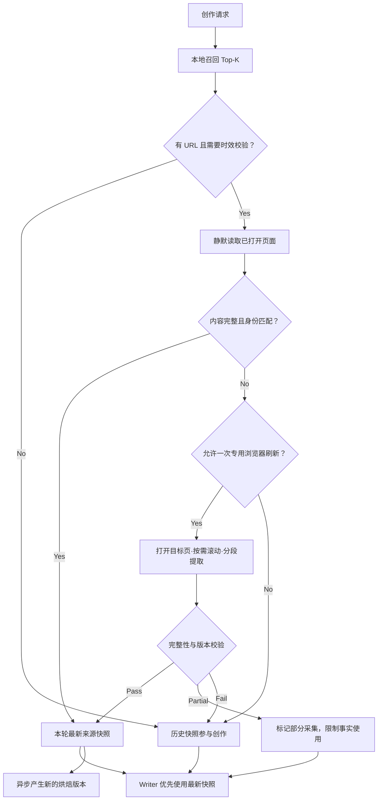

# MemoryBread 创作文档召回即时刷新方案

**状态：** MVP 已落地（站点适配与自动重新烘焙待后续阶段）
**最后更新：** 2026-08-21
**决策人：** 待指定

## 一、结论

方案可行，但不建议把“所有召回文档都像数据一样强制打开浏览器并滚动到底”作为默认逻辑。建议采用**本地召回 + 按需即时校验 + 有边界的完整性证明**的混合方案：

1. 仍使用本地文档索引完成首轮召回，保证速度和离线可用。
2. 只对 Top-K 中“有原始 URL、可能被原地更新、且当前任务对时效敏感”的文档执行即时刷新。
3. 优先静默读取已打开页面；必要时才在用户允许下启动一次专用浏览器会话。
4. 滚动只用于触发懒加载或虚拟列表；普通文档优先读取 DOM/Accessibility Tree 中的完整文本，避免不必要的界面操作。
5. 刷新结果先作为“本轮最新来源快照”参与创作，不应未经校验直接覆盖旧的烘焙文档；后台再按版本差异重新提炼。

这一方向可以明显降低“旧版文档被当成当前事实”的概率，但不能对所有站点承诺 100% 获取完整文档。完整性必须变成可观察、可降级的状态，而不是“打开了页面就算成功”。

## 二、问题与现状

创作当前召回的文档是某次采集和提炼后的本地版本。对在线周报、项目方案、会议纪要、需求文档和知识库页面，原 URL 的内容可能已被编辑，而本地向量、摘要和烘焙文档尚未更新。由此会出现：

- 召回主题正确，但关键结论、时间、负责人或指标已过期。
- 多轮创作继续沿用首轮召回的旧版本，时效风险被放大。
- 用户看到了来源 URL，容易误以为系统已核对过当前原文。

仓库现有数据网页刷新能力已提供可复用基础：复用本机浏览器登录态、后台页签静默读取、专用窗口降级、DOM/AX 提取和最多 20 个滚动分段的长页聚合。现有通用采集上限为 80,000 字符，因此它能作为基础，但不能等同于长文档已完整采集。

## 三、目标与非目标

### 目标

- 对有时效风险的召回文档，在撰写前按需校验原始页面。
- 让 Writer 能区分“已验证当前内容”、“历史快照”和“未完整采集”。
- 尽可能复用用户现有登录态，不导出 Cookie、Token 或浏览器配置。
- 在最新性、体验干扰、性能和隐私之间建立可配置边界。

### 非目标

- 不保证解析任意网站、任意嵌入内容、附件、评论、折叠块或历史版本。
- 不绕过登录、验证码、权限、企业安全策略或反自动化限制。
- 不为每次创作刷新全部召回文档，不在后台定时遍历用户的全部文档。
- 不因即时刷新失败而阻断所有创作。

## 用户与场景

- **文档创作者**：需要根据在线周报、需求文档、会议纪要或项目方案生成当前交付物，并希望知道来源是否已校验。
- **历史资料使用者**：仍需要使用本地旧版本理解背景，但不希望旧事实被伪装成当前结论。
- **隐私与运维人员**：需要根据状态、数量、延迟和稳定错误码定位问题，不读取文档正文、凭据或未清理的 URL。
- **典型场景**：用户说“根据最新项目周报生成本周汇报”，系统先本地召回周报，再校验当前原页面；若校验失败，则保留历史背景但不把其中的指标宣称为本周值。

## 四、方案比较

| 选项 | 新鲜度 | 速度 | 对用户干扰 | 完整性 | 结论 |
| --- | --- | --- | --- | --- | --- |
| 仅使用本地版本 | 低 | 高 | 无 | 本地版本内完整 | 保留为离线与失败降级 |
| 所有召回文档强制打开并滚到底 | 高 | 低 | 高 | 仍无法保证 | 不采用 |
| 定时后台刷新全部文档 | 中高 | 召回时快 | 中 | 受站点限制 | 暂不采用，隐私和资源成本高 |
| 召回后对少量风险文档按需刷新 | 高 | 可控 | 可控 | 可显式证明/降级 | **推荐** |

## 五、推荐流程

### 5.1 候选选择

系统先从本地资产完成普通召回，再对召回结果进行刷新门禁判定。默认只检查相关性最高的 2 份可刷新文档，最多 3 份，并且浏览器操作串行执行。以下任一条成立时才进入刷新：

- 用户要求“最新、当前、今天、本周、当前版”等时效性。
- 来源是可原地编辑的在线协作文档，且本地快照超过 TTL。
- 同一 URL 过去观察到多个内容指纹，证明它会原地更新。
- 用户将该文档的刷新策略显式设为“每次校验”。

用户可将单份文档设为“自动、每次校验、从不校验”。处于黑名单、敏感标记或没有原 URL 的文档必须跳过。

### 5.2 采集通道

1. **静默通道（默认）**：仅附加 URL 精确匹配的已打开页签，不创建窗口、不切换前台。
2. **专用会话（降级）**：页面未打开、静默页签结构不足，且用户允许时，在来源浏览器中建立一次临时会话。会话内完成加载、展开和滚动，结束后关闭临时窗口并恢复原应用。
3. **HTTP 通道（仅公开文档）**：不携带任何浏览器凭据；仅当页面为公开文档且完整性可校验时使用。

不导出 Cookie、Authorization header、localStorage、客户端证书或浏览器配置。

### 5.3 完整文档提取

提取顺序为：站点结构化内容/DOM → Accessibility Tree 补充 → 分段滚动触发懒加载。截图 OCR 只用于视觉内容补充，不作为长文档主提取通道。

每次采集必须返回下列完整性信号：

- `identity_match`：最终 URL、页面标题或站点文档 ID 与召回来源一致。
- `reached_end`：已到达可见滚动容器底部，或 DOM 明确表明正文一次完整挂载。
- `stable_passes`：连续两次遍历的正文指纹和节点数不再增长。
- `expanded_block_count` 与 `remaining_collapsed_count`：已展开和未展开的正文折叠区数量。
- `segment_count`、`character_count`、`truncated`、`content_hash`：用于限制、差异和后续追踪。
- `completeness_status`：`complete | partial | failed`，不得用单一“成功”覆盖部分采集。

评审建议：对文档另设可配置字符预算，不直接沿用数据网页 80,000 字符的“超限即截断”语义。超长时应保留标题树和分片快照，根据当前创作目标选取相关分片，同时明确返回 `partial`。

### 5.4 版本与创作消费

即时刷新得到的是“原始来源快照”，而本地文档是“经过提炼的资产”，两者不应直接覆盖：

- 本轮创作优先使用 `complete` 的最新来源快照中的事实，旧的烘焙文档可继续提供历史背景和结构。
- `partial` 快照只能支持已读取段落的引用，不得用于“通读全文后”的总结性结论。
- 刷新失败时保留旧资产，但标记“历史快照，本轮未验证”。对“当前/最新”问题，Writer 不得把它写成当前事实。
- 新快照与上一来源指纹不同时，异步创建新版本并重新烘焙。新版本通过后才替代默认召回版本，保留原版本哈希以便追踪和回滚。

## 六、功能与非功能需求

- **FR-001** — 当本地召回返回带有可校验 HTTP(S) 原 URL 的文档时，系统必须根据用户时效要求、刷新策略、最后成功校验时间和更新证据判断是否刷新。
- **FR-002** — 默认每轮最多对相关性最高的 2 份文档执行即时校验，上限可配置为 3；浏览器取数必须串行。
- **FR-003** — 刷新必须直接建立一次性隐藏浏览器会话，不依赖用户预先打开 URL 精确匹配页签；正文加载、交互与长页遍历结束后必须清理该会话。
- **FR-004** — 对懒加载或虚拟化文档，系统必须分段滚动、去重合并，并在到达底部后再执行至少一次稳定性复检。
- **FR-005** — 每次刷新必须返回页面身份、版本指纹、完整性状态、截断状态、采集时间和稳定错误码。
- **FR-006** — Writer 必须优先使用已校验的当前快照；历史快照在刷新失败时仍可作背景，但不得用来回答当前事实。
- **FR-007** — 当新来源指纹与旧版本不同时，系统必须保留版本关系并异步重新提炼，不得在无原文快照和完整性证据时覆盖旧资产。
- **FR-008** — 用户必须能在单份文档上设置“自动、每次校验、从不校验”，并看到最后成功校验时间、完整性和失败原因。
- **FR-009** — 刷新链路必须尊重应用黑名单、敏感标记和 URL 凭据清理规则，不得保存或输出会话凭据。
- **FR-010** — 任一单文档刷新失败不得清空已有召回结果或中断创作；系统必须返回降级状态。

- **NFR-001** — 单文档默认刷新超时为 45 秒，单轮总刷新时间预算不得超过 90 秒；超时时按 `partial` 或 `failed` 降级。
- **NFR-002** — 同一文档的自动校验默认 6 小时内最多发生一次，内容 TTL 必须可按历史更新节奏在 12 小时至 7 天之间调整。
- **NFR-003** — 日志和创作轨迹只保留文档 ID、站点类型、状态、字符数、分段数、延迟、指纹和错误码，不保留 URL 查询值、正文、Cookie、Token 或浏览器脚本输出。
- **NFR-004** — 未登录、断网、未运行受支持浏览器或用户拒绝前台刷新时，本地创作与召回仍必须可用。

## 七、状态、错误与页面反馈

### 刷新状态

| 状态 | 含义 | 创作行为 |
| --- | --- | --- |
| `fresh_complete` | 本轮已取得完整、身份匹配的快照 | 可作为当前事实 |
| `fresh_recent` | 命中节流门禁，复用近期成功的完整快照 | 可在节流窗口内作为当前事实 |
| `fresh_partial` | 取得部分内容或发生截断 | 只可使用已读段落，禁止全文结论 |
| `fresh_recent_partial` | 命中节流门禁，复用近期部分快照 | 只可使用已读段落，禁止全文结论 |
| `unchanged` | 指纹与已验证版本一致 | 继续使用已验证版本 |
| `historical_only` | 未刷新或刷新失败，仅有旧快照 | 仅作背景，显式标记时间 |
| `unavailable` | 身份、权限或安全校验失败 | 不使用抓取内容 |

### 稳定错误码

- `URL_MISSING` / `URL_INVALID`：没有可用原地址。
- `REFRESH_THROTTLED` / `CONTENT_FRESH`：被节流或 TTL 门禁跳过。
- `BROWSER_ATTACH_UNAVAILABLE` / `BROWSER_SCRIPTING_DISABLED`：浏览器或系统脚本权限不可用。
- `AUTH_REQUIRED` / `ACCESS_DENIED` / `PAGE_GONE`：需要登录、无权限或页面不存在。
- `IDENTITY_MISMATCH`：跳转后的实际页面不是召回来源。
- `SCROLL_STALLED` / `CONTENT_TRUNCATED` / `COMPLETENESS_UNPROVEN`：滚动失败、超预算或无法证明全文完整。
- `USER_INTERRUPTED`：用户主动切换应用或终止本次刷新。

创作页的参考资料卡显示“刚刚已校验”、“近期已校验”、“部分采集”、“历史版本·最后观察于…”等标识。即时校验直接创建一次性隐藏浏览器会话，不要求用户预先打开来源页；会话完成后必须清理，且不得在用户切换应用后抢回前台。命中 6 小时成功节流时返回最近来源快照，不再把已验证内容降级为“本轮未验证”；瞬态失败只退避 10 分钟。

## 八、主要风险与弊端

| 风险/弊端 | 后果 | 缓解方案 |
| --- | --- | --- |
| 不能真正保证“完整” | 折叠块、附件、分页、虚拟列表或 iframe 可能遗漏 | 引入完整性状态和证据；不能证明时返回 `partial` |
| 延迟显著增加 | 两份文档可让创作多等 30–90 秒 | 只刷新少量 Top-K，有 TTL/节流，展示进度，允许跳过 |
| 干扰用户当前工作 | 浏览器置前、页面滚动、窗口闪现 | 静默通道优先；前台降级需本轮授权；用户切走即中止，不抢回焦点 |
| 并发与会话污染 | 多个任务可以滚动或关闭彼此的窗口 | 全局串行锁、唯一会话标识、精确窗口匹配和孤儿窗口清理 |
| 误抓登录页或其他页 | 旧 URL 跳转后可将无关内容当成源文档 | 校验最终 URL、站点文档 ID、标题和内容特征；不匹配即拒绝 |
| 权限与隐私面扩大 | 自动读取用户登录态文档可超出用户预期 | 仅复用来源浏览器安全上下文；敏感/黑名单优先；前台动作显式授权；不记录正文和凭据日志 |
| 站点兼容性脆弱 | 页面结构、虚拟滚动和安全策略变化后采集失效 | 建立站点适配层和契约测试；通用 DOM/AX 只作降级 |
| 滚动引发页面副作用 | 阅读位置、“已读”状态、分析事件或延迟加载可被触发 | 使用专用窗口，避免操作用户现有页签；禁止点击提交、点赞、评论等交互 |
| 内容注入与恶意页面 | 文档中的指令性文本可影响 Agent 行为 | 把抓取正文标记为不可信证据，只用于内容回答，不得改变 Tool/Skill/权限计划 |
| 新旧版本误合并 | 用 LLM 直接将新原文补丁到旧提炼产物，可遗留已删除结论 | 先保存不可变源快照和 Diff，再生成新烘焙版本；旧版本可追踪、可回滚 |
| 本地存储增长 | 长文档多版本和分片快照占用空间 | 仅持久化变更版本，相同指纹仅更新检查时间，设置版本保留和清理策略 |
| 平台覆盖有限 | 当前浏览器会话附加主要依赖 macOS 和受支持浏览器 | 首期明确平台范围；非支持环境保留本地快照和公开 HTTP 降级 |

## 九、验收标准与追溯

- **AC-001** — （覆盖 FR-001）给定一份本地版本过期、原 URL 可更新的在线文档，当用户要求“根据最新版本”创作时，该文档进入刷新候选；静态文档、无 URL 文档和策略为“从不”的文档不打开浏览器。
- **AC-002** — （覆盖 FR-002、FR-003）给定召回 10 份带 URL 文档，默认必须最多刷新 2 份；若目标页已打开，不切换前台应用。
- **AC-003** — （覆盖 FR-003、FR-010）当目标页未打开且用户不允许专用会话时，创作必须继续并将该文档显示为“历史版本·未校验”。
- **AC-004** — （覆盖 FR-004、FR-005）给定一份含懒加载段落的长文档，验证刷新结果覆盖到页面底部，连续两轮节点数不再增长，且返回分段数、字符数、指纹和 `complete`。
- **AC-005** — （覆盖 FR-004、FR-005、FR-006）当文档超过字符或时间预算时，系统必须返回 `partial` 和 `truncated=true`；Writer 不得声称已通读全文。
- **AC-006** — （覆盖 FR-005、FR-009）当旧 URL 跳转至登录页、首页或其他文档时，系统必须返回对应错误，不将返回页正文交给 Writer。
- **AC-007** — （覆盖 FR-006、FR-007）当原文删除一条旧结论并新增一条结论后，验证本轮 Writer 只把新快照视为当前事实；新烘焙版本不保留被删除结论，且旧版本仍可追踪。
- **AC-008** — （覆盖 FR-008）当用户更改单文档刷新策略后，下一轮召回必须立即按新策略生效，界面显示最后校验结果。
- **AC-009** — （覆盖 FR-009）验证抓取日志、错误事件和创作轨迹中不出现文档正文、凭据或未清理的 URL 查询参数。
- **AC-010** — （覆盖 FR-010）当浏览器未运行、未登录、断网或脚本权限关闭时，创作必须仍产出结果，参考资料标记为历史快照或不可用。

## 十、可观察性与成功指标

- **OBS-001** — 记录候选数、尝试数、静默命中数、专用会话数、`complete/partial/failed/unchanged` 数和各阶段延迟。
- **OBS-002** — 记录刷新前后指纹变化率、新版本重新提炼成功率和版本回滚数。
- **OBS-003** — 区分用户拒绝、权限问题、站点不兼容、超时、截断和身份错配，不上报正文和原始 URL。

建议上线后关注：刷新文档中实际发生版本变化的比例、P50/P95 等待时间、专用会话使用率、部分采集率、用户跳过率，以及“旧版事实进入成稿”的人工抽检率。具体目标值应在基线采集后再确定，不在方案评审阶段虚构。

## 十一、分期实施

### 当前落地范围（2026-08-21）

- 已完成 Top-2 文档串行即时校验、成功校验 6 小时节流、瞬态失败 10 分钟退避、动态 TTL，以及“最新”任务对普通内容 TTL 的受控覆盖。
- 已完成一次性隐藏浏览器会话采集；不读取用户已打开的匹配页签，不触发前台浏览器降级。
- 已完成最多 20 段的长页滚动聚合、80,000 字符截断识别、页面身份校验，以及 `complete / partial / failed` 状态。
- 已完成不可变来源快照、内容指纹幂等、最后成功校验元数据和页面可见状态；即时抓取不再直接覆盖烘焙正文。
- Writer 已按 `fresh_complete / fresh_recent / fresh_partial / fresh_recent_partial / historical_only` 约束事实使用；刷新失败不阻断创作。
- 已完成 Core、Sidecar 与桌面端契约贯通；旧数据默认解释为“历史版本·未校验”。
- 暂未完成站点专用折叠块展开、真实双遍节点稳定性证明、后台自动重新烘焙、版本 Diff/回滚和快照清理策略；这些继续归入 Phase 2/3。

### Phase 0：能力验证

- 选取 3–5 个高频在线文档站点，建立真实长文、折叠块、虚拟化、权限跳转和超长内容样本。
- 用实验数据确定字符、分段、时间预算和完整性规则。
- 验证页面滚动是否会改变已读状态或其他站点数据。

### Phase 1：低干扰 MVP

- 仅支持静默读取已打开页签和公开 HTTP 文档。
- 上线召回后门禁、完整性状态、快照指纹、Writer 新旧证据规则和参考卡标识。
- 刷新结果暂不自动覆盖烘焙文档。

### Phase 2：专用会话与完整滚动

- 在用户授权下加入一次专用浏览器会话、懒加载触发、折叠块安全展开和完整性证明。
- 优先完成站点适配层，再开放通用 DOM/AX 降级。

### Phase 3：版本化重新烘焙

- 持久化不可变来源快照、版本指纹和 Diff。
- 在后台重新烘焙并通过质量门禁后替换默认召回版本。
- 提供版本追踪、回滚和存储清理策略。

## 十二、发布与回滚

- **ROLL-001** — 先以功能开关只向内部测试开放，初期只支持明确验证过的站点。
- **ROLL-002** — 灰度期默认只开静默刷新，专用浏览器会话使用独立开关。
- **ROLL-003** — 回滚时关闭即时刷新开关，召回立即恢复为纯本地版本；已持久化的新版本保留但不成为默认版本。
- **ROLL-004** — 旧客户端和旧数据库继续把缺失刷新字段解释为 `auto` 且“未校验”，不影响本地召回。

## 十三、待决策事项

1. 首批支持哪些在线文档站点，是先做通用 DOM/AX，还是先做 3–5 个站点适配器。
2. 专用浏览器会话是“每轮确认”，还是允许用户设置一次长期偏好。
3. 超长文档的默认字符、分段和总时间预算，需要用 Phase 0 样本数据确定。
4. 是否在本轮创作结束后立即发起重新烘焙，还是进入旲时计算队列。
5. 来源快照的版本保留数量、保留时间和磁盘上限。

## 十四、变更历史

- 2026-08-21：创建方案评审稿。
- 2026-08-21：完成低干扰 MVP、版本化来源快照、完整性状态和创作消费约束；记录 Phase 2/3 遗留项。
