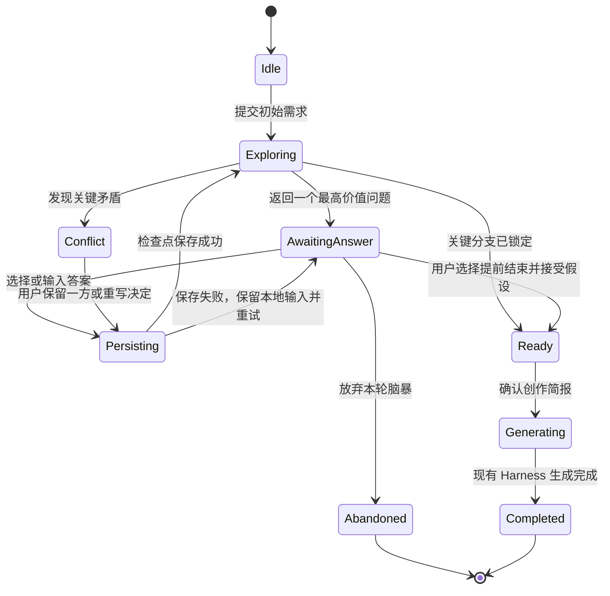

# 创作页“直出 / 脑暴”创作模式产品技术规格

> 状态：Draft / 方案评审  
> Owner：待指定  
> Decision Maker：待指定  
> 最后更新：2026-08-31  
> 影响范围：MemoryBread `desktop-ui`、`core-engine`、`ai-sidecar`、创作历史与 `creation.agent.v1` 事件协议

## 1. 摘要

创作页新增用户可选择的两种创作模式：

- **直出模式**：保持当前行为。用户提交需求后，Creation Harness 直接规划、检索、生成和质检文档。
- **脑暴模式**：在文档生成前进入“需求探索”阶段。系统结合用户输入、已选 Skill 和本地可读取上下文，每轮只提出一个上游高价值问题；问题可以是选择题或输入题，并给出推荐答案和取舍。每次回答都会立即更新并持久化一份“创作简报”。当关键方向已经锁定、重大矛盾已经解决后，用户确认简报，再由现有 Creation Harness 生成文档。

脑暴模式参考 Grill Me 的核心方法：一次解决一个问题、先处理上游决策、每题给出推荐答案、读取已有资料后再问、逐答持久化、主动暴露矛盾、收敛后再产出。不同之处是：Grill Me 本身以提取和压力测试为终点；MemoryBread 将脑暴作为创作前置阶段，最终必须能连续交给现有创作 Agent。

本方案采用**代码控制权威状态与持久化 + 模型根据完整选择路径动态生成下一题和候选项 + JSON Schema 校验**。是否继续追问、是否沿当前分支下钻以及何时收敛均由模型判断，不作为用户选择项。模型判断已经收敛后，界面仍可提供“继续脑暴”，由模型推荐若干新的探索方向，末项允许用户输入自定义方向；模型不能自行跳过用户决定、覆盖历史答案或直接修改持久化状态。

## 2. 问题与证据

### 2.1 用户问题

当前创作链路会在收到首轮需求后直接建立目标并开始方案设计、章节设计和文档撰写。当方案类、设计类、规划类需求的目标用户、范围、关键选型或成功标准仍不清楚时，Agent 只能自行补充假设。一旦早期方向错误，后续章节、细节、资料检索和质量优化都会围绕错误方向继续投入。

用户实际需要的不是“先生成一篇再反复改”，而是以较低成本先锁定少数高影响决策，再开始高成本产出。

### 2.2 当前能力基础

现有创作系统已经具备：

- 目标驱动的 Creation Harness、专业 Agent、Tool、Skill 和质量回路；
- `session_id`、`root_request`、多轮对话、事件轨迹和文档修订；
- `confirmation.required` 暂停点；
- 本地创作历史和恢复；
- 本地模型与品牌模型共用的暂停 / 恢复协议。

但现有 `confirmation.required` 只表达一次布尔确认，不能承载选择题、输入题、推荐项、答案修订、分支依赖、矛盾或逐答检查点，因此不能直接承担脑暴流程。

### 2.3 参考方法

公开 Grill Me Skill 的共同原则包括：

1. 一次只问一个问题；
2. 优先解决依赖链上游和信息增益最高的问题；
3. 每题给出一个推荐答案，让用户确认、修正或重定向；
4. 可以从代码、资料或上下文中得到的答案，不重复询问用户；
5. 每次回答后立即更新持久化记录；
6. 后续答案与前文矛盾时主动指出；
7. 所有重要分支锁定或明确延期后才结束。

参考：[Grill Me Skill](https://github.com/gusinov/grill-me/blob/main/grill-me/SKILL.md)、[focused Grill Me variant](https://github.com/suttapol/codex-setup/blob/main/skills/grill-me/SKILL.md)。

## 3. 目标与非目标

### 3.1 目标

- **G-001**：用户可以明确选择“直出”或“脑暴”，且直出保持当前效率和兼容性。
- **G-002**：脑暴优先消除会改变整体方案的上游不确定性，避免先细化后推翻。
- **G-003**：每次回答都形成可见、可恢复、可修订的创作简报检查点。
- **G-004**：脑暴有明确收敛条件，用户可以随时基于当前简报开始生成，不陷入无止境访谈。
- **G-005**：脑暴结论作为结构化输入进入现有 Creation Harness，而不是拼成一段不可追溯的隐藏 Prompt。
- **G-006**：模式、问题、回答、推断和最终采用的约束可在本地历史中追溯，但不得写入普通日志或云端遥测正文。

### 3.2 非目标

- 不把创作页改造成通用访谈或知识管理工具。
- 不要求所有创作都经过脑暴；短文、改写、翻译、总结等任务仍适合直出。
- 不在脑暴阶段自动执行互联网检索、付费调用、发布、发送或其他有外部影响的动作。
- 不展示模型私有思维链；只展示“为什么现在问”、推荐理由、取舍和安全的判断摘要。
- 不把供应商模型名、供应商密钥或购买成本写入客户端契约。
- MVP 不支持多人共同回答同一个脑暴会话。

## 4. 核心产品决策

### 4.1 用户始终拥有模式选择权

创作输入框附近增加分段选择器：`直出` / `脑暴`。

- 默认值为 `直出`，保证老用户行为不变；模式偏好可保存在本机，但每个新会话都保存自己的实际模式。
- 当需求被识别为方案、设计、架构、PRD、规划、策略等高歧义任务，而用户仍选择直出时，页面可显示非阻断提示“这个需求适合先脑暴”，但**不得自动切换模式**。
- 已生成文档后的后续修改，仍允许逐轮选择“直接修改”或“先脑暴再修改”。模式作用于本轮任务，不永久锁死整个会话。

### 4.2 一轮只解决一个决策

每一轮只展示一个主问题。所有问题都必须由模型给出 2 到 5 个任务特定方向，并把“自定义答案”作为末项独立选项；只有选中该项后才展开输入框，并与所有预设选项互斥。不得在一个问题中同时提交预设选项和自定义文本，也不得同时塞入多个独立问题。这样能让下一题真正依赖上一题答案，并避免用户一次面对十多个表单字段。

支持的问题类型：

| 类型 | 适用场景 | UI |
| --- | --- | --- |
| `single_choice` | 互斥方向、优先级、范围 | 2—5 个单选项 |
| `multi_choice` | 可并存目标、能力或风险 | 2—5 个多选项，可限制最多选择数 |
| `confirm_inference` | 兼容旧版已从资料推断的历史答案 | 仅用于历史展示，不作为模型新题型 |

所有问题必须允许“自定义答案”；推荐选项固定置顶并标记“推荐”，同时解释选择它会得到什么、放弃什么。组织特有信息或难以穷举的约束也必须先枚举代表性方向，再由末项自由输入承接未覆盖答案，不再使用纯自由文本题。

### 4.3 简报是脑暴阶段的事实源

脑暴期间，文档区域不显示空白页，而是实时显示“创作简报”，并区分：

- **已确认**：用户明确选择或输入；
- **资料推断**：来自本地资料或已选 Skill，尚待用户确认；
- **合理假设**：用户选择跳过后由 Agent 补齐；
- **待决定**：仍会影响方案方向的开放项；
- **存在冲突**：新答案与既有决定不一致。

模型上下文、聊天记录或 `resume_state` 都不是脑暴事实源。每次回答保存成功后，新的简报 revision 才生效。

### 4.4 用户可提前结束，但不能被“伪完成”

页面始终提供“基于当前简报生成”。若仍有高影响开放项，点击后展示这些开放项及系统将采用的假设，用户可：

1. 返回继续脑暴；
2. 接受列出的假设并生成。

系统不得用问题数量作为结束条件，也不设置产品层面的固定题数或固定下钻层数。每轮由模型根据原始需求、完整选择路径、当前简报和最近选择的取舍，自主判断继续追问、沿当前分支下钻或收敛；较早上下文通过简报压缩继续保留。用户可以随时基于当前简报生成。系统判断 `ready` 后，用户还可以从模型推荐方向或末项自定义方向发起一轮新的“继续脑暴”，但不能手动要求模型继续下钻当前分支。

## 5. 用户流程

### 5.1 直出模式

1. 用户选择“直出”，输入需求并点击“开始创作”。
2. 客户端按现有协议调用 Creation Harness。
3. Agent 检索、规划、生成、质检并展示文档。
4. 本轮历史记录保存 `creation_mode=direct`。

直出链路不增加额外模型调用或确认步骤。现有旧 Core / Sidecar 回退行为保持不变。

### 5.2 脑暴模式



详细流程：

1. 用户选择“脑暴”，输入创作需求，按钮文案变为“开始梳理”。
2. 系统先解析任务类型，并读取已选 Skill 和已允许读取的本地资料；能从资料得到的内容写为“资料推断”，不直接询问。
3. 系统建立决策图，从最高影响、最高不确定、最上游的未解决节点中选择一个问题。
4. 页面展示一个问题卡：问题、为什么现在问、推荐答案、其他选项，以及固定末项的“自定义答案”；自定义输入框仅在该项被选中后显示。
5. 用户回答后，系统先持久化答案和新简报 revision，再生成下一题。
6. 若答案推翻上游决定，系统把受影响的下游答案标记为 `stale`，明确告知哪些结论需要重新确认；不静默保留失效结论。
7. 模型判断达到收敛条件后，页面展示创作简报确认页。用户可编辑任一决定、从模型推荐方向或末项自定义方向继续脑暴，也可“按此生成”。
8. 确认后，现有 Harness 以 `root_request + creation_brief` 建立目标并生成文档；最终历史保留脑暴摘要和答案来源。

### 5.3 切换模式

- **尚未开始**：可无成本切换。
- **脑暴进行中切换到直出**：提供“基于当前简报直出”与“仅按原始需求直出”两个明确动作；默认推荐前者。
- **直出已在执行**：模式选择器禁用；用户可中止后重新发起，不能把运行中的 Loop 热切换成脑暴。
- **文档已生成**：模式选择器控制下一轮修改。选择脑暴时，新简报只记录本轮修改决策，并引用首轮简报和当前文档。

### 5.4 中断与恢复

- 关闭页面、切换 Tab 或应用退出后，再次打开同一创作记录应恢复到最后成功保存的简报 revision 和当前问题。
- 用户尚未提交的输入仅保存在前端草稿；已点击提交但保存失败的回答显示“未保存”，不得生成下一题。
- 用户可“放弃脑暴但保留记录”；该记录不产生空白创作文档，并可从创作记录继续。

## 6. 页面交互

### 6.1 输入区

```text
┌──────────────────────────────────────────────┐
│ 创作模式  [ 直出 ] [ 脑暴 ]                  │
│                                              │
│ 描述你想创作的内容……                         │
│                                              │
│ + 附件   @ Skill   模型              开始梳理 │
└──────────────────────────────────────────────┘
```

模式下方只在需要时显示一行说明：

- 直出：“直接规划并生成完整内容。”
- 脑暴：“先逐步确认关键方向，形成简报后再生成。”

### 6.2 脑暴问题卡

```text
┌ 方向 1/预计 6 · 目标与受众 ───────────────────┐
│ 这份方案首先要说服谁做出什么决定？             │
│ 先锁定决策人，会直接影响内容深度与论证方式。     │
│                                               │
│ ● 集团管理层批准立项（推荐）                   │
│   聚焦收益、风险、投入和路线，不先展开接口细节。 │
│ ○ 业务负责人统一流程                           │
│ ○ 技术团队进入实施                             │
│ ○ 自定义答案                                   │
│   （选中后）具体内容                           │
│   [                                           ]│
│                      [跳过] [确认并继续]        │
└───────────────────────────────────────────────┘
```

交互要求：

- 推荐项默认获得视觉强调，但不得默认提交；
- 自定义答案固定为末项；选中后清空预设选项并显示输入框，改选任一预设项后隐藏输入框；
- “确认并继续”只允许提交预设选项或非空自定义文本中的一种，自定义文本按去除首尾空白后的内容保存；
- 单选、输入、提交、返回编辑均支持键盘操作和可见焦点；
- 问题卡使用现有白色卡片、浅灰背景、深色正文和克制强调色，不引入第二套设计系统；
- 窄屏时选项纵向排列，主提交按钮保持可见；
- `prefers-reduced-motion` 下取消卡片切换动画；
- 模型生成下一题期间显示“正在整理你的回答”，保留已提交答案，不显示伪进度百分比。

### 6.3 创作简报

简报建议固定包含以下分区，但只显示与当前任务有关的部分：

1. 目标与预期决策；
2. 目标用户 / 读者；
3. 当前问题与证据；
4. 范围与非范围；
5. 关键约束；
6. 方向、备选方案与取舍；
7. 成功标准；
8. 风险、失败方式与待核验项；
9. 输出结构与表达偏好。

每个条目显示来源标签与“修改”入口。修改上游答案后，相关下游条目先进入“需重新确认”，而不是直接删除。

## 7. 问题生成与收敛机制

### 7.1 决策图

Sidecar 为每次脑暴维护一个有向决策图。节点至少包含：

```text
DecisionNode {
  id
  dimension
  question_goal
  depends_on[]
  affects[]
  impact: low | medium | high
  uncertainty: known | inferred | unknown | conflicting
  status: pending | answered | skipped | stale | locked
  answer_source: user | local_context | skill | agent_assumption
}
```

方案类任务使用两层覆盖图：

- **背景决策层**：业务目标、使用者与触发流程、现状问题与证据；
- **章节决策层**：总体方案与能力架构、核心能力与实现机制、端到端使用链路与集成、质量评估与反馈闭环、实施路径与演进；
- **落地护栏层**：范围边界、数据治理、责任运营、成功标准和技术约束。技术约束排在业务、架构和核心机制之后，避免性能参数反向主导方案。

前三类背景决策完成后，下一题优先进入架构与核心机制，不要求先把所有背景或治理细节问完。Skill 的 `executionSteps` 会按语义归并到上述稳定决策面，并把步骤的 `objective` 与 `output` 注入问题目标；收集资料、撰写、排版、润色、审校和交付等机械步骤不转换为用户问题。这样既利用 Skill 的章节结构，也避免一个九步模板变成九道固定题。

### 7.2 下一题选择

代码只从依赖已满足且状态为 `pending / stale / conflicting` 的节点中选择候选。建议优先级：

```text
priority = 影响程度 × 不确定程度 × 下游节点数量 × 失败代价
           - 用户回答成本 - 已可从资料读取的程度
```

具体权重属于实现参数，不进入公开协议。模型结合这些信号自主决定是否继续提问、是否沿当前分支下钻以及何时收敛，并把选中的 `question_goal` 改写成自然、具体的问题、生成有限选项；模型不得自行跳到依赖未满足的细节节点。客户端不展示“是否继续下钻”的用户选项。

### 7.3 推荐答案

推荐答案来自以下优先级：

1. 用户已经明确表达的目标和约束；
2. 已选 Skill 的规则；
3. 用户授权读取的本地资料；
4. 针对当前任务的通用产品 / 方案设计惯例。

每个推荐项必须同时给出简短理由和主要代价。资料不足时应标记“基于当前信息的建议”，不得伪装成用户已做决定。

### 7.4 矛盾处理

当新答案与已锁定节点冲突时，系统必须：

1. 暂停普通提问；
2. 引用两条冲突结论的安全摘要；
3. 让用户选择保留旧决定、采用新决定或重写统一决定；
4. 递增 revision，并把受影响的下游节点标记为 `stale`；
5. 重新询问其中仍会改变方案方向的节点。

### 7.5 收敛条件

同时满足以下条件时进入 `ready`：

- 目标与预期决策已锁定；
- 用户 / 读者已锁定；
- 总体架构、核心机制、端到端链路、质量反馈和实施演进已经确认或显式延期；
- 范围和至少一个关键约束已锁定，或被明确标记为不适用；
- 不存在 `high` 影响的冲突节点；
- 方案类 / 设计类任务至少比较过一个方向与替代方案；
- 成功标准已锁定，或用户明确接受系统假设；
- 其余开放项不会改变整体方向，只影响可在写作阶段补足的细节。

用户提前结束时可跳过上述自动收敛，但必须确认所有高影响开放项对应的假设。模型返回 `ready` 时还必须给出 2 到 4 个可选的继续脑暴方向及其价值说明；这些方向用于开启新的探索分支，不代表当前简报尚未收敛。

### 7.6 执行 Skill 的解析时机

脑暴启动前必须先运行与正式生成相同的提交后 Skill 路由。显式 `@Skill` 优先；没有显式选择时，使用 Skill 自描述进行模型匹配。路由结果在首轮 `start` 时写入 Core，后续回答、跳过、修改和继续脑暴均携带并复用同一上下文。不得先开始脑暴、到正式生成时才补选 Skill，否则 Skill 章节无法参与问题覆盖与收敛门禁。

## 8. 示例：数据治理平台建设方案

用户输入：“帮我设计一套集团数据治理平台建设方案。”

系统不会立即开始写总体架构，而是依次根据回答选择下一题：

1. **目标与决策**：“这份方案首先要推动管理层批准立项、统一业务流程，还是指导技术实施？”推荐“批准立项”，因为输入尚未给出实施边界。
2. **问题证据**：“当前最需要解决的是口径不一致、数据质量、权限合规，还是交付效率？”上一题选择管理层后，此题决定价值论证主线。
3. **范围**：“一期推荐覆盖主数据 + 指标口径，还是直接覆盖全域治理？”推荐小范围闭环，并说明全域覆盖的时间和组织成本。
4. **组织约束**：“治理规则由集团集中决策，还是事业部自治、集团设底线？”该决定会影响平台权限和流程架构。
5. **方向取舍**：“优先复用现有数据平台增加治理能力，还是建设独立治理平台？”系统读取已有项目资料后可给出 `confirm_inference`，不要求用户重复现状。
6. **成功标准**：“一期验收更看重规则覆盖率、问题闭环时长，还是核心指标一致率？”

简报确认后，现有“方案设计 Agent → 章节设计 Agent → Writer → 质量审校”链路消费这些已锁定决定。若用户在第 4 题改为“事业部完全自治”，系统需将第 3、5 题中依赖集中治理的推断标记为需重新确认。

### 8.1 回放：原创剧本在灵机独立站使用

历史会话只确认了目标用户与价值、触发痛点和进入页面后的第一个动作。旧逻辑把这三项当作充分信息并进入生成，导致后续“整体架构”和“原创剧本生成机制”完全由 Writer 自行假设。

新逻辑将这三项仅映射为背景决策。回放后的下一题必须是“总体方案与能力架构”，随后至少覆盖：原创剧本能力采用何种生成与知识组合机制、输入和可控参数如何设计、用户如何修改并进入下游视频生成、原创性与 AI 感如何评估和反馈、一期如何试点与演进。任何一个必答章节决策仍为 `pending` 时，模型返回的 `ready` 都会被拒绝。

## 9. 功能需求

- **FR-001** — 创作页必须允许用户在发起每一轮创作前选择 `direct` 或 `brainstorm` 模式。
- **FR-002** — 选择 `direct` 时，系统必须保持现有 Creation Harness 行为，不增加脑暴问题或额外确认。
- **FR-003** — 当高歧义创作需求处于 `direct` 时，页面可以推荐脑暴，但不得自动切换模式或阻止直出。
- **FR-004** — 选择 `brainstorm` 后，系统必须先建立并持久化脑暴会话，再展示第一个问题。
- **FR-005** — 系统每轮必须只展示一个主问题；模型新生成的问题只支持 `single_choice`、`multi_choice`，`confirm_inference` 仅用于兼容旧版已回答记录，不得生成纯 `free_text` 题。
- **FR-006** — 每个问题必须包含 2 到 5 个任务特定方向、唯一推荐项、推荐理由、主要取舍和固定末项的自定义答案入口；自定义输入框只能在该项被选中后显示，且预设选项与自定义答案必须互斥选择和提交。
- **FR-007** — 系统必须优先读取已允许的本地上下文和已选 Skill，不能询问可直接得到且置信度足够的信息；推断必须等待确认或明确标记来源。
- **FR-008** — 每次回答必须在下一题出现前保存为新的简报 revision；保存失败时不得推进决策图。
- **FR-009** — 系统必须在简报中区分用户确认、资料推断、Agent 假设、待决定和冲突。
- **FR-010** — 修改上游答案后，系统必须将受影响的下游节点标记为 `stale` 并按影响重新确认。
- **FR-011** — 检测到关键矛盾时，系统必须先解决矛盾，再继续普通问题。
- **FR-012** — 是否继续追问、是否沿当前分支下钻以及何时收敛必须由模型判断，不得展示为用户选择；满足收敛条件或用户确认接受剩余假设后，系统必须生成可预览、可编辑的最终创作简报。处于 `ready` 时，页面可展示“继续脑暴”，并按模型推荐方向在前、自定义方向固定末项的顺序开启新的探索分支。
- **FR-013** — 用户确认简报后，系统必须把结构化简报交给现有 Creation Harness，并在同一 `session_id` 下生成文档。
- **FR-014** — 用户必须可以在脑暴中随时返回修改答案、跳过当前题、按当前简报生成或放弃脑暴。
- **FR-015** — 应用重启或页面重进后，系统必须恢复最后成功保存的简报 revision 和当前问题。
- **FR-016** — 对已有文档选择脑暴时，系统必须把本轮脑暴限定为修改目标，并保留首轮需求和当前文档作为基线。
- **FR-017** — 创作记录必须显示本轮使用的模式，并可查看最终简报、已确认决定与开放假设。
- **FR-018** — 不支持脑暴协议的旧 Sidecar 被检测到时，客户端必须提示“当前版本暂不支持脑暴”，允许切换直出，不得静默直出。
- **FR-019** — 方案类任务在背景决策完成后，必须继续覆盖总体架构、核心机制、端到端链路、质量反馈和实施演进；这些章节决策未确认或显式延期时，模型不得自动收敛。
- **FR-020** — 脑暴启动前必须完成与正式生成一致的执行 Skill 路由，并将 Skill 的决策性执行步骤归并为稳定章节覆盖项；写作和审校类步骤不得生成机械问题。

## 10. 非功能需求

- **NFR-001** — 所有脑暴正文、问题和答案只保存在本地产品数据中；普通日志和遥测不得记录其正文。
- **NFR-002** — 回答提交到本地持久化成功的 P95 应小于 300 ms；模型生成下一题不计入持久化耗时。
- **NFR-003** — 问题生成失败时，系统应在 2 次内部结构修复重试后保留当前页面答案并提示重试，不得用固定通用选项冒充动态结果。
- **NFR-004** — 脑暴不得设置固定题数或固定层级；为控制上下文，Sidecar 可以只发送最近若干轮原始问答，但必须同时发送累计简报，且不得因此强制收敛。
- **NFR-005** — 问题卡、模式选择器、简报修改和主要动作必须支持键盘、可见焦点、屏幕阅读器标签及窄屏布局。
- **NFR-006** — 客户端内 Python 代码必须保持 Python 3.9 语法兼容。
- **NFR-007** — 新事件和字段必须向前兼容；客户端继续忽略未知事件，旧历史缺少脑暴字段时按 `direct` 展示。
- **NFR-008** — 脑暴问题与简报传入模型前必须沿用现有内容边界和长度限制，防止上下文无限增长。

## 11. 接口与事件契约

### 11.1 请求扩展

脑暴问答使用独立的逐答端点 `POST /api/creation/brainstorm/turn`，避免把等待用户输入的状态混入现有生成 SSE：

```json
{
  "session_id": "creation-session-id",
  "root_request": "设计数据治理平台建设方案",
  "selected_skills": [{
    "id": "microservice-solution",
    "title": "微服务模块技术方案文档",
    "summary": "覆盖业务流程、数据所有权、组织保障和上线验收",
    "skillDescription": {},
    "executionSteps": []
  }],
  "action": "answer",
  "revision": 3,
  "question_id": "scope.primary",
  "answer": {
    "selected_option_ids": [],
    "custom_text": "一期覆盖三个核心事业部"
  }
}
```

约束：

- `action`：`start | answer | skip | reopen | revise_answer | finish | continue_brainstorm | abandon`；
- `revision` 用于乐观并发控制；不匹配时返回 `409 BRAINSTORM_REVISION_CONFLICT`；
- `question_id` 必须等于服务端当前问题；`reopen` / `revise_answer` 可指向已回答问题；
- `answer` 只保存用户可见答案，不保存模型私有推理；
- 选择题的 `selected_option_ids` 与非空 `custom_text` 必须互斥；组合提交、未开放自定义答案却提交 `custom_text`，均返回 `400 BRAINSTORM_INVALID_ANSWER`；
- 已保存的旧版组合答案继续保持可读；互斥规则只约束新回答和修改后的答案，不破坏性改写历史记录；
- `continue_brainstorm` 仅允许在 `ready` 状态调用；推荐方向提交 `continuation_direction_id`，自定义末项提交 `continuation_direction_id=__custom__` 与 1 到 500 字的 `focus_hint`；
- 每次成功响应只返回一个 `current_question`，并携带最新 `brief_markdown`、`decisions`、`open_flags`、`continuation_directions` 与 `invalidated_question_ids`。

`POST /api/creation/agent/run` 保持现有生成职责，并在 `AgentRunRequest` 上增加可选字段：

```json
{
  "creation_mode": "brainstorm",
  "creation_brief": {
    "session_id": "creation-session-id",
    "revision": 4,
    "phase": "ready",
    "brief_markdown": "# 创作简报\n...",
    "decisions": []
  }
}
```

- `creation_mode`：`direct | brainstorm`，缺省按 `direct`，保证旧客户端兼容；
- `creation_brief` 为 Core 已返回并由客户端持有的结构化快照；Core 将其连同模式转发给 Sidecar，并把实际消费的 revision 固化到创作历史；
- 直出请求不带 `creation_brief`，继续走原有生成链路。

### 11.2 问题契约

```json
{
  "id": "audience.primary_decision",
  "dimension_id": "users_workflow",
  "dimension": "audience",
  "type": "single_choice",
  "prompt": "这份方案首先要说服谁做出什么决定？",
  "why_now": "受众会决定价值论证与技术细节的比例。",
  "required": true,
  "allow_custom": true,
  "options": [
    {
      "id": "management_approval",
      "label": "管理层批准立项",
      "description": "聚焦收益、风险、投入与路线。",
      "recommended": true
    }
  ],
  "answer_template": "主要读者是___，希望他们决定___。"
}
```

校验规则：

- `single_choice` 与 `multi_choice` 都必须提供 2—5 个选项；
- 必须且只能有一个 `recommended=true`，且推荐项排序第一；
- `single_choice` / `multi_choice` 只能提交有效选项 ID 或在 `allow_custom=true` 时提交非空自定义文本，不能同时提交两者；
- `why_now` 只解释决策影响，不暴露思维链；
- 题型错误、选项数量错误、选项字段不完整、选项 ID 重复或推荐项数量错误时丢弃模型结果，并携带具体错误自动重试；达到 3 次上限后返回 `BRAINSTORM_MODEL_OUTPUT_INVALID`，保留当前输入并提示重试，不得降级为自由文本题。

### 11.3 状态返回

V1 的脑暴状态通过逐答端点的同步 JSON 返回，不新增 Creation Agent SSE 事件。只有进入正式生成后才沿用 `creation.agent.v1` 事件流。这样刷新恢复、revision 冲突和逐答失败都能在生成会话之外独立处理。

### 11.4 错误码

| HTTP / 错误码 | 行为 |
| --- | --- |
| `400 BRAINSTORM_INVALID_ANSWER` | 答案与题型不匹配，保留输入并提示修正 |
| `404 BRAINSTORM_SESSION_NOT_FOUND` | 提示无法恢复，可从原需求重新开始 |
| `409 BRAINSTORM_REVISION_CONFLICT` | 拉取最新 revision，展示差异后让用户重试 |
| `409 BRAINSTORM_QUESTION_STALE` | 当前问题已变化，不接受旧答案 |
| `422 BRAINSTORM_NOT_READY` | 未接受高影响假设就请求生成，返回开放项 |
| `500 BRAINSTORM_PERSIST_FAILED` | 保留当前页面输入，提示重试，不进入下一题 |

## 12. 持久化设计

新增本地表 `creation_brainstorm_sessions`，避免首篇文档尚未生成时无处恢复：

| 字段 | 说明 |
| --- | --- |
| `session_id` | 主键，与创作会话 ID 一致 |
| `phase` | `exploring / ready / abandoned` |
| `root_request` | 首轮原始需求 |
| `revision` | 单调递增，由 Core 计算 |
| `state_json` | 原始需求、当前问题索引、用户可见答案和失效节点的结构化快照 |
| `created_at / updated_at / completed_at` | UTC 毫秒时间戳 |

`creation_history` 增加兼容字段：

- `creation_mode`：缺省 `direct`；
- `creation_brief_json`：最终简报快照；
- `brainstorm_revision`：生成文档实际消费的 revision。

写入顺序：

1. 校验 `session_id + revision + question_id`；
2. 在一个本地数据库事务中写答案、更新决策图、更新简报并递增 revision；
3. 提交成功后才返回新 revision、简报与下一题；
4. 客户端使用返回值原子替换本地脑暴状态；
5. 生成文档时把实际消费的简报 revision 固化到历史，后续脑暴修改不追溯改变旧文档版本。

问答正文不写入通用应用日志；删除创作记录时，关联脑暴记录沿用现有删除确认与数据生命周期策略。

## 13. Sidecar 实现边界

V1 使用模型驱动的递归脑暴协调器，作为 Creation Harness 的前置状态机：

- **Core 负责**：状态转移、乐观并发、答案版本、回改失效、Skill 上下文持久化和错误契约；
- **代码负责选题与收敛门禁**：按任务类型建立稳定 `dimension_id` 覆盖账本。方案类任务先确认少量背景决策，随后强制横向覆盖总体架构、核心机制、端到端链路、质量反馈和实施演进，再补齐范围、治理、责任、验收与技术约束。必答维度未确认或显式延期时，模型返回的 `ready` 无效；
- **模型负责问题表达**：结合原始需求、完整选择路径、代码指定的 `question_goal` 与已选 Skill，动态生成一个任务特定问题、有限选项、推荐依据和取舍；只有覆盖门禁完成后才能建议收敛或继续下钻；
- **Sidecar 负责**：压缩已选 Skill 的业务与交付规则、构造安全上下文、限制单次输出、校验 `dimension_id`、模型 JSON 和 2 至 5 个完整方向选项、拒绝无依据的精确性能指标，并在最多 3 次内重试无效输出；超过上限必须报错，不得降级题型；
- **Skill 扩展**：客户端在脑暴首轮前完成执行 Skill 路由；Sidecar 将决策性 `executionSteps` 语义归并到稳定章节覆盖项并注入问题目标，不逐步机械发问。Skill 可以补充必答节点和完成条件，但不得破坏通用协议；脑暴只传递必要规则，不传完整示例文档；
- **Tool 负责**：仅在已有授权范围内读取本地资料。互联网检索继续遵循现有开关，不因进入脑暴而自动开启。

最终给 Writer 的结构化上下文至少包含：

```text
CreationBrief {
  revision
  original_request
  desired_outcome
  primary_audience
  problem_and_evidence[]
  scope_in[]
  scope_out[]
  constraints[]
  selected_direction
  rejected_alternatives[]
  success_criteria[]
  risks[]
  output_expectations[]
  assumptions[]
  open_flags[]
  decisions[] { id, value, source, status }
}
```

Writer 必须优先遵循 `status=locked` 的用户决定；资料推断和 Agent 假设不能覆盖用户决定。若 `root_request` 与后续锁定决定冲突，以明确的后续决定为准，并在 `intent.interpreted` 的安全摘要中说明覆盖关系。

## 14. V1 验收标准与追踪

- **AC-001** — 验证 **FR-001/FR-002/FR-003**。给定新会话，当用户保持直出并提交需求时，则请求包含 `creation_mode=direct`、页面不出现脑暴问题；若展示脑暴建议，用户仍可直接生成。
- **AC-002** — 验证 **FR-004/FR-005/FR-006/FR-007**。给定一个具体方案需求，当用户选择脑暴时，则首轮只显示一个根据需求和允许上下文动态生成的问题，选择题包含任务特定推荐、取舍说明和末项“自定义答案”；初始不显示自定义输入框，选中自定义后预设项全部取消且空内容不可提交，改选预设项后自定义输入框隐藏；请求只能携带有效选项 ID 或去除首尾空白后的自定义文本中的一种。已可靠推断的信息必须标记来源。
- **AC-003** — 验证 **FR-008/FR-015**。给定当前 revision，当回答成功时，则 revision 递增、简报更新后才展示下一题；刷新或重新打开同一历史时恢复最后保存的问题。
- **AC-004** — 验证 **FR-008**。给定过期 revision 或问题 ID，当提交答案时，则分别返回 `409 BRAINSTORM_REVISION_CONFLICT` 或 `409 BRAINSTORM_QUESTION_STALE`，且持久化状态不前进。
- **AC-005** — 验证 **FR-009/FR-014**。给定一个当前问题，当用户跳过时，则简报以 `agent_assumption` 保存并显示“合理假设”；用户确认项、待决定项和冲突使用不同文字标签。
- **AC-006** — 验证 **FR-010/FR-011/FR-014**。给定多轮分支答案，当用户回到较早决定时，则该决定、后续答案和当前子问题全部失效；若新答案形成关键矛盾，下一题应先处理矛盾。
- **AC-007** — 验证 **FR-012/FR-014**。给定模型返回 `ready`，页面不得询问用户是否继续下钻，而应展示“继续脑暴”；展开后按模型推荐方向在前、自定义方向固定末项的顺序展示。用户选定方向后状态回到 `exploring`，模型围绕该方向提出一个新问题，并在后续轮次继续自主判断是否下钻或收敛；当用户提前生成时，则必须显式接受开放假设。
- **AC-008** — 验证 **FR-013/FR-016**。给定已确认简报或已有文档的修改脑暴，当正式生成时，则请求携带 `creation_mode=brainstorm`、结构化 `creation_brief`、原始需求与当前文档，Sidecar 将其保存到同一 Creation Harness 会话环境。
- **AC-009** — 验证 **FR-017/FR-018**。给定新旧创作历史，当打开详情时，则新记录恢复模式、简报和 revision，旧记录按直出显示；若 Sidecar 不支持脑暴，则页面提示升级或切换直出，不得静默直出。
- **AC-010** — 验证 **FR-005/FR-014**。给定键盘和窄窗口环境，当用户操作模式、选项、自定义输入、跳过、修改、继续脑暴和生成时，则焦点顺序、语义标签、深色模式与响应式布局均可用。
- **AC-011** — 验证 **FR-019**。给定“原创剧本如何在灵机独立站使用”及已经回答的目标用户、核心价值、场景痛点和首次动作，当请求下一题时，则状态仍为 `exploring`，下一未覆盖项为总体方案与能力架构；之后仍需覆盖原创剧本核心生成机制、完整使用链路、质量反馈与实施演进，未覆盖时拒绝模型 `ready`。
- **AC-012** — 验证 **FR-020**。给定一个非显式 `@` 但匹配技术方案 Skill 的需求，当开始脑暴时，则请求顺序为 Skill 路由、历史建立、脑暴 `start`，且 `selected_skills` 包含架构与核心机制执行步骤；给定包含写作、润色和审校步骤的 Skill，则这些步骤不增加覆盖问题。

下列能力保留为后续增强，不属于本次 V1 交付门槛：直出模式的智能脑暴建议、基于本地资料的预填推断、复杂非线性依赖图与冲突专用卡、Skill 自定义交互组件、遥测灰度和旧 Sidecar 能力协商。

## 15. 观察指标

- **OBS-001** — `creation_mode_selected`：模式、任务类别、本机会话匿名 ID；判断模式使用率，不记录需求正文。
- **OBS-002** — `brainstorm_question_answered`：dimension、question_type、轮次、是否采用推荐、回答耗时；判断问题质量，不记录答案正文。
- **OBS-003** — `brainstorm_completed`：问题数、修改答案次数、冲突次数、开放假设数、完成 / 提前结束 / 放弃；判断流程负担和收敛质量。
- **OBS-004** — `creation_first_major_revision`：生成后首轮是否发生范围、受众、核心方向的重大修订；对比直出与脑暴是否减少方向性返工。
- **OBS-005** — `brainstorm_recovery`：恢复成功、revision 冲突、保存失败、题库兜底；判断可靠性。

建议核心成功指标为：脑暴模式相对直出模式，生成后前两轮内“推翻受众 / 范围 / 核心方向”的重大修订率下降。停留时长和问题数量只能作为护栏，不能单独代表成功。

所有遥测仅上传枚举、计数和耗时；需求、问题、答案、简报、资料标题和文档正文均不得上传。

## 16. 发布与回滚

- **ROLL-001** — Phase A，契约与持久化。增加可选字段、事件、错误码和本地迁移；不开启 UI。验证旧客户端、旧历史和直出回归。
- **ROLL-002** — Phase B，内部灰度。仅在本地 `feature_flags` 开启脑暴；支持首轮方案类 / 设计类创作，使用通用决策图和题库兜底。
- **ROLL-003** — Phase C，小比例用户灰度。收集匿名漏斗与重大返工率；若保存失败率、放弃率或生成失败率超过评审确定的门槛，关闭 feature flag，直出不受影响。
- **ROLL-004** — Phase D，扩展修订脑暴与 Skill 节点。在首轮稳定后再支持已有文档的本轮脑暴修改和 Skill 自定义决策图。

回滚只关闭脑暴入口；已保存脑暴记录保持只读可恢复或可转直出，数据库字段和事件不回退，防止历史不可读。

## 17. 风险与缓解

| 风险 | 后果 | 缓解 |
| --- | --- | --- |
| 问题过多、像填表 | 用户放弃 | 一轮一题、模型按信息增益建议收敛、用户可随时基于当前简报生成；不以固定题数截断 |
| 推荐项形成锚定偏差 | 用户机械接受错误方向 | 显示取舍、允许自定义、不默认提交、标记依据来源 |
| 模型先问细节 | 上游仍错误 | 代码控制依赖图和候选节点，模型只负责表达 |
| 用户改答案后旧结论污染 | 文档内部矛盾 | revision + 依赖失效 + 冲突门禁 |
| 频繁模型调用变慢 | 体验割裂 | 显示生成状态、限制单题输出、结构修复重试；失败时保留页面答案并允许重试 |
| 脑暴内容只在对话中 | 重启或长上下文后丢失 | 每答一次事务性检查点，数据库为事实源 |
| 脑暴成为第二套 Agent | 维护成本和行为漂移 | 仅做前置协调器，最终仍进入现有 Creation Harness |
| 旧版本被静默降级 | 用户以为已脑暴实际直出 | 能力协商与明确错误，不对脑暴静默回退 |

## 18. 开放问题与待决策

1. **默认模式**：本规格推荐继续默认直出，并对高歧义任务做非阻断推荐；是否要对新用户默认脑暴，需要产品数据后再决定。
2. **偏好记忆**：是否记住用户上次模式，或每个新会话固定回到直出。推荐仅记住显式选择，不根据任务自动切换。
3. **脑暴记录入口**：未生成文档的脑暴草稿是否进入现有“创作记录”列表。推荐进入，并标记“脑暴中”，否则恢复入口不明显。
4. **Skill 扩展契约**：MVP 是否允许 Skill 声明自定义决策节点。推荐 Phase B 只读 Skill 的写作规则，Phase D 再开放受 Schema 管理的节点声明。
5. **开放假设门槛**：哪些节点属于所有方案类任务的必答项，需要产品、创作 Agent 与 Skill 维护者共同确认。

## 19. 建议实施拆分

1. **契约优先**：定义 `creation_mode`、`brainstorm_interaction`、问题 Schema、事件和错误码，补协议测试。
2. **Core 持久化**：增加脑暴表、revision 事务、恢复与历史关联。
3. **Sidecar 协调器**：根据完整选择路径动态生成下一题、子项选项和收敛建议，校验结构化模型输出；保持 Python 3.9 兼容。
4. **客户端交互**：模式选择器、单问题卡、创作简报、修改答案、恢复、错误和无障碍状态，沿用当前创作页设计系统。
5. **Harness 接入**：最终简报写入目标环境，Writer / Solution Design / Chapter Design 消费锁定决定，并保留 revision 追踪。
6. **测试与灰度**：覆盖协议、状态机、数据库并发、前端交互、旧版本兼容、直出全回归和匿名指标。

## 20. 变更记录

- 2026-08-30：初版。提出直出 / 脑暴双模式、逐题决策图、创作简报、逐答检查点、收敛门禁及现有 Creation Harness 接入方案。
- 2026-08-31：纠正固定七题实现，改为模型根据用户指令和选择路径递归生成问题与细分子项；移除固定题数和固定层级。
- 2026-08-31：明确是否继续追问和下钻由模型判断；收敛页将用户动作改为“继续脑暴”，展示模型推荐方向，并把自定义方向固定为最后一项。
- 2026-08-31：复盘原创剧本会话的章节覆盖缺口；新增背景/章节/落地三层覆盖图、执行 Skill 前置解析、Skill 步骤语义归并及章节级收敛门禁。
