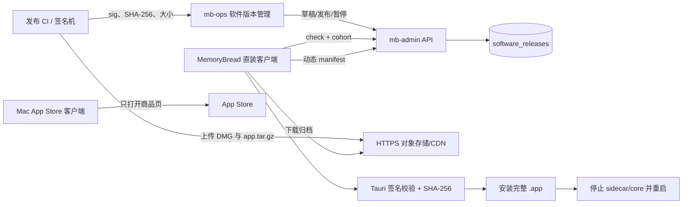
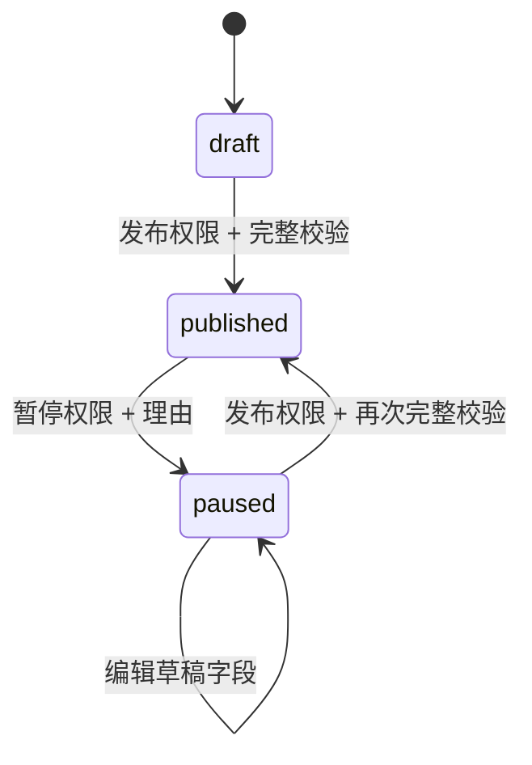

# 记忆面包应用内更新与版本管理完整方案

**状态：** 已实现；生产发布凭证与线上对象地址待发布负责人配置
**负责人：** MemoryBread 发布负责人（未指派具体姓名）
**决策人：** MemoryBread 产品与工程负责人
**最后更新：** 2026-08-05
**适用仓库：** MemoryBread、mb-admin、mb-ops

## 摘要

本方案把记忆面包从“发现新版本后打开下载页面”升级为完整的全应用更新体系：官网直装版在客户端左下角显示更新入口，用户可在应用内完成下载、Tauri 签名校验、SHA-256 校验、安装与重启；运营控制台可管理版本、构建号、渠道、分发方式、灰度比例、最低支持版本、强制更新、发布、暂停和审计。更新归档替换整个 `.app`，因此 React 前端、Rust 桌面壳、core-engine、Python sidecar 和随包资源会作为同一个签名版本升级。

这里的“热更新”指用户无需重新前往网站或 App Store、由正在运行的直装版发起完整应用更新；不采用远程下发并单独执行 JavaScript/Python 代码的机制。Tauri 官方更新器要求对更新归档签名并在客户端验证，签名检查不能关闭，方案在此基础上增加 SHA-256 二次校验。[Tauri Updater 官方文档](https://v2.tauri.app/plugin/updater/)

分发必须区分两条轨道：

- 官网/企业直装版（`direct`）支持上述应用内安装。
- Mac App Store 版（`app_store`）只在客户端打开 App Store 商品页。Apple 规则要求商店应用保持自包含，不能下载、安装或执行会引入或改变应用功能的代码，因此不能把直装更新器伪装进商店包。[Apple App Review Guidelines 2.5.2](https://developer.apple.com/app-store/review/guidelines/)

首次启用更新能力仍存在一次“引导版本”要求：已经安装的旧客户端没有更新器代码，无法自行获得该能力，必须通过既有分发渠道安装一次包含本方案的基线版本。此后，直装轨道可持续在应用内升级；App Store 轨道继续由商店升级。

## 问题与证据

### 现状问题

原有实现具备 SemVer 检查、版本草稿和发布/暂停，但客户端只展示 HTTPS 下载入口，缺少以下闭环：

- 无法在应用内下载和替换完整应用。
- 无 Tauri 更新签名、包大小、构建号、最低支持版本和稳定灰度 cohort。
- 用户关闭可选提示后，缺少类似 Codex 的左下角常驻更新入口。
- 旧发布记录只有安装页或 DMG 地址，不能作为 Tauri 更新归档使用。
- App Store 与官网直装版没有明确分轨，存在合规与实现混淆。

### 影响

- 直装用户每次升级都要离开应用并重新下载安装，发布到达率不可控。
- 缺少密码学签名和回滚防护时，下载地址或运营数据错误可能把不可信包交给客户端。
- 单一版本字符串无法满足 macOS `CFBundleVersion` 单调递增要求，也无法区分同一营销版本的构建次序。
- 如果迁移后继续发布旧的无签名记录，新客户端会看到更新但无法安装。

### 事实依据

- Tauri 动态更新清单支持运行时端点、版本检查、下载、签名验证与安装，适合按渠道、架构和灰度返回不同发布。[Tauri Updater JavaScript/Rust API 参考](https://v2.tauri.app/reference/javascript/updater/)
- Tauri `bundle.macOS.bundleVersion` 用于 macOS 构建号，本方案把它作为独立于 SemVer 的单调整数。[Tauri 配置参考](https://v2.tauri.app/reference/config/)
- App Store 分发不能使用会改变应用功能的自更新代码，必须保留商店更新轨道。[Apple App Review Guidelines](https://developer.apple.com/app-store/review/guidelines/)

## 目标与成果

- 官网直装用户在客户端内完成完整应用更新，不需要手动下载 DMG。
- 更新归档在写入前同时通过 Tauri 签名和 SHA-256 校验。
- 运营人员通过现有 Fluent UI 控制台管理直装版和 App Store 版发布。
- 版本号、构建号、渠道、平台、架构和分发方式形成可验证的单调发布序列。
- 发布可按匿名稳定 cohort 做 1%–100% 灰度，并可立即暂停新检查请求。
- 旧无签名发布在数据库迁移时自动暂停，避免不完整产物进入新链路。
- 文档、API、客户端和运营台对同一字段、状态与发布流程使用一致定义。

## 非目标

- 不远程替换单个 JavaScript、Python、Rust 动态库或模型执行代码。
- 不绕过 Apple App Store 审核或商店更新机制。
- 不在运营台生成、保存或回显 Tauri 私钥、Apple 证书与公证凭证。
- 不实现差分补丁；当前更新归档是完整 `.app.tar.gz`。
- 不实现服务端自动上传对象存储；CI/发布机上传归档后把 HTTPS 地址录入运营台。
- 不在本次新增崩溃率或更新失败遥测上报；现有设备版本上报和发布审计继续可用，更新阶段指标列为后续增强。
- 不承诺当前 macOS 实现已经覆盖尚未交付的 Windows/Linux 安装器行为；数据模型和 API 保留平台字段，但每个平台必须使用自己的归档。

## 用户与场景

### 官网直装用户

- 应用启动、联网恢复、定时检查或回到前台时，用户看到匹配版本的提示。
- 用户关闭可选提示后，左下角仍保留“更新可用”入口，24 小时内不自动再次弹窗。
- 用户点击“立即更新”后留在应用内查看下载、校验和安装阶段，完成后点击“重启并完成更新”。
- 下载中断、签名失败、SHA-256 不一致或安装失败时，客户端保留当前版本并显示可重试错误。

### App Store 用户

- 客户端仍可显示版本说明与左下角入口。
- 点击更新只打开 `apps.apple.com`，不注册应用内下载/安装命令。

### 运营发布人员

- 创建版本草稿，填写版本号、构建号、目标、分发方式、发布说明和审计理由。
- 直装版额外填写 `.app.tar.gz` 地址、`.sig` 内容、SHA-256 和包大小。
- 先以小比例灰度，确认后编辑暂停记录并重新发布更高版本；发布中记录必须先暂停才能编辑。
- 出现事故时立即暂停，使后续检查返回无更新；修复代码必须用更高 SemVer 和构建号前滚发布。

### 发布工程人员

- 使用受保护的 Tauri 私钥、Apple Developer ID 与公证凭证构建生产包。
- 把私钥放在 CI secret 或受限文件中，只把公钥编译进直装客户端。
- 上传 DMG 供首次安装，上传 `.app.tar.gz` 供应用内更新，保存 `.sig`、SHA-256 和字节数供运营录入。

## 范围

**范围内**

- mb-admin 合同、MySQL/PostgreSQL 迁移、公开检查 API、Tauri 清单 API、运营 CRUD/发布/暂停。
- mb-ops 软件版本表单、状态操作、分发轨道和签名产物字段。
- MemoryBread Tauri 更新器、进度事件、双重校验、安装、重启、应用元数据和双发行模式。
- 左下角更新按钮、弹窗、稍后提醒、必须更新、设置页与关于页入口。
- SemVer/构建号同步脚本、DMG 与 updater 归档构建脚本。
- 迁移、灰度、暂停、前滚回滚、密钥轮换和验收操作说明。

**范围外**

- 对象存储账号、CDN 域名、Apple Developer 证书、公证账号和生产 Tauri 密钥的实际值。
- 对现有用户强制分发基线版本的营销与客服执行。
- Windows/Linux 安装器的生产签名和真机验收。

**依赖**

- 可通过 HTTPS 公开读取更新归档的对象存储或 CDN。
- 生产直装包的 Apple Developer ID 签名与公证环境。
- 独立保管的 Tauri 更新私钥、公钥和密码。
- 先部署数据库迁移与 mb-admin，再发布运营台和客户端。

## 方案架构



### 端到端时序

1. 发布 CI 同步 SemVer 与构建号，构建直装 `.app`、DMG、`.app.tar.gz` 和 `.sig`。
2. CI 使用 Developer ID 签名并公证应用；Tauri 私钥只对 updater 归档签名。
3. 发布人员上传 DMG 与 updater 归档，计算 SHA-256 和字节数。
4. 运营人员在 mb-ops 创建草稿并发布；mb-admin 验证字段完整性与版本单调性。
5. 客户端发送当前版本、平台、架构、渠道、分发方式和本地匿名 cohort。
6. 服务端返回匹配灰度的最高 SemVer；无适用版本时检查接口返回“无更新”，Tauri 清单接口返回 204。
7. 用户点击更新后，Tauri 再请求动态清单并核对版本未变化。
8. 客户端下载归档，Tauri 先验证签名，随后客户端验证 SHA-256。
9. 校验通过后安装完整应用，停止受管 core/sidecar，用户确认重启。

## 版本机制

### 三层标识

| 标识 | 示例 | 规则 | 用途 |
|---|---:|---|---|
| SemVer | `1.4.2` | `major.minor.patch`，beta 可用 `1.5.0-beta.1`，不含 `+build` | 用户可见版本、更新比较 |
| 构建号 | `42` | 大于 0，生产发布严格单调递增 | macOS `CFBundleVersion`、发布防倒退 |
| 发布目标 | `stable/direct/macos/aarch64` | 渠道、分发方式、平台、架构组合 | 选择归档与灰度人群 |

### 递增规则

- 发布候选的 SemVer 与构建号必须同时高于同渠道、同分发方式以及重叠平台/架构范围内的所有在线版本。
- `stable` 不接受预发布版本；`beta` 可接受预发布版本或正式版本。
- 不能用更高构建号重复发布相同 SemVer；用户可见版本必须同步上升。
- 不能把旧二进制重新命名为新版本。需要撤销功能时，回退代码后发布新的 patch 版本和更高构建号。
- 强制更新记录的灰度必须为 100%；低于 `minimum_supported_version` 的客户端也按必须更新显示。

### 仓库同步源

以下值必须一致：

- `desktop-ui/package.json` 的 `version`
- `desktop-ui/package-lock.json` 顶层与根 package 的 `version`
- `desktop-ui/src-tauri/tauri.conf.json` 的 `version`
- `desktop-ui/src-tauri/Cargo.toml` 的 package `version`
- `desktop-ui/src-tauri/tauri.conf.json` 的 `bundle.macOS.bundleVersion`（独立构建号）

设置与校验命令：

```bash
cd MemoryBread/desktop-ui
npm run version:set -- 1.4.2 42
npm run version:check
```

## 需求

- **FR-001** — 当公开检查返回可用版本时，桌面客户端必须在左下角显示包含目标版本的更新入口，直到该版本被暂停、安装完成或检查结果不再适用。
- **FR-002** — 当用户关闭非强制更新弹窗时，客户端必须隐藏自动弹窗 24 小时，同时保留左下角手动入口；强制更新不得被稍后提醒抑制。
- **FR-003** — 当直装用户确认更新时，客户端必须重新获取 Tauri 动态清单，并在清单版本与已展示版本一致时开始下载。
- **FR-004** — 当直装更新归档下载完成时，客户端必须先通过 Tauri 更新签名验证，再通过清单中的 SHA-256 验证，任一失败均不得安装。
- **FR-005** — 当归档安装完成时，客户端必须显示“重启并完成更新”，并在确认后停止受管后端进程再重启应用。
- **FR-006** — 当 App Store 分发版本收到更新时，客户端必须只打开 `apps.apple.com` 商品页，不注册或调用应用内安装命令。
- **FR-007** — 当运营人员创建或编辑草稿时，运营台必须支持版本、构建号、渠道、分发方式、平台、架构、灰度、最低支持版本、强制更新、说明和审计理由。
- **FR-008** — 当运营人员发布直装版本时，服务端必须拒绝缺少 HTTPS updater 地址、SHA-256、Tauri 签名或有效包大小的记录。
- **FR-009** — 当运营人员发布版本时，服务端必须拒绝不高于重叠在线目标的 SemVer 或构建号。
- **FR-010** — 当客户端检查更新时，服务端必须按渠道、分发方式、平台、架构、发布状态、SemVer 和稳定匿名 cohort 返回适用的最高版本。
- **FR-011** — 当发布被暂停时，后续检查与动态清单请求必须不再返回该记录；已下载到客户端的字节不承诺远程撤回。
- **FR-012** — 当数据库升级到签名更新模型时，迁移必须暂停缺少签名、SHA-256 或包大小的旧在线记录。
- **FR-013** — 当发布工程人员设置新版本时，同步脚本必须更新四个 SemVer 源和 macOS 构建号，校验脚本必须在不一致或格式非法时失败。
- **FR-014** — 当构建直装生产包时，构建脚本必须同时生成 DMG、`.app.tar.gz` 和 `.sig`，并输出 updater SHA-256；缺少一侧更新密钥时必须失败。

- **NFR-001** — 正式版动态清单与归档地址必须使用 HTTPS，客户端不得在 release 构建中接受 HTTP 清单。
- **NFR-002** — Tauri 私钥、私钥密码、Apple 证书和公证凭证不得写入 Git、数据库、客户端响应或运营台；客户端只携带 Tauri 公钥。
- **NFR-003** — 灰度 cohort 必须是本地生成并持久化的 32 字节随机值，网络只发送其 64 位十六进制表示，不使用用户内容或内部标签。
- **NFR-004** — 下载期间客户端必须展示阶段和可用的百分比；忙碌状态不得允许关闭弹窗或重复开始安装。
- **NFR-005** — 更新检查失败不得阻断本地功能，客户端必须在联网恢复、重新可见或下一轮周期检查时重试。
- **NFR-006** — 新增客户端 UI 必须沿用 MemoryBread 暖色设计体系、键盘可操作、提供 dialog 语义、焦点按钮、状态播报与 reduced-motion 处理。

## 状态、权限与失败行为

### 发布状态



- `draft`：可编辑，不对客户端可见。
- `published`：不可编辑，按灰度对客户端可见。
- `paused`：不对新检查请求可见，可编辑后再次发布。

运营权限：

| 权限 | 行为 |
|---|---|
| `ops.software_releases.read` | 查看版本列表与字段 |
| `ops.software_releases.write` | 创建草稿、编辑 draft/paused |
| `ops.software_releases.publish` | 发布、恢复、暂停并写审计理由 |

### 客户端阶段

| 阶段 | 用户界面 | 失败行为 |
|---|---|---|
| `idle` | 更新说明与操作按钮 | 可关闭非强制更新 |
| `preparing` | 正在核对更新 | 失败回到 idle，显示错误 |
| `downloading` | 字节进度/百分比 | 保留待更新对象，可重试 |
| `verifying` | 正在校验签名 | 失败拒绝安装 |
| `installing` | 正在安装 | 失败保留当前版本并允许重试 |
| `ready_to_restart` | 重启并完成更新 | 重启失败显示错误，应用保持运行 |

### 错误与恢复

- API 400：修正运营字段或客户端版本格式后重试。
- API 204：当前设备无适用更新；客户端不安装。
- 网络超时：保持当前应用，下一次周期/联网/前台事件重查。
- 清单版本变化：要求重新检查，避免用户看到版本 A 却安装版本 B。
- 签名失败：拒绝安装；发布人员暂停版本并核对归档与 `.sig` 是否同源。
- SHA-256 失败：拒绝安装；检查 CDN 缓存、上传完整性和运营录入值。
- 安装失败：保留待更新对象用于重试；必要时用户可下载正式 DMG。
- 发布事故：先暂停；修复后以前滚 patch 版本发布，不降低版本号。

## 接口与合同

### 应用元数据

Tauri `get_app_metadata` 返回：

```json
{
  "product_name": "记忆面包",
  "version": "1.4.1",
  "build_number": "41",
  "platform": "macos",
  "architecture": "aarch64",
  "distribution": "direct",
  "update_supported": true
}
```

`update_supported` 仅在直装构建且编译时存在有效非空公钥时为 `true`。测试构建没有公钥时回退为打开正式安装包地址。

### 公开检查接口

```http
GET /v1/software-updates/check
  ?current_version=1.4.1
  &platform=macos
  &architecture=aarch64
  &channel=stable
  &distribution=direct
X-MemoryBread-Environment: production
X-MemoryBread-Update-Cohort: 64-hex-characters
```

响应示例：

```json
{
  "data": {
    "current_version": "1.4.1",
    "latest_version": "1.4.2",
    "update_available": true,
    "is_mandatory": false,
    "release": {
      "id": "01980000-0000-7000-8000-000000000001",
      "version": "1.4.2",
      "build_number": 42,
      "channel": "stable",
      "distribution": "direct",
      "platform": "macos",
      "architecture": "aarch64",
      "title": "记忆面包 1.4.2",
      "release_notes": "修复同步并改进更新体验。",
      "download_url": "https://download.memorybread.example/releases/1.4.2/MemoryBread.app.tar.gz",
      "checksum_sha256": "64 位小写十六进制值",
      "updater_signature": "同归档 .sig 文件内容",
      "download_size_bytes": 125829120,
      "minimum_supported_version": "1.3.0",
      "rollout_percentage": 25,
      "is_mandatory": false,
      "status": "published"
    }
  },
  "request_id": "..."
}
```

### Tauri 动态清单

```http
GET /v1/software-updates/manifest/macos/aarch64/1.4.1?channel=stable
X-MemoryBread-Environment: production
X-MemoryBread-Update-Cohort: <与 check 相同>
```

无更新、不在灰度或记录不完整时返回 `204 No Content`。有更新时：

```json
{
  "version": "1.4.2",
  "notes": "修复同步并改进更新体验。",
  "pub_date": "2026-08-05T08:00:00Z",
  "url": "https://download.memorybread.example/releases/1.4.2/MemoryBread.app.tar.gz",
  "signature": "同归档 .sig 文件内容",
  "release_id": "01980000-0000-7000-8000-000000000001",
  "title": "记忆面包 1.4.2",
  "build_number": 42,
  "checksum_sha256": "64 位小写十六进制值",
  "download_size_bytes": 125829120,
  "mandatory": false
}
```

### 灰度算法

客户端首次检查生成 32 随机字节并保存为本地 cohort。服务端计算：

```text
bucket = first_u16_be(SHA256(release_id + ":" + cohort)) % 100 + 1
eligible = bucket <= rollout_percentage
```

同一设备对同一发布的分桶保持稳定；没有合法 cohort 的请求只匹配 100% 发布。不同发布使用不同 `release_id`，因此设备在新发布中会重新分桶。

### 数据迁移

- MySQL：`mb-admin/migrations/mysql/0002_signed_software_updates.sql`
- PostgreSQL：`mb-admin/migrations/postgresql/0031_signed_software_updates.sql`

新增字段：`build_number`、`distribution`、`updater_signature`、`download_size_bytes`、`minimum_supported_version`、`rollout_percentage`。迁移重建目标唯一约束并暂停不完整旧发布。

### 关键错误码

| 错误码 | 条件 | 恢复 |
|---|---|---|
| `INVALID_CURRENT_VERSION` | 客户端版本不是合法 SemVer | 修正构建版本 |
| `INVALID_RELEASE_BUILD_NUMBER` | 构建号小于 1 | 使用递增整数 |
| `INVALID_RELEASE_DISTRIBUTION` | 分发方式非法或 App Store 目标错误 | 选择 direct/app_store |
| `INVALID_UPDATER_SIGNATURE` | 签名为空或含非法控制字符 | 重新复制 `.sig` |
| `INVALID_RELEASE_DOWNLOAD_SIZE` | 包大小不在 1 字节到 50 GB | 重新读取实际大小 |
| `INVALID_MINIMUM_SUPPORTED_VERSION` | SemVer 非法或高于发布版本 | 修正最低版本 |
| `INVALID_RELEASE_ROLLOUT` | 灰度不在 1–100 或强制更新未达 100% | 修正灰度 |
| `RELEASE_ARTIFACT_INCOMPLETE` | 发布时缺哈希、签名或大小 | 补齐产物字段 |
| `SOFTWARE_RELEASE_NOT_NEWER` | 版本或构建号未同时上升 | 发布更高 patch/build |

## 安全与密钥管理

### 信任链

1. Apple Developer ID 与公证证明 `.app` 的 macOS 发布身份。
2. Tauri updater 私钥对 `.app.tar.gz` 签名，客户端内置公钥验证 `.sig`。
3. 服务端清单提供 SHA-256，客户端在签名成功后再核对字节哈希。
4. HTTPS 保护清单与下载传输，release 构建拒绝 HTTP 清单。
5. 服务端发布校验与客户端校验相互独立，任一层失败都阻止安装。

### 密钥边界

- `TAURI_SIGNING_PRIVATE_KEY`：CI secret 中的私钥字符串；也可配置 `TAURI_SIGNING_PRIVATE_KEY_PATH`，构建脚本读取受限文件后传给 Tauri。
- `TAURI_SIGNING_PRIVATE_KEY_PASSWORD`：CI secret，可选但生产建议设置。
- `MEMORY_BREAD_UPDATER_PUBLIC_KEY`：对应公钥，编译进直装客户端并临时注入 Tauri bundle 配置。
- Apple Developer ID、公证 API key/Apple ID 凭证：只在 CI/签名机环境。
- 运营台只接收 `.sig`、SHA-256、字节数和 URL；不得接收私钥。

### 生成生产密钥

在受控签名机执行一次：

```bash
cd MemoryBread/desktop-ui
npm run tauri -- signer generate --ci --password '<由密码库注入>' --write-keys '/受限目录/memorybread-updater.key'
```

把私钥文件和密码分别存入秘密管理系统，把 `.pub` 内容配置为 `MEMORY_BREAD_UPDATER_PUBLIC_KEY`。不要在终端历史中直接写生产密码；上例的占位表达表示应由秘密管理系统注入，而不是复制字面值。

### 密钥轮换

当前客户端只信任一个活动公钥。轮换必须按以下顺序：

1. 使用旧私钥签一个“过渡版本”，其中编译新公钥。
2. 让旧公钥客户端升级到过渡版本，并观察版本覆盖率。
3. 达到批准的覆盖阈值后，CI 切换到新私钥。
4. 仍未升级的旧客户端无法验证新私钥包，需要保留旧密钥签名通道或提供 DMG 人工升级。
5. 私钥疑似泄露时立即暂停所有直装发布，停止使用该密钥，并按安全事件流程发布新基线。

## 客户端交互

### 左下角入口

- 位于侧栏 footer、账户入口上方，只有 `update_available=true` 且包含 release 时出现。
- 常规状态显示“更新可用 / vX.Y.Z / 更新”；强制状态显示“需要更新”。
- 关闭可选弹窗不会移除此入口。
- 入口是原生 `button`，支持键盘焦点与激活。

### 更新弹窗

- 显示当前版本、目标版本、构建号、标题、更新说明和信任提示。
- 直装正式包显示“发布签名与 SHA-256 双重校验”。
- App Store 包显示“由 App Store 完成”。
- 未编译公钥的本地测试包只打开正式安装包地址。
- 忙碌阶段禁用关闭和重复操作；非强制 idle 状态可选择 24 小时后提醒。
- `Escape` 只在允许关闭时生效；进度使用 `role=status` 与 `aria-live=polite`。

### 更新检查触发

- 主界面完成首次初始化后立即检查。
- 固定周期检查。
- 浏览器/应用重新在线时检查。
- 窗口重新进入可见状态时检查。
- 设置页与关于页允许手动检查，并通过统一事件打开同一更新弹窗。

## 运营发布流程

### 生产构建

1. 确认工作区只包含本次发布内容，并完成代码评审。
2. 设置更高 SemVer 与构建号：

```bash
cd MemoryBread/desktop-ui
npm run version:set -- 1.4.2 42
npm run version:check
```

3. 配置 CI secrets：

```text
TAURI_SIGNING_PRIVATE_KEY 或 TAURI_SIGNING_PRIVATE_KEY_PATH
TAURI_SIGNING_PRIVATE_KEY_PASSWORD
MEMORY_BREAD_UPDATER_PUBLIC_KEY
APPLE_SIGNING_IDENTITY
Apple 公证所需 API key 或 Apple ID 凭证
```

4. 构建直装包：

```bash
cd MemoryBread/desktop-ui
npm run macos:build:dmg
```

5. 构建脚本输出并验证：

- `记忆面包.app`
- `记忆面包_<version>_<arch>.dmg`
- `记忆面包.app.tar.gz`
- `记忆面包.app.tar.gz.sig`
- updater SHA-256

缺少两类更新密钥时，脚本只生成本机测试 DMG；只缺一类时直接失败。没有 Developer ID 时使用 ad-hoc 签名且明确标记为测试包，不能对外发布。

### 上传与建档

1. 把 DMG 和 `.app.tar.gz` 上传到版本化、不可被同名覆盖的 HTTPS 路径。
2. 用 `shasum -a 256` 复核 updater 归档，并读取实际字节数。
3. 在 mb-ops 的“内容运营 / 软件版本”创建 `direct` 草稿。
4. 粘贴同一归档的 URL、SHA-256、字节数和 `.sig` 完整内容。
5. 设置渠道、平台、架构、灰度比例、最低支持版本与说明。
6. 由具备发布权限的人员填写理由并发布。

### 灰度建议

| 阶段 | 建议比例 | 最少观察 | 前进条件 | 停止条件 |
|---|---:|---|---|---|
| 内部验证 | 1% | 1 个工作日 | 签名安装、重启、版本上报均正常 | 任一校验/安装失败可复现 |
| 小流量 | 10% | 1 个工作日 | 无新增阻断问题，客服无集中反馈 | 更新失败或启动失败集中出现 |
| 扩大 | 25% / 50% | 每档 1 个工作日 | 指标与反馈保持在批准阈值内 | 任何安全或数据完整性问题 |
| 全量 | 100% | 持续 | 覆盖率达目标 | 触发事故流程 |

当前 `rollout_percentage` 是发布记录字段，已发布记录不可直接编辑。调整比例时先暂停记录、编辑后再发布；更严格的生产流程可选择每次比例变化创建新审计事件。

### 暂停与回滚

- 止损第一步：在运营台暂停发布；后续 check/manifest 不再返回该记录。
- CDN 第二步：保留已发布对象用于取证，不要用同 URL 覆盖不同字节。
- 已下载归档无法远程撤回，但未安装用户再次准备时会收到 204 或新版本。
- 代码回滚：在源码中还原功能，设置更高 patch 版本和构建号，重新签名并发布。
- 数据库迁移：只做 expand，不因客户端回滚立即删除新增列；服务端保持旧客户端 check 契约兼容。

## 验收标准

- **AC-001** — 验证 **FR-001**。给定 check 返回 `1.2.0`，当主界面完成检查时，则左下角必须出现一个包含 `v1.2.0` 的按钮；当发布暂停后再次检查，则该按钮消失。
- **AC-002** — 验证 **FR-002**。给定非强制更新，当用户选择“24 小时后提醒”时，则弹窗关闭而左下角入口仍存在；给定强制更新，则不显示稍后提醒或关闭按钮。
- **AC-003** — 验证 **FR-003**。给定已展示 `1.2.0`，当动态清单返回 `1.2.1` 或 204 时，则客户端必须拒绝开始安装并要求重新检查。
- **AC-004** — 验证 **FR-004**。给定签名错误或 SHA-256 不一致的归档，当下载完成时，则安装函数不得成功且当前应用版本保持不变。
- **AC-005** — 验证 **FR-005**。给定安装完成事件，当用户点击重启时，则受管 core/sidecar 先收到停止流程，应用随后重启到目标版本。
- **AC-006** — 验证 **FR-006**。给定 `distribution=app_store` 构建，当用户点击更新时，则只观察到打开 `apps.apple.com`，且 app-store feature 编译中不存在 prepare/download/install 命令注册。
- **AC-007** — 验证 **FR-007**。给定拥有 write 权限的运营人员，当创建直装草稿时，则表单与 API 保存全部版本、目标、灰度、最低版本、签名产物和理由字段。
- **AC-008** — 验证 **FR-008**。给定缺少签名、SHA-256 或包大小的直装草稿，当调用 publish 时，则 API 返回 `RELEASE_ARTIFACT_INCOMPLETE` 且状态保持未发布。
- **AC-009** — 验证 **FR-009**。给定在线 `1.4.2/build 42`，当发布 `1.4.2/build 43` 或 `1.4.3/build 41` 时，则 API 返回 `SOFTWARE_RELEASE_NOT_NEWER`。
- **AC-010** — 验证 **FR-010**。给定 25% 发布与固定 cohort，当同一设备重复检查时，则资格结果保持一致；没有合法 cohort 的请求不匹配低于 100% 的记录。
- **AC-011** — 验证 **FR-011**。给定在线版本，当运营人员暂停后再次请求 check 与 manifest 时，则 check 不含该 release 且 manifest 返回 204。
- **AC-012** — 验证 **FR-012**。给定迁移前存在缺少签名字段的 published 记录，当执行迁移时，则记录状态变为 paused 并写入迁移理由。
- **AC-013** — 验证 **FR-013**。给定当前 build 41，当执行 `version:set -- 1.4.2 42` 时，则四个 SemVer 源和 bundleVersion 同步；当使用 build 41 或制造版本不一致时，则命令失败。
- **AC-014** — 验证 **FR-014**。给定成对的 Tauri 测试密钥，当执行 DMG 构建时，则必须观察到 DMG、`.app.tar.gz`、`.sig` 和 SHA-256；只设置公钥或私钥时构建失败。

- **AC-015** — 验证 **NFR-001** 与 **NFR-002**。给定 release 构建，当传入 HTTP manifest 或空公钥时，则更新准备失败；扫描 Git 与运营请求不得发现私钥或 Apple 凭证。
- **AC-016** — 验证 **NFR-003**。给定首次检查，当生成 cohort 时，则值符合 64 位十六进制并在重复检查中保持相同。
- **AC-017** — 验证 **NFR-004**、**NFR-005** 与 **NFR-006**。给定网络失败、下载进度和 reduced-motion 环境，当操作更新界面时，则本地功能不阻断、状态可播报、忙碌状态不可重复提交且动画被抑制。

### 已执行验证（2026-08-05）

| 范围 | 命令/方式 | 结果 |
|---|---|---|
| 客户端前端 | `npm test` | 53 个测试文件，319 项通过 |
| 客户端构建 | `npm run build` | TypeScript 与 Vite 构建通过；存在既有大 chunk 警告 |
| 版本同步 | `npm run version:check` | `0.1.0 (build 1)` 同步通过 |
| Tauri 直装 | `cargo check` | 通过 |
| Tauri App Store | `cargo check --features app-store` | 通过 |
| mb-admin | `cargo test --workspace` | admin-api 60 项、domain 3 项通过 |
| mb-ops | `npm test -- --run && npm run build` | 2 项测试与生产构建通过；存在既有 chunk 提示 |
| UI 视觉检查 | 本地浏览器 1220×720 | 左下角按钮、居中弹窗、进度与无溢出检查通过 |
| 本机 DMG | `npm run macos:build:dmg` | ad-hoc 测试 DMG 与 bundle 校验通过 |
| updater 产物 | 一次性测试密钥 + 同一构建命令 | `.app.tar.gz`、`.sig`、SHA-256 成功生成 |

本次没有修改客户端内运行或打包的 Python 产品代码；新增的文档生成脚本不进入客户端运行时，并按 Python 3.9 语法编写。DMG 使用现有 Python 3.14 构建环境完成本机结构验证；正式发布仍必须在项目规定的 Python 3.9 兼容 Intel/macOS 构建环境中执行同一打包门禁。

## 观测与度量

- **OBS-001** — 继续使用 `devices.client_version` 和 `last_seen_at` 统计已登录设备的版本覆盖率；不上传用户内容。
- **OBS-002** — 使用 software release outbox 审计事件追踪创建、编辑、发布与暂停的人员、理由和状态。
- **OBS-003** — 发布期间按版本、平台、架构和最近活跃时间观察覆盖变化；没有更新失败遥测时，不能把“未升级”直接解释为安装失败。
- **OBS-004** — 后续可新增隐私受限的 `update_check/result/phase/error_code` 聚合事件；事件不得包含下载 URL 查询参数、文件路径、用户内容、私钥或签名全文。

生产批准阈值由发布负责人确定并记录在发布单。未配置失败遥测前，灰度必须结合内部真机、版本覆盖、客服反馈和启动健康检查，不仅依赖版本上报。

## 发布、迁移与回滚

- **ROLL-001** — 先部署数据库迁移。验证新增列、唯一约束和旧无签名在线记录已暂停；失败时停止后续部署并从数据库备份恢复迁移前状态。
- **ROLL-002** — 再部署 mb-admin。用 staging 验证 check、manifest 204/JSON、CRUD、发布拒绝和暂停；失败时回滚服务端二进制，保留 expand 列。
- **ROLL-003** — 再部署 mb-ops。验证权限、表单、发布/暂停和错误显示；失败时回滚静态站点，不影响 API 与旧客户端。
- **ROLL-004** — 发布包含更新器的直装基线版本与 App Store 基线版本。旧客户端需要通过原渠道安装一次；停止条件是签名、公证、首次启动或原有功能出现阻断。
- **ROLL-005** — 直装后续版本按 1%→10%→25%→50%→100% 扩大。任一安全、启动或数据完整性事故立即暂停；修复使用更高 patch/build 前滚。
- **ROLL-006** — App Store 轨道继续使用 TestFlight/商店分阶段发布；客户端只提供商店入口，不能切换为 direct manifest。

### 推荐部署顺序

1. 备份数据库并应用 MySQL `0002` 或 PostgreSQL `0031`。
2. 部署 mb-admin，确认公开和运营接口。
3. 部署 mb-ops，分配 read/write/publish 权限。
4. 生成并保管生产 Tauri 密钥，把公钥配置到 CI。
5. 设置高于所有已发布客户端的 SemVer 与构建号。
6. 在生产签名机完成 Developer ID 签名、公证、DMG 和 updater 构建。
7. 上传不可变产物，先创建并发布 1% 直装记录。
8. 通过既有渠道分发一次更新器基线。
9. 按批准门槛扩大直装灰度；App Store 包单独提交审核。

## 风险与缓解

| 风险 | 影响 | 缓解 | 剩余风险 |
|---|---|---|---|
| 私钥泄露 | 攻击者可签受信包 | CI secret、受限签名机、双人发布、轮换流程 | 已安装旧公钥客户端仍需过渡版本 |
| CDN 同 URL 被覆盖 | 签名/哈希与字节不一致，更新失败 | 版本化不可变路径、上传后复核 SHA/大小 | CDN 错误配置仍需运维审计 |
| 旧客户端无更新器 | 无法自动升级到基线 | 原渠道强制/引导安装一次 | 长期离线用户仍需人工支持 |
| App Store 合规误用 | 审核拒绝或下架 | app-store feature 不注册 updater，运营分轨 | Apple 规则变化需重新评审 |
| 强制更新配置错误 | 用户被不可关闭弹窗阻断 | 强制更新要求 100%、发布权限、审计理由、先灰度非强制版本 | 配置事故仍需暂停 API |
| 下载后发布被暂停 | 已下载字节无法撤回 | 安装前重新准备清单、不可变归档、前滚修复 | 已完成安装用户需新版本修复 |
| 完整包体积较大 | 下载耗时和带宽上升 | 显示真实进度、CDN、后续评估差分更新 | 当前无断点续传 |
| 单公钥模型 | 轮换窗口复杂 | 旧钥签过渡版本，达到覆盖再切新钥 | 未升级设备需要旧通道/DMG |
| 当前无失败遥测 | 灰度判断证据不足 | 内部真机、覆盖率、客服、启动健康联合判断 | 难以量化下载/安装阶段失败率 |

## 开放问题与决策

以下事项不影响代码完成，但阻塞生产上线：

| 决策 | 当前状态 | 影响 | 负责人 | 截止点 |
|---|---|---|---|---|
| 生产 Tauri 密钥与密码库位置 | 未配置 | 无法生成可长期升级的正式 `.sig` | 发布负责人 | 首个基线构建前 |
| 正式下载域名与不可变对象路径 | 未配置 | 运营台无法录入生产 URL | 基础设施负责人 | 首个灰度发布前 |
| Developer ID 与公证凭证 | 当前环境未配置 | 当前 DMG 仅 ad-hoc，不能公开分发 | macOS 发布负责人 | 对外发布前 |
| 首个更新器基线的 SemVer/build | 待核对线上最高版本 | 若未严格上升会被服务端拒绝或客户端不更新 | 发布负责人 | 合并发布单前 |
| 灰度推进与停止阈值 | 未形成组织标准 | 发布判断依赖个案 | 产品与 SRE | 1% 灰度前 |
| 更新失败遥测是否进入下一迭代 | 待排期 | 影响定量诊断能力 | 产品与隐私负责人 | 全量后复盘 |

已确认决策：

- 采用完整应用签名更新，不采用远程脚本热替换。
- 官网直装与 App Store 双轨管理。
- 采用 SemVer + 单调构建号。
- 采用稳定匿名 cohort 灰度。
- 回滚采用暂停 + 更高版本前滚，不允许降低版本号。

## 实现清单

### MemoryBread

- `desktop-ui/src-tauri/src/lib.rs`：Tauri updater、动态端点、签名下载、SHA-256、安装、重启、发行元数据。
- `desktop-ui/src/App.tsx`：定时/联网/前台检查，常驻入口与弹窗状态。
- `desktop-ui/src/components/FloatingBuddy.tsx`：左下角更新按钮。
- `desktop-ui/src/components/SoftwareUpdateNotice.tsx`：完整更新阶段与双发行行为。
- `desktop-ui/src/utils/softwareUpdate.ts`：检查、cohort、Tauri invoke 和稍后提醒。
- `desktop-ui/src-tauri/tauri.direct.conf.json` 与 `tauri.appstore.conf.json`：更新产物开关与发行隔离。
- `scripts/set-version.mjs`、`check-version-sync.mjs`：版本管理。
- `scripts/build-macos.sh`：DMG/updater 构建、密钥校验和产物输出。

### mb-admin

- `crates/contracts/src/lib.rs`：跨端发布字段合同。
- `migrations/mysql/0002_signed_software_updates.sql`：MySQL 迁移。
- `migrations/postgresql/0031_signed_software_updates.sql`：PostgreSQL 迁移。
- `services/admin-api/src/modules/software_releases.rs`：检查、manifest、灰度、校验、发布与暂停。

### mb-ops

- `src/App.tsx`：Fluent UI 版本字段、分发轨道、签名产物、灰度与状态操作。

## 变更历史

- 2026-08-05 — 完成跨仓应用内更新、版本管理、双发行隔离、签名产物构建、测试与交付文档。
