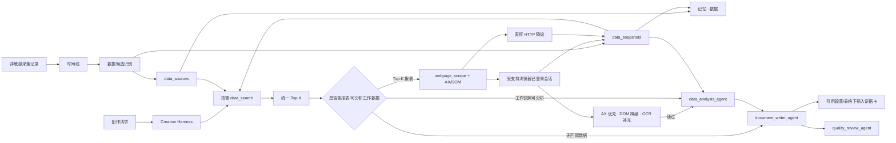

# MemoryBread 数据记忆与实时报表采集产品技术规范

**状态：** 已实现并通过端到端人工验收

**负责人：** MemoryBread 客户端团队

**决策人：** 未指定
**最后更新：** 2026-08-02

## 摘要

日报、周报、项目总结和数据分析文档不能只依赖历史文档：经营报表需要在成稿前取得当前页面数据，文档和工作 IM 中的指标又必须依据采集时间判断是否仍可采用。本方案在记忆中新增与“文档、知识、操作”平级的“数据”模块，并提供两个稳定能力：`data_search` 从本地数据资产召回带时效和来源的数据，`webpage_scrape` 复用用户已登录的受支持浏览器会话即时刷新报表网页。

采集方案采用双通道，主通道为浏览器会话附加，适用于登录态、内网页面和动态渲染报表；降级通道为不携带用户会话的直接 HTTP 访问，适用于公开网页。系统不复制、不导出、不保存 Cookie、Authorization header 或浏览器配置。创作 Agent 先让报表 URL 与工作数据统一参加 Top-K，再对 Top-K 中的报表先以 `focus_policy=never` 附加已打开的 URL 匹配标签静默取数；页面未打开或静默结构不足以取得目标指标时，用 `allow_foreground_refresh=true`、`focus_policy=allow_once` 对该来源降级一次专用浏览器会话完成加载与筛选。页面事实优先读取 Accessibility Tree（AX）与同次 DOM/表格；“保留证据截图”缺省关闭，只控制是否在同一浏览器会话中生成图片资产，不控制即时取数。用户在一次性会话期间主动切走时中止当前刷新，不抢回焦点。截图不是数据可用性的硬门槛，OCR 只做补充核验。截图证据卡插在实际使用数据的段落或表格下方。

## 问题与证据

当前创作链路主要从文档记忆和互联网资料获得上下文，存在三类缺口：

1. 报表、看板、监控平台通常是动态网页而非文档，因而不一定进入文档提炼和文档召回。
2. 报表页面往往依赖公司登录态、单点登录或内网访问；独立 HTTP 抓取无法复用用户当前会话。
3. 文档和工作 IM 中的数字是“某次看到的值”，采集时间只能作为事实时间的下界。若召回时忽略时间，周报可能引用数周前的指标且不提示风险。

仓库已有可复用基础：Core Engine 已通过浏览器专用通道采集页面 URL、标题和正文，时间线与采集记录具有来源关联；Creation Agent 已有 Tool/Agent 计划和数据分析 Agent；记忆页面已有文档、知识、操作三个资产 Tab。这些事实支持以新增本地资产类型完成能力，而无需引入云端数据平台或复制浏览器凭据。

## 目标与成果

- 用户浏览过的报表 URL、数据型时间线和工作数据陈述能沉淀为本地数据资产，并保留来源采集记录或时间线。
- 数据型创作任务以 `data_search` 探测数据证据，并由 Harness 基于 Tool 反馈选择网页刷新、数据分析或跳过路径。
- 登录态报表能够通过正在运行的来源浏览器或其他受支持浏览器刷新；公开网页在浏览器通道不可用时可以通过 HTTP 降级刷新。
- “数据”页能检索指标正文、查看最新快照、识别采集策略、手动刷新报表并显示失败原因。
- 每个数据来源在数据面板只保留一份最新快照；创作即时取到的新数据覆盖旧快照，不产生重复数据项。
- 创作引用报表当前值时可在对应正文位置显示浏览器实际渲染截图、来源和采集时间，并可从创作历史恢复。
- 数据资产随现有加密资产快照备份恢复；原始 Cookie、凭据和敏感采集正文不进入该资产。

## 非目标与不做事项

- 不建设执行任意网页指令的通用浏览器自动化平台；通用截图仅打开目标 URL、等待渲染、读取 DOM 并截取窗口像素。
- 不绕过登录、验证码、访问控制、机器人限制或公司安全策略。
- 不复制任何浏览器 Cookie、站点存储或会话令牌到数据库、Sidecar、日志、Tool 事件或云端快照。
- 不在本期解析每个 BI 供应商的私有接口，不暴露供应商模型、密钥或购买成本。
- 不把历史工作数据自动改写为实时事实；缺少事实时间时只把采集时间作为时效下界。
- 不在后台定时刷新所有报表；实时网页只在用户手动刷新或数据型创作需要时按需刷新。

## 用户与场景

### 文档创作者

- 触发：要求生成日报、周报、月报、项目总结、经营分析、指标分析或数据报告。
- 任务：在成稿前获得与主题相关的数据，并区分当前值、历史值和待核验值。
- 结果：文档包含可追溯的数据结论、采集时间和刷新失败提示，不编造缺失数字。

### 数据资产使用者

- 触发：在记忆中打开“数据”页，或搜索某个指标、报表和业务主题。
- 任务：知道系统从哪里看到数据、最后何时采集、当前是否可采用，并可刷新实时网页。
- 结果：通过同一页面管理报表 URL 与工作数据快照，必要时打开原网页核对。

### 隐私和运维人员

- 触发：检查浏览器权限、采集失败、资产备份或数据泄露风险。
- 任务：只从稳定错误码和数量指标定位问题，不读取用户正文、URL 查询值或凭据。
- 结果：可以判断没有受支持浏览器运行、脚本权限未开、需要登录、页面为空或两通道都失败。

## 范围

**范围内**

- 本地 SQLite 数据源、单份最新快照、来源关联、全文索引和资产快照。
- 归属创作运行的本机截图证据、OCR/DOM 校验、正文证据卡和创作历史恢复。
- 从非敏感 timelines 统一识别报表 URL 和数据陈述；关联 captures 仅作为 URL、正文和来源证据。
- 本地数据检索、时效评分、按需网页刷新和结构化表格/指标标签提取。
- Creation Agent 的数据型文档路由、数据分析约束、写作与审校提示。
- 记忆总览中的数据计数和独立“数据”Tab。

**范围外**

- 云端共享数据源、多人权限和团队级数据目录。
- Excel/CSV 文件导入、数据库连接器、定时任务调度和供应商专用 BI API。
- 将报表快照发送到远程模型；是否调用远程创作模型仍沿用用户现有创作配置和提示边界。

## 方案决策

选择“受支持浏览器会话附加优先 + 直接 HTTP 降级”，不选择单一通道。

| 方案 | 登录态/内网 | 页面动态渲染 | 对用户会话的影响 | 凭据风险 | 结论 |
| --- | --- | --- | --- | --- | --- |
| 仅直接 HTTP | 不可保证 | 不可保证 | 无 | 低 | 只能作为公开网页降级 |
| 导出 Cookie 后抓取 | 可实现 | 需额外浏览器运行时 | 无 | 高 | 不采用 |
| 仅浏览器会话附加 | 支持 | 支持 | 普通刷新使用后台标签，创作取证使用专用后台窗口 | Cookie 留在浏览器 | 作为主通道 |
| 双通道 | 支持 | 支持 | 专用窗口不切换用户前台窗口或现有标签 | Cookie 留在浏览器 | 采用 |

macOS 主通道通过 AppleScript 附加浏览器本机会话，当前适配 Google Chrome/Canary、Microsoft Edge、Brave、Chromium、Vivaldi 和 Safari。首轮刷新只读取 URL 精确匹配的已打开后台标签，交互等级为 `background_tab`，`focus_policy=never`；页面未打开或目标指标不足时，Harness 以 `allow_foreground_refresh=true` 请求一次专用浏览器会话，兼容交互等级仍记为 `temporary_foreground_window`、`focus_policy=allow_once`。`retain_screenshot=false` 时仅在创建专用隐藏窗口时短暂置前并立即恢复原应用，页面加载、Tab 与日期筛选及虚拟化长页面 DOM 遍历均在隐藏窗口完成，不调用截图。保留证据截图时才维持同一连续前台租约，由 `xcap` 精确匹配同一窗口并完成所有滚动分段。前台租约建立前、运行中和清理前都执行焦点硬门禁；用户切走即中止且不得再次置前。为避免清理动作反向抢焦点，用户已经切走时遗留的专用隐藏窗口由下一次串行采集启动时清理。Firefox、Arc 等没有当前适配器的浏览器只能使用公开页面 HTTP 通道，暂不能生成创作证据截图。

直接 HTTP 不复用浏览器会话。登录态可能同时依赖系统钥匙串加密 Cookie、`localStorage`、SSO 临时令牌、客户端证书和页面 JavaScript 发起的 API 请求；导出 Cookie 既不能完整复现，也扩大凭据泄露面。浏览器通道让页面留在原安全上下文中加载，HTTP 通道只承担无需登录的公开页面。

## 系统流程

## 功能需求

- **FR-001** — Core Engine 必须以时间线为唯一数据候选入口，并从时间线关联的 `is_sensitive=0` 采集记录中识别活动 URL 和正文内 URL；只有 URL、页面标题或时间线上下文命中报表、看板、分析、指标、监控、表格类特征时才创建 `report_url` 数据源。数据物化状态必须跟踪时间线更新时间、事实契约与更新时间、接受事实数及关联采集版本；任一输入变化都必须让该时间线重新进入物化，不得依赖全局 capture 游标。
- **FR-002** — Core Engine 必须从时间线摘要、概述、详情及其关联采集正文中识别同时含数值与可命名指标、对象或统计维度的数据陈述，并创建或更新 `work_memory` 数据源与快照。默认每条时间线只创建一个数据集，所有通过证据校验的事实必须作为 `metric_rows` 多行写入同一数据表；超过 50 行时才允许稳定分片，单条时间线最多 3 个数据集。自动数据名称必须优先使用整批结构化事实的业务对象和指标主题，能够直接说明“这批数据代表什么”；`Quest Window`、`LangBridge`、`ChatGPT` 等应用或窗口名称，以及“用户执行/参与/查看……”等过程叙述不得直接作为数据名称。自动数据摘要必须使用完整自然语言说明数据对象、指标范围、数据行数，并列举最多 3 条带对象、指标和值的关键数据，禁止仅拼接标题和数值。每条入库数据必须能回答“什么对象的什么指标、值是多少”；存在比较或结论时还必须保留比较对象和结论。`9类 43%`、`7类33%` 这类无法确定指标含义的孤立数字即使带百分号也必须丢弃。日期、时刻、版本号、计划规模、参与人数、文件变更数、导航数量、评论计数、列表序号、明确否定或仅作示例的数字，以及只出现“用户”“客户”“数据”等泛词的界面正文不得单独构成数据资产；超长页面正文、无对象归属的多个同名数值和明显界面噪声必须被排除。
- **FR-003** — 每个数据源必须保存稳定规范键、来源类型、URL、访问模式、刷新策略、实时等级、首次/最后看到时间、最后成功采集时间、状态和错误码；每个数据源只能保留一条最新快照，新采集必须原位覆盖其采集时间、观察时间、正文、结构化数据、哈希、时效 TTL 与来源证据。
- **FR-004** — URL 入库前必须拒绝非 HTTP(S) 地址和嵌入式用户名/密码，移除常见令牌、签名和凭据查询参数；用于单页应用路由且不含凭据的 fragment 必须保留。
- **FR-005** — `data_search` 必须让报表 URL 与工作数据在同一候选集合中按相关性、新鲜度和来源置信度参加 Top-K，不得给 URL 预留名额。规范 URL 完全相同或规范标题完全相同是相关性特征，不是绕过排序的“精确命中”通道。响应必须返回相关性、新鲜度、最终分、`refresh_required`、`can_use`、采集时间和来源证据。
- **FR-006** — `webpage_scrape` 必须支持 `auto`、`browser`、`http` 三种模式；`auto` 根据来源访问模式优先选择来源浏览器、其他正在运行的受支持浏览器或 HTTP，并在第一通道失败后尝试适用的另一通道。
- **FR-007** — 浏览器采集必须使用浏览器原生本机会话。首轮刷新在 `focus_policy=never` 下只附加 URL 精确匹配的已打开后台标签读取 DOM，不得创建新标签或切换前台应用。页面未打开，或静默结果没有通过校验的目标指标时，允许对同一来源用 `allow_foreground_refresh=true`、`focus_policy=allow_once` 降级一次专用浏览器会话，完成页面加载、Tab 与日期筛选；该能力与截图开关独立。数据读取顺序固定为目标窗口 AX → 同次 DOM；AX 只读到浏览器工具栏、超时、不可用或与 DOM 缺少实质重合时必须自动降级 DOM。专用会话只允许每个来源取得一次连续前台租约，不得逐滚动分段在应用间往返切换；用户主动切走后必须返回 `FOCUS_POLICY_BLOCKED` 并中止当前刷新，不得抢回。保留截图时才按页面高度分段滚动并拼成长图；专用窗口使用唯一会话标识和几何位置匹配，完成或失败后关闭，只在浏览器仍是前台时恢复原 App。两种模式均不得读取或持久化 Cookie、Authorization header、浏览器配置或密码，也不得依赖页面供应商的导出功能。
- **FR-008** — 页面刷新成功后必须覆盖该数据源的最新本地快照并清除来源错误；失败时必须保留旧快照，写入稳定错误码，且 Agent 可以基于其他上下文继续。覆盖不得创建第二条同源快照或重复数据项。
- **FR-009** — 记忆页面必须提供“数据”Tab，支持关键词检索、分页、语义摘要、表格化数据明细、新鲜度、数据 ID、关联时间线跳转、删除、重新识别、即时刷新及打开原网页。主列表条目必须以具体数据含义为主体；详情优先用“对象 / 指标 / 数值 / 说明”表格表达，只有不适合表格的结论才使用文字。来源、访问模式和采集策略只能作为核对信息。只有地址但没有快照的报表必须单列为“待采集报表”，并说明其尚未取得可展示的数据；该类条目不得冒充数据记录，也不得占用数据记录的分页总数和页容量。
- **FR-014** — 提炼结果必须使用 `data-memory.v6` 结构，至少包含可独立理解的 `title`、`summary`、`semantic_identity` 与 `metric_rows`。所有候选先经过事实性判定，建议、命令、假设、示例、否定引用和配置动作不得作为已观测事实；再将结果动作谓词与任意指标主体分离；最后验证数据能独立回答“什么对象的什么指标、值是多少”。`title` 必须使用“对象 + 指标”表达且不得拼入具体指标值；对象可来自陈述中的显式对象、稳定文档/页面标题或资源指标的来源应用，无法可靠补出对象的裸指标必须拒绝。`summary` 必须说明对象/范围、关键值、比较或结论，不能只是数字拼接；`semantic_identity` 必须排除具体值、采集时间、动作谓词、原始标题片段和仅由宽泛上下文推断的对象，并与稳定页面/文档范围共同判重，使同一来源范围内的相同数据在不同时间线再次出现时更新同一来源。无法确认稳定范围的通用聊天窗口必须保持时间线隔离，优先避免错误合并；`metric_rows` 必须为每个值保存非空规范指标名，并在可识别时保存对象/范围与说明。列表、关键词检索、`data_search` 和分页必须共同使用同一份 v6 语义判定；历史 v1-v5 快照必须在后续识别批次中持久化重建、合并同义来源，无法形成 v6 结果的来源不展示、不召回且不计入总数。
- **FR-010** — 当创作请求需要业务数据证据时，Creation Harness 必须把 `data_search` 作为初始证据探针，但不得预置固定供应商链路；统一 Top-K 返回后，对其中所有报表 URL 在本轮创作中追加 `webpage_scrape`，工作数据快照可直接进入分析。Skill 执行步骤可用 `retain_webpage_screenshot` 控制“保留证据截图”，旧 Skill 缺少字段与缺省值均按 `false` 处理；关闭只移除预览、图片资产和正文证据卡，不得关闭 DOM/AX 即时取数。关闭时先以 `focus_policy=never` 静默读取，失败或目标指标缺失时再以 `allow_foreground_refresh=true`、`focus_policy=allow_once` 重试一次；开启截图时同一一次性会话额外生成证据。无匹配数据时跳过两者并继续使用其他上下文。
- **FR-011** — 数据分析 Agent 和文档撰写 Agent 必须只消费本轮经 AX/DOM 程序化校验的报表指标，并核对 URL、标题、采集时间、口径、时间范围及单位。AX 可用时以 DOM 候选与 AX 文本交叉匹配；AX 不可用时以同次 DOM 结构化指标作为可用事实。截图 OCR 只记录置信度和补充命中数，不得因长图 OCR 漏识别而否决已通过 AX/DOM 的指标。任何程序化校验不一致都必须清空报表正文和结构化值，不插入证据卡，也不得把旧值或未验证值写成当前事实；一旦本轮尝试刷新某个报表，该 URL 对应的历史派生工作记忆必须标记为已被即时来源替代，即使刷新或校验失败也不得作为“当前值”回退。已保留、通过验证且被正文实际使用的证据卡必须紧跟对应段落或表格。
- **FR-012** — `data_sources`、`data_snapshots`、`data_source_links` 必须进入现有加密资产快照；创作证据的原图路径、原始采集正文、Cookie 和凭据继续排除。证据元数据归属创作 `run_id`/`session_id` 并随创作历史引用，不与会被覆盖的数据快照强绑定。
- **FR-013** — 数据、文档、知识、操作和互联网结果必须作为平权证据进入创作环境；数据模块的近期扫描调度和内部新鲜度分不得形成跨模块加权，撰写 Agent 只按相关性、可靠性、时效和口径适配度取舍证据。

- **NFR-001** — 单次网页正文最多保存 80,000 字符；浏览器等待基础加载与动态内容稳定最长约 40 秒，直接 HTTP 请求超时 20 秒，Agent 单来源刷新请求超时 45 秒。
- **NFR-002** — 数据识别批次必须限制在 1 至 5,000 条采集记录，后台每次处理到新时间线或距离上次识别达到 5 分钟时触发，不主动刷新网页。首次识别从最新记录开始；后续批次优先处理新增记录，并用剩余预算持续回填历史记录，避免大库中的旧数据永久无法进入数据模块。该顺序仅决定数据索引何时覆盖某条 capture，不影响数据与知识、文档、操作之间的召回优先级。
- **NFR-003** — Tool 事件和错误响应只允许包含来源 ID、标题、采集器、时间、数量、状态和稳定错误码；不得把网页正文、URL 查询值、Cookie 或凭据写入轨迹。
- **NFR-004** — `data_search` 与 `webpage_scrape` 作为必备 Tool 对旧客户端兼容：调用方未传或漏传时，Core Engine、Sidecar 和 UI 都必须自动补齐；普通非数据型创作不得增加这两个执行步骤。
- **NFR-005** — 数据列表默认每页 20 条、最大 100 条；Tool 单次最多返回 20 个候选，Agent 单次最多刷新 3 个报表来源。

## 采集与提炼逻辑

### 候选发现

后台处理器在时间线批处理后调用 `POST /api/data/sources/extract`。Core Engine 读取最近的非敏感采集，并按以下顺序判定：

读取使用双游标：`newest_capture_id` 标记已经覆盖的新增记录高水位，`backfill_before_capture_id` 标记历史回填边界。首次批次倒序读取最新记录；后续批次最多将 75% 配额用于高水位之后的新增记录，其余配额继续倒序回填历史。若新增量不足，未用配额全部让给历史回填；游标推进与重复来源更新均保持幂等。

1. 对活动页面 URL 做规范化和数据网址分类，命中则按 `report:<canonical_url>` 幂等更新来源。
2. 从 AX、OCR、输入和音频正文中提取最多 12 个 HTTP(S) URL，排除与活动 URL 重复的地址，再执行同样分类。
3. 对每条时间线只处理一次，将时间线摘要、概述、详情与采集正文合并；候选句必须在 280 字符内，同时包含数值以及可命名的指标、对象或统计维度。百分号、金额单位或技术单位只能证明值的形态，不能替代指标语义。人数、条数、集数、文件数和普通时长等通用量纲本身不足以构成数据，单纯日期/时刻、版本号、导航数字和泛化主体词也不参与判定，命中常见界面噪声的候选直接丢弃。
4. 从合并正文切分最多 80 条候选陈述，按“事实性判定 → 动作/指标分离与指标规范化 → 对象完整性校验”的顺序分别提炼为 `data-memory.v6`。`title` 使用“对象 + 指标”表达，`summary` 负责说明范围、关键值、比较或结论，稳定页面/文档范围与规范化后的“显式对象 + 指标集合”共同组成跨时间线判重键，原始标题片段、动作谓词和仅由宽泛上下文推断的对象不得进入判重身份。`metric_rows` 以对象/维度、规范指标、数值和说明保存可计算明细，原合格陈述保留在 `metric_statements` 以便追溯。不同主题不得混进同一快照；同一主题的新观察覆盖旧值，历史回填不得覆盖更新值。若无法生成非空指标名，或裸指标无法从稳定文档标题/来源应用可靠补出对象，则整条来源丢弃。每轮识别先持久化重建请求预算内的历史 v1-v5 快照并合并同义来源，使旧版本误识别的界面正文、否定引用、建议/命令、孤立数字和不完整标题停止展示和召回。无法识别事实发生时间时，`observed_at` 取采集时间，并在 provenance 标记其只是下界。
5. `data_source_links` 用稳定 `source_ref_key` 关联 capture/timeline，使重复批次幂等且可回溯。

### 新鲜度与采用规则

报表快照 TTL 为 15 分钟：15 分钟内为 `live`，2 小时内为 `fresh`，24 小时内为 `aging`，之后为 `stale`。当请求 `need_fresh=true` 且报表快照缺失或超过 15 分钟时，返回 `refresh_required=true`、`can_use=false`，直到刷新成功。

工作记忆按采集时间衰减：24 小时内新鲜度分为 0.82，7 天内为 0.60，30 天内为 0.34，之后为 0.10。它不自动变成不可用，但数据分析 Agent 必须根据任务周期判断，只作历史参考或列入待核验项。

最终排序采用确定性组合：相关性 78%、新鲜度 12%、来源置信度 10%；报表来源置信度为 0.95，工作记忆为 0.68。规范 URL 相同得 1.0 身份相关性，规范标题相同得 0.96，并与正文相关性取较大值。`refresh_required` 是 Top-K 形成后的动作状态，不再对候选降权，避免唯一相关且可刷新的报表被历史内容挤出。

## 状态、权限与失败行为

数据源状态为 `active`、`unavailable` 或 `disabled`。刷新失败变为 `unavailable` 但不删除旧快照；后续刷新成功恢复为 `active` 并清空错误码。工作数据不存在网页地址时页面不展示刷新按钮。

稳定错误码如下：

| 错误码 | 触发 | 恢复行为 |
| --- | --- | --- |
| `DATA_SOURCE_NOT_FOUND` | 来源不存在 | 重新识别或选择其他来源 |
| `DATA_SOURCE_URL_MISSING` | 工作数据没有 URL | 使用带时间的历史快照 |
| `BROWSER_ATTACH_UNAVAILABLE` | 没有受支持浏览器运行或自动化权限不可用 | 打开已登录的受支持浏览器、授权后重试 |
| `BROWSER_SCRIPTING_DISABLED` | 禁止 Apple Events 执行 JavaScript | 打开对应浏览器的开发者设置 |
| `SCRAPE_AUTH_REQUIRED` | 页面跳转登录/SSO | 在对应浏览器登录后重试 |
| `SCRAPE_EMPTY` | 页面没有正文或表格 | 等待页面加载或改用其他来源 |
| `SCRAPE_FAILED` | 两通道均失败 | 保留旧快照并标记待核验 |
| `EVIDENCE_CONTEXT_REQUIRED` | 截图请求缺少创作运行或会话身份 | Harness 补齐身份后重试 |
| `SCREENSHOT_FAILED` | 浏览器页面可读但窗口像素截图失败 | 检查系统录屏权限后重试 |
| `SCREENSHOT_BLANK` | DOM 已读取，但浏览器后台窗口尚未绘制出页面内容 | 重新触发窗口绘制并重试；仍为空时拒绝该证据且不采用快照 |
| `EVIDENCE_VALIDATION_FAILED` | OCR 与 DOM/表格或页面元数据不一致 | 不采用该报表值，使用其他证据或人工核验 |
| `DATA_SEARCH_UNAVAILABLE` | 本地检索接口不可用 | Agent 使用其他记忆继续，记录数据缺口 |

空态必须告诉用户先正常浏览报表、文档或工作 IM，再点击“重新识别数据”。加载态、识别态和单来源刷新态分别显示，避免用户重复触发。错误通过现有页面状态消息展示，不把 URL 或正文拼入错误文本。

## 接口与契约

稳定 JSON Schema 位于 `shared/data-memory/data-tools.schema.json`，说明位于 `shared/data-memory/README.md`。本地 API 如下：

| 方法与路径 | 用途 |
| --- | --- |
| `GET /api/data/sources?q=&limit=&offset=` | 数据 Tab 列表与快照 |
| `GET /api/data/sources/:id` | 单个数据源详情 |
| `POST /api/data/sources/extract` | 从采集/时间线识别数据资产 |
| `POST /api/tools/data-search` | Agent 数据检索 Tool |
| `POST /api/data/sources/:id/refresh` | 网页爬取 Tool 的来源刷新执行端点 |
| `GET /api/creation/evidence/:id/image` | 读取本机创作证据图像 |
| `GET /api/creation/browser-previews/:id/image` | 读取运行中的后台浏览器缩略预览；UUID 校验、禁止缓存 |
| `POST /api/creation/evidence/:id/validate` | 保存 OCR/DOM 硬校验状态与通过的指标 |
| `DELETE /api/data/sources/:id` | 软删除数据来源及其展示/召回入口，保留来源时间线和采集记录 |

`POST /api/tools/data-search` 输入 `query`、`need_fresh`、可选 `as_of_ms` 和 `limit`，返回 `memorybread.data-search.v1`。来源结果中 `content_excerpt` 与 `structured_data` 只进入本轮 Agent 内部环境；对 UI 的 Tool 轨迹只返回来源元数据和数量。

默认创作刷新先输入 `{ "mode": "auto", "browser_preference": "auto", "retain_screenshot": false, "allow_foreground_refresh": false, "focus_policy": "never" }`，只附加已打开的 URL 匹配标签静默读取。没有匹配页面或结构校验未取得目标指标时，Harness 对同一来源再输入 `{ "allow_foreground_refresh": true, "retain_screenshot": false, "focus_policy": "allow_once" }`；Core Engine 在硬门禁下创建一次专用隐藏浏览器会话并立即恢复原应用，后续在隐藏窗口完成即时 DOM/AX 取数，不生成图片。保留证据截图时额外传 `capture_evidence=true`、`run_id`、`session_id`、可选 UUID `preview_id` 与 `retain_screenshot=true`，并在同一受保护前台租约内完成截图。专用刷新或截图请求若仍为 `never`，或用户在前台租约内切走，Core Engine 返回 `FOCUS_POLICY_BLOCKED`，不得再次抢占。响应返回实际 `focus_takeover_count<=1`；静默成功为 `background_tab`，专用会话为 `temporary_foreground_window`。浏览器偏好可显式选择 `chrome`、`chrome_canary`、`edge`、`brave`、`chromium`、`vivaldi` 或 `safari`。

数据库迁移为 `064_data_memory_module.sql`、`065_allow_browser_attach_snapshots.sql` 和 `066_creation_evidence_latest_data.sql`：

- `data_sources`：来源身份和刷新策略。
- `data_snapshots`：每个来源唯一的一份最新采集结果与时效证据。
- `data_source_links`：来源到 capture/timeline 的多对一证据。
- `data_snapshots_fts`：正文与结构化数据全文索引，由三类触发器同步。

已有早期草案表的升级数据库追加执行 `065_allow_browser_attach_snapshots.sql`，在事务内扩展 `collector` 约束以接受 `browser_attach`，保留旧快照并重建全文索引。`066` 先为每个来源保留最近一条历史快照，再建立 `source_id` 唯一索引，并新增创作证据表与 `creation_history.evidence_json`。
- `data_extraction_state`：新增采集高水位和历史回填边界；只属于本机运行状态，不进入加密资产快照。

## 创作 Harness 强化

Creation Agent 先根据根需求、本轮要求和文档类型决定需要哪些证据探针。数据探针与记忆、互联网等 Tool 平权，初始计划最多加入 `data_search`，不提前加入其依赖动作。每个 Tool 完成或失败后，Harness 把以下可观察反馈写回环境并重新规划：结果数、可刷新来源数、可分析快照数、`refresh_required`、`can_use` 和稳定错误码。

动态分支为：

1. `data_search` 统一排序后只要 Top-K 中存在报表 URL，就在当前游标处追加创作模式的 `webpage_scrape`；报表即使 15 分钟内刷新过，也要为当前创作重新读取 AX/DOM；是否重做截图由 Skill 步骤配置决定，默认不保留。
2. `data_search` 只有工作数据快照且可分析时，直接追加 `data_analysis_agent`。
3. `data_search` 无匹配数据或只有无快照元数据时，跳过刷新和数据分析，撰写 Agent 使用其他平权证据继续，并明确数据缺口。
4. `webpage_scrape` 成功且至少一个报表通过 AX/DOM 校验时，只把验证通过的指标追加给 `data_analysis_agent`。
5. `webpage_scrape` 刷新或程序化校验失败时，不分析该报表的历史或未验证值；截图或 OCR 单独失败只影响图片证据，不得否决已通过 AX/DOM 的数据。若另有工作数据仍可分析，则只处理工作数据，否则跳过分析。
6. `document_writer_agent` 完成后，Harness 按“指标标签 + 数值”定位实际使用证据的段落或表格，并插入截图、来源、采集时间和校验状态；未使用的截图不插入正文。

Harness 发出不含正文和 URL 的 `harness.decision` 事件，记录触发 Tool、反馈计数、原因码和实际追加的能力。Skill 即使声明固定数据步骤，也会被规范化为一次数据探针，依赖动作仍由反馈决定。普通方案、PRD 和非数据型文档仍只按原意图选择证据与专业 Agent。

## 验收标准

- **AC-001** — 验证 **FR-001**、**FR-002**、**FR-003**。给定含报表 URL 的非敏感采集和含“本周订单 1200，环比增长 8%”的时间线，当执行数据识别两次并再次刷新报表，则每个来源仍只有一个数据项和一条最新快照，最新内容覆盖旧内容，来源关联保持可追溯。
- **AC-002** — 验证 **FR-004**。给定带业务筛选、`access_token` 和 `#chart` 路由的 HTTPS 报表 URL，当规范化时，则保留业务筛选与 `#chart`，移除令牌；`file:` 或嵌入用户名密码的 URL 必须被拒绝。
- **AC-003** — 验证 **FR-005**。给定多个工作数据和一个报表 URL，当查询包含该规范 URL 或完整标题且 `limit=1`，则报表与其他候选统一计算后位于 Top-1；响应包含分数与刷新状态，且 `refresh_required` 不降低其排序分。
- **AC-004** — 验证 **FR-006**、**FR-007**、**FR-008**。分别给定已登录的 Chromium 系浏览器和 Safari：精确匹配页面已打开且结构有效时，首轮刷新返回 `background_tab`、`focus_policy=never`、`focus_takeover_count=0`，连续轮询期间前台应用和键盘焦点不得变化；页面未打开或静默结构无目标指标时，只允许一次 `temporary_foreground_window` 降级，返回 `focus_policy=allow_once`、`focus_takeover_count=1`。`retain_screenshot=false` 时只允许创建隐藏窗口的一次极短切换，恢复原应用后完成页签、筛选和长 DOM 采集，不生成图片；显式保留证据截图时，同一连续前台区间生成覆盖页尾的长图，禁止逐分段切换。用户切走必须中止且不得抢回；纯白截图返回 `SCREENSHOT_BLANK`，Cookie 不进入数据库和事件。
- **AC-005** — 验证 **FR-008**。给定没有受支持浏览器运行且 HTTP 返回鉴权失败，当刷新报表，则旧快照保持不变，来源记录稳定错误码，创作运行发出 `tool.failed` 后继续后续 Agent。
- **AC-006** — 验证 **FR-002**、**FR-009**、**FR-014**。给定报表源、含“背景显示国内日均 GPU 利用率为 42%，海外为 47%，但 GPUTL 无法反映硅片内 SM 的实际使用情况，存在掩盖低效的事实”的工作数据、孤立的“9类 43%”以及仅含聊天时刻、评论计数和导航正文的历史快照，当用户打开“数据”Tab，则主列表用可独立理解的 GPU 利用率比较结论作为摘要，详情表至少展示国内 42% 与海外 47% 两行，来源信息位于次级区域；孤立数字和历史界面噪声不进入列表、分页总数或检索。详情显示数据 ID，可跳转来源时间线并可删除该数据；只有报表源出现即时采集或刷新动作。
- **AC-007** — 验证 **FR-010**、**FR-011**。给定“生成本周项目周报，并分析核心指标变化”，初始计划必须包含 `data_search` 且不包含后续固定链；Top-K 含报表时追加创作网页刷新，只有 AX/DOM 程序化校验及 URL、标题、时间匹配的指标才进入分析。默认配置不产生预览、图片资产或证据卡，但同一指标仍可通过 DOM/AX 进入分析；Skill 明确开启截图时，长截图卡必须紧跟实际使用该指标的段落或表格。程序化校验不一致时不得插卡或输出该报表当前值，同 URL 的历史派生工作记忆也必须显示为“已由即时数据替代”并从写作环境清空。
- **AC-008** — 验证 **FR-012**。给定含数据源、最新快照、来源关联和创作截图的本地库，当导出加密资产快照并恢复到新库，则三张数据表可观察到对应资产，而创作截图原图、截图路径、capture 正文、Cookie 和凭据不存在；创作历史在原设备上仍可恢复证据图。
- **AC-009** — 验证 **FR-013**。给定同一主题的数据快照、文档、知识和操作线索，当进入撰写环境，则所有来源均可观察且没有“数据模块加分”字段；近期优先扫描只改变数据资产被识别的批次，不改变其他模块结果的顺序或权重。

## 度量与可观察性

- **OBS-001** — 记录每批 `scanned_count`、新增/更新来源数、快照数和跳过数，用于判断识别规则覆盖率；不记录正文和 URL。
- **OBS-002** — Tool 轨迹记录数据检索结果数、需刷新数、网页刷新成功/失败数和稳定错误码，用于判断实时数据链可用性；不记录查询参数值和快照正文。
- **OBS-003** — 数据 Tab 总览记录本地有效来源数量，用于判断模块是否形成资产；该值仅来自本地 SQLite。
- **OBS-004** — 人工发布验收统计各受支持浏览器附加成功、需登录、脚本权限关闭、HTTP 降级成功四类场景，任一场景不得在日志发现 Cookie、Authorization 或 URL 令牌值。
- **OBS-005** — `harness.decision` 记录触发 Tool、反馈状态、匹配/可刷新/可分析数量、原因码和实际追加的步骤，用于验证执行路径来自反馈而非固定文档类型；不得记录正文或 URL。

## 发布、迁移与回滚

- **ROLL-001** — 第一阶段随客户端启动执行 064 迁移并开放本地 API；验证迁移、数据识别幂等和旧客户端创作请求自动补齐 Tool。失败时停止新版本发布，旧表不受影响。
- **ROLL-002** — 第二阶段开放“数据”Tab 和手动识别/刷新；内部账号使用公开网页、各受支持浏览器中的已登录报表、没有浏览器运行和脚本权限关闭四类用例。停止条件是后台窗口抢占前台、用户窗口/标签选择被覆盖、缩略图误截其他窗口或任何凭据进入日志/数据库。
- **ROLL-003** — 第三阶段启用数据型创作 Harness；抽查日报、周报、项目总结和数据分析的“新鲜快照、过期报表、无数据、刷新失败”分支，验证实际路径、时间、口径和失败降级。出现固定数据流水线、无来源数字或过期值被写成当前事实时，回滚 Sidecar 路由，保留数据资产和手动刷新。
- **ROLL-004** — 资产快照 schema 升至 3；新版本导出三张数据表，旧版本导入会跳过未知表而不破坏其他资产。若恢复测试失败，暂时从导出列表移除数据表，不删除本地数据。

## 风险与缓解

| 风险 | 影响 | 缓解 | 剩余风险 |
| --- | --- | --- | --- |
| 浏览器脚本权限默认关闭 | 实时报表无法读取 | 稳定错误码、页面恢复说明、HTTP 降级 | 用户仍需手工开启浏览器设置 |
| 网页采集与用户并发操作 | 静默路径误抢焦点，或截图路径逐段闪烁 | 默认 `focus_policy=never` 并连续监测前台应用；截图路径使用一次性焦点租约和唯一窗口匹配，响应记录 `focus_takeover_count` | Safari 创建新文档时仍需持续做系统版本回归 |
| BI 使用 Canvas、虚拟表格或跨域嵌入 | DOM 正文不完整 | 优先读取 AX 标签，同时提取表格和带数字的 aria-label；截图 OCR 只作补充 | AX 与 DOM 都没有可读标签的纯图形只能人工核验，不生成数据结论 |
| URL 带临时签名 | 凭据泄露或去密后失效 | 入库移除常见令牌/签名；优先依赖浏览器登录态 | 非标准参数名可能需补充规则 |
| 页面加载超过等待时间 | 快照为空或不完整 | 返回 `SCRAPE_EMPTY`，保留旧快照，不宣称成功 | 慢报表需要后续可配置等待策略 |
| 文档/IM 数字缺少事实时间和口径 | 结论误用 | 采集时间仅作下界、随时间衰减、分析 Agent 标记缺口 | 仍需用户或报表核对业务口径 |
| 数据资产增长 | 本地库或截图目录体积增加 | 每个来源只保留一条最新快照；截图按创作证据独立保存且不进入资产备份 | 仍需后续按历史保留策略清理孤立证据图 |

## 开放问题与已决策事项

已决策：本期使用多浏览器会话附加而不是导出 Cookie；事实读取采用 DOM/AX 程序化通道并静默优先，静默不可用时每个来源只允许一次受硬门禁保护的专用浏览器刷新；“保留证据截图”只控制图片资产，不控制即时取数。截图使用同一前台租约生成分段长图，不使用任一报表平台的导出功能；报表 URL 与其他数据统一参加 Top-K；AX/DOM 校验失败的数据不得成为当前事实，截图 OCR 失败不反向否决程序化事实。

后续问题不阻塞本期：是否为常用报表提供用户可配置 TTL；是否增加 CSV/Excel、数据库连接器和 BI 专用 API；是否按总容量与时间清理旧快照；是否允许用户手动合并重复数据源；非 macOS 平台采用何种受控浏览器连接协议。这些问题需要在实际使用数据和隐私评审后另立需求。

## 变更历史

- 2026-08-16 — 修复关闭截图后只允许精确匹配已打开标签、导致即时取数被 `FOCUS_POLICY_BLOCKED` 的断链；改为静默优先，页面缺失或结构不足时用一次性专用会话重试，截图开关只控制证据图片，并细分焦点门禁与结构校验提示。
- 2026-08-16 — 网页创作刷新改为默认静默 DOM/AX 取数；截图改为显式按需并增加 `focus_policy` 硬门禁，长截图由逐分段切换改为每来源一次连续焦点租约。
- 2026-08-02 — 统一报表 URL 与其他来源的 Top-K，新增创作即时通用浏览器截图、OCR/DOM 硬校验、正文证据卡和单来源最新快照覆盖契约。
- 2026-08-09 — 增加后台 Chromium 窗口绘制唤醒与白屏证据拒绝；修正 OCR 懒加载，并禁止本轮已刷新报表回退到同 URL 的历史派生数据。
- 2026-08-09 — 网页事实改为目标窗口 AX 优先、DOM 自动降级；截图改为 Skill 可配置且默认保留的分段长图，OCR 从数据硬门槛降为补充核验。
- 2026-08-01 — 将浏览器采集扩展为多浏览器低干预适配，明确数据与其他资产平权，并把数据型文档固定链改为反馈驱动 Harness。
- 2026-08-01 — 完成数据资产、双通道网页采集、数据 Tool、创作规划、数据 Tab、资产快照和验收规范的首版实现。
